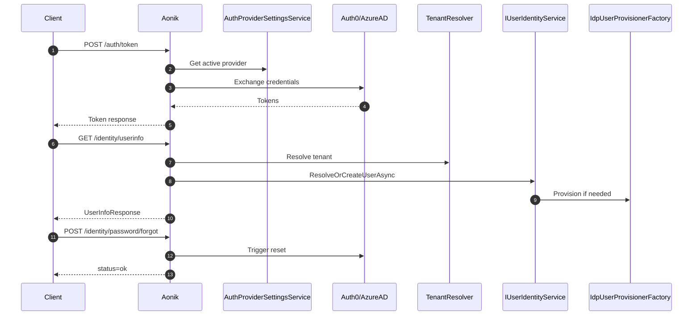

# 001.identity-auth

## Objective
Implement Aonik identity endpoints required by MyBillAfrica to replace MTM authentication and userinfo flows.

## Scope
- `POST /auth/token`
- `GET /identity/userinfo`
- `POST /identity/password/forgot`
- Tenant routing enforcement for claim/subdomain/header modes
- Active provider enforcement (Auth0 vs Azure AD)

## Existing Aonik Auth Abstractions
- `AonikAuthenticationSetup` policy scheme with issuer-based routing for Auth0/Azure AD.
- `AuthOptions` with `Provider` and `TenantRoutingMode` (Claim/Subdomain/Header).
- `AuthProviderSettingsService` for active provider and IdP settings storage.
- `IdpUserProvisionerFactory` with `Auth0UserProvisioner` and `AzureAdUserProvisioner`.
- `IUserIdentityService.ResolveOrCreateUserAsync` invoked during token validation.

## Detailed Plan
1) Provider-aware token exchange
- Introduce `IAuthTokenService` with provider-specific implementations.
- Use `AuthProviderSettingsService` to read active provider + client settings.
- Forward token requests to the active IdP (Auth0/Azure AD) instead of minting tokens in Aonik.
- Support MyBillAfrica flow requirements (password grant or authorization code with PKCE) based on provider settings.

2) Userinfo endpoint aligned with identity pipeline
- Implement userinfo by reading `ICurrentUserContext` set during JWT validation.
- Map external identity to Aonik user and Party/Profile references.
- Return minimal fields for frontend: userId, email, name, roles, tenantId.

3) Forgot password abstraction
- Introduce `IIdpPasswordResetService` with Auth0/Azure AD implementations.
- Use provider APIs to trigger reset (Auth0 change_password endpoint or Azure AD flow via Graph).
- Return success response regardless of email existence.

4) Tenant routing and issuer enforcement
- Reuse `TenantRoutingMode` to resolve tenant from claim/subdomain/header.
- Reject tokens if issuer does not match active provider settings.
- Ensure tenant context is resolved before user provisioning.

5) Auditing and compliance
- Log authentication and password reset events with tenant + user references.
- Do not store credentials or IdP tokens in Aonik persistence.

## Requirements
- Token response returns `accessToken`, `refreshToken`, `expiresIn`, `tokenType`.
- Userinfo response returns `userId`, `email`, `firstName`, `lastName`, `roles`, `tenantId`.
- Forgot password returns success regardless of account existence.
- All endpoints resolve tenant context by token + explicit tenant header.
- Identity context maps to Party/Profile records, not financial state.
- Token exchange respects active provider and configured auth settings.

## API Contracts
- `POST /auth/token`
  - Request: `grantType`, `clientId`, `username`, `password`, `scope`, `redirectUri`, `codeVerifier`, `authorizationCode`
  - Response: `accessToken`, `refreshToken`, `expiresIn`, `tokenType`, `idToken`
- `GET /identity/userinfo`
  - Response: `userId`, `email`, `firstName`, `lastName`, `roles[]`, `tenantId`, `partyId`
- `POST /identity/password/forgot`
  - Request: `email`, `tenantId`
  - Response: `status`

## DTO Definitions
```csharp
public record TokenRequest(
    string GrantType,
    string ClientId,
    string? Username,
    string? Password,
    string? Scope,
    string? RedirectUri,
    string? CodeVerifier,
    string? AuthorizationCode);

public record TokenResponse(
    string AccessToken,
    string? RefreshToken,
    int ExpiresIn,
    string TokenType,
    string? IdToken);

public record UserInfoResponse(
    Guid UserId,
    string Email,
    string? FirstName,
    string? LastName,
    IReadOnlyCollection<string> Roles,
    Guid TenantId,
    Guid PartyId);

public record ForgotPasswordRequest(
    string Email,
    Guid TenantId);

public record ForgotPasswordResponse(
    string Status);
```

## Example Payloads
```json
// POST /auth/token
{
  "grantType": "password",
  "clientId": "mybillafrica-web",
  "username": "user@example.com",
  "password": "***",
  "scope": "openid profile aonik"
}
```
```json
{
  "accessToken": "eyJ...",
  "refreshToken": "eyJ...",
  "expiresIn": 3600,
  "tokenType": "Bearer",
  "idToken": "eyJ..."
}
```
```json
// GET /identity/userinfo
{
  "userId": "11111111-1111-1111-1111-111111111111",
  "email": "user@example.com",
  "firstName": "Amina",
  "lastName": "Diallo",
  "roles": ["Customer"],
  "tenantId": "22222222-2222-2222-2222-222222222222",
  "partyId": "33333333-3333-3333-3333-333333333333"
}
```
```json
// POST /identity/password/forgot
{
  "email": "user@example.com",
  "tenantId": "22222222-2222-2222-2222-222222222222"
}
```
```json
{
  "status": "ok"
}
```

## Provider-Specific Behavior
### Auth0
- Token exchange: `POST https://{domain}/oauth/token`
  - Supports `password` grant only when enabled for the Auth0 application.
  - Prefer `authorization_code` + PKCE for production where possible.
- Forgot password: `POST https://{domain}/dbconnections/change_password`
  - Requires Auth0 connection name from settings.
- User provisioning: uses Management API via `Auth0UserProvisioner`.

### Azure AD (Entra)
- Token exchange: `POST https://login.microsoftonline.com/{tenantId}/oauth2/v2.0/token`
  - Prefer `authorization_code` + PKCE for public clients.
  - Password grant only if allowed by tenant policy.
- Forgot password: use Microsoft Graph user password reset or Azure AD B2C flow depending on tenant.
- User provisioning: uses Graph API via `AzureAdUserProvisioner`.

### Shared
- Provider selection uses `AuthProviderSettingsService` and token issuer matching.
- Tenant routing uses `TenantRoutingMode` (claim/subdomain/header).
- Claims mapping prefers `oid` over `sub` for Entra.

## Provider Config Keys
- Active provider: `Auth.Provider`
- Auth0
  - `Auth.Auth0.Domain`
  - `Auth.Auth0.Audience`
  - `Auth.Auth0.ClientId`
  - `Auth.Auth0.ManagementClientId`
  - `Auth.Auth0.ManagementClientSecret`
  - `Auth.Auth0.Connection`
  - `Auth.Auth0.ManagementAudience`
- Azure AD
  - `Auth.AzureAd.Authority`
  - `Auth.AzureAd.Audience`
  - `Auth.AzureAd.ClientId`
  - `Auth.AzureAd.ClientSecret`
  - `Auth.AzureAd.TenantId`
  - `Auth.AzureAd.UserPrincipalNameDomain`

## Sequence Diagram (Auth Flow)
```text
Client -> Aonik: POST /auth/token (grantType/password or auth_code)
Aonik -> AuthProviderSettingsService: Get active provider settings
Aonik -> IdP (Auth0/AzureAD): Exchange credentials for tokens
IdP -> Aonik: access_token, refresh_token, id_token
Aonik -> Client: token response

Client -> Aonik: GET /identity/userinfo (Bearer token)
Aonik -> AonikAuthenticationSetup: Validate JWT + issuer
Aonik -> TenantResolver: resolve tenant from claim/subdomain/header
Aonik -> IUserIdentityService: ResolveOrCreateUserAsync
IUserIdentityService -> IdpUserProvisionerFactory: Provision if needed
Aonik -> Client: userId, partyId, tenantId, roles

Client -> Aonik: POST /identity/password/forgot
Aonik -> IdpPasswordResetService: Trigger reset in active provider
Aonik -> Client: status=ok
```

## Mermaid Sequence Diagram


## Service Interfaces
```csharp
public interface IAuthTokenService
{
    Task<TokenResponse> ExchangeAsync(TokenRequest request, CancellationToken cancellationToken = default);
}

public interface IIdpPasswordResetService
{
    Task TriggerResetAsync(string email, Guid tenantId, CancellationToken cancellationToken = default);
}
```

## Application Services
- AuthService.TokenAsync
- IdentityService.GetUserInfoAsync
- IdentityService.SendPasswordResetAsync
- AuthTokenService (new) with Auth0/AzureAd implementations
- IdpPasswordResetService (new) with Auth0/AzureAd implementations

## Acceptance Criteria
- Token endpoint authenticates using active provider settings and returns IdP tokens.
- Userinfo resolves tenant and party/user mapping correctly.
- Forgot password triggers IdP reset workflow and returns 200.
- Tenant routing honors configured mode and blocks ambiguous tenancy.
- All endpoints are auditable with tenant and user id.
