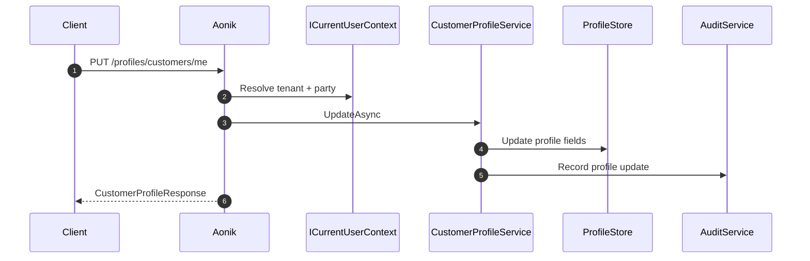
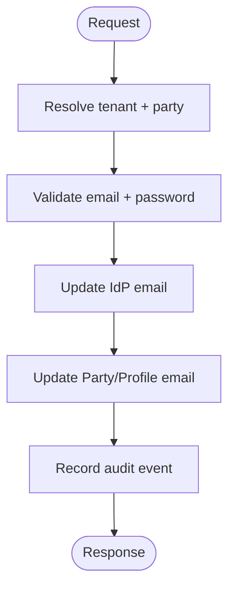

# 002.customer-profile

## Objective
Expose customer profile endpoints to support MyBillAfrica profile and account update flows while keeping Party/Profile as the source of truth and maintaining full auditability.

## Scope
- `GET /profiles/customers/me`
- `PUT /profiles/customers/me`
- `PUT /profiles/customers/me/email`
- `PUT /profiles/customers/me/password`
- `POST /profiles/customers/me/photo`
- `DELETE /profiles/customers/me/photo`

## Domain Alignment
- Profile data maps to Party/Profile domain, not ledger or financial state.
- Identity comes from authenticated user context; no direct customerId input is accepted for `/me` endpoints.
- All writes must produce an audit trail (actor, tenant, timestamp, change summary).

## Detailed Plan
1) Resolve authenticated customer context
- Use `ICurrentUserContext` to obtain `UserId`, `TenantId`, `PartyId`.
- Use `IUserIdentityService` to map identity to Party/Profile if not already resolved.
- Reject requests without a valid tenant or party context.

2) Profile read model
- Aggregate view from Party/Profile with minimal fields needed by MyBillAfrica.
- Normalize phone to E.164, country to ISO-3166-1 alpha-2.
- Include profile photo URL if present; otherwise return null.

3) Profile update flow
- Update only mutable fields: firstName, lastName, title, phone, countryCode.
- Ignore unknown fields; validate required fields for non-empty names.
- Persist to Party/Profile store and emit audit event.

4) Email update flow
- Validate current password with Identity provider before updating email.
- Require email uniqueness within tenant scope.
- Update identity account email and reflect new email in Party/Profile.
- Return updated profile snapshot.

5) Password update flow
- Validate current password.
- Enforce password policy configured for active IdP.
- Update IdP credentials only; no password stored in Aonik.
- Return success response with no sensitive data.

6) Photo upload and delete
- Support direct file upload (multipart) or signed URL flow.
- Store only metadata and URL in Party/Profile.
- Delete clears photo URL and removes stored asset if managed by Aonik storage.

7) Observability and auditing
- Capture audit entries with tenant, partyId, userId, and field changes.
- Emit metrics for update frequency and failure rates by endpoint.

## Requirements
- Profile payload contains name, title, email, phone, country, photoUrl.
- Email update validates current password and returns updated profile.
- Password update validates current password and returns success.
- Photo upload returns photoUrl; delete clears photoUrl.
- All updates write to Party/Profile domain with audit trail.

## API Contracts
### `GET /profiles/customers/me`
- Response: `CustomerProfileResponse`

### `PUT /profiles/customers/me`
- Request: `UpdateCustomerProfileRequest`
- Response: `CustomerProfileResponse`

### `PUT /profiles/customers/me/email`
- Request: `UpdateCustomerEmailRequest`
- Response: `CustomerProfileResponse`

### `PUT /profiles/customers/me/password`
- Request: `UpdateCustomerPasswordRequest`
- Response: `UpdateCustomerPasswordResponse`

### `POST /profiles/customers/me/photo`
- Request: `CustomerPhotoUploadRequest` (multipart or signed URL)
- Response: `CustomerPhotoUploadResponse`

### `DELETE /profiles/customers/me/photo`
- Response: `CustomerPhotoDeleteResponse`

## DTO Definitions
```csharp
public record CustomerProfileResponse(
    Guid PartyId,
    Guid UserId,
    Guid TenantId,
    string Email,
    string? FirstName,
    string? LastName,
    string? Title,
    string? Phone,
    string? CountryCode,
    string? PhotoUrl);

public record UpdateCustomerProfileRequest(
    string? FirstName,
    string? LastName,
    string? Title,
    string? Phone,
    string? CountryCode);

public record UpdateCustomerEmailRequest(
    string CurrentEmail,
    string NewEmail,
    string Password);

public record UpdateCustomerPasswordRequest(
    string CurrentPassword,
    string NewPassword);

public record UpdateCustomerPasswordResponse(
    string Status);

public record CustomerPhotoUploadResponse(
    string PhotoUrl);

public record CustomerPhotoDeleteResponse(
    string Status);
```

## Example Payloads
```json
// GET /profiles/customers/me
{
  "partyId": "33333333-3333-3333-3333-333333333333",
  "userId": "11111111-1111-1111-1111-111111111111",
  "tenantId": "22222222-2222-2222-2222-222222222222",
  "email": "user@example.com",
  "firstName": "Amina",
  "lastName": "Diallo",
  "title": "Ms",
  "phone": "+233201234567",
  "countryCode": "GH",
  "photoUrl": "https://cdn.aonik.io/profiles/3333/photo.jpg"
}
```
```json
// PUT /profiles/customers/me
{
  "firstName": "Amina",
  "lastName": "Diallo",
  "title": "Ms",
  "phone": "+233201234567",
  "countryCode": "GH"
}
```
```json
// PUT /profiles/customers/me/email
{
  "currentEmail": "user@example.com",
  "newEmail": "new@example.com",
  "password": "***"
}
```
```json
// PUT /profiles/customers/me/password
{
  "currentPassword": "***",
  "newPassword": "***"
}
```
```json
// POST /profiles/customers/me/photo (response)
{
  "photoUrl": "https://cdn.aonik.io/profiles/3333/photo.jpg"
}
```
```json
// DELETE /profiles/customers/me/photo
{
  "status": "ok"
}
```

## Validation Rules
- `Email` must be valid RFC 5322 address.
- `Phone` must be valid E.164 when provided.
- `CountryCode` must be ISO-3166-1 alpha-2 when provided.
- Email update requires current password validation with IdP.
- Password update must comply with active IdP policy.

## Error Handling
- `404 Not Found` if profile/party is missing for authenticated user.
- `401 Unauthorized` when token is missing or invalid.
- `403 Forbidden` when tenant context is ambiguous or mismatched.
- `409 Conflict` on email already in use.
- `422 Unprocessable Entity` for validation failures.

## Storage and Data Flow
- Party/Profile tables remain the single source for personal data.
- Identity provider is the source for credentials.
- Photo URLs stored in profile; binary stored in managed storage.

## Sequence Diagram (Profile Update)
```text
Client -> Aonik: PUT /profiles/customers/me
Aonik -> CurrentUserContext: resolve tenant + party
Aonik -> CustomerProfileService: UpdateAsync
CustomerProfileService -> ProfileStore: update fields
CustomerProfileService -> AuditService: record change
Aonik -> Client: CustomerProfileResponse
```

## Mermaid Sequence Diagram


## Mermaid Flow Diagram (Email Update)


## Service Interfaces
```csharp
public interface ICustomerProfileService
{
    Task<CustomerProfileResponse> GetCurrentAsync(CancellationToken cancellationToken = default);
    Task<CustomerProfileResponse> UpdateAsync(UpdateCustomerProfileRequest request, CancellationToken cancellationToken = default);
    Task<CustomerProfileResponse> UpdateEmailAsync(UpdateCustomerEmailRequest request, CancellationToken cancellationToken = default);
    Task<UpdateCustomerPasswordResponse> UpdatePasswordAsync(UpdateCustomerPasswordRequest request, CancellationToken cancellationToken = default);
    Task<CustomerPhotoUploadResponse> UploadPhotoAsync(Stream fileStream, string fileName, CancellationToken cancellationToken = default);
    Task<CustomerPhotoDeleteResponse> DeletePhotoAsync(CancellationToken cancellationToken = default);
}
```

## Application Services
- CustomerProfileService.GetCurrentAsync
- CustomerProfileService.UpdateAsync
- CustomerProfileService.UpdateEmailAsync
- CustomerProfileService.UpdatePasswordAsync
- CustomerProfileService.UploadPhotoAsync
- CustomerProfileService.DeletePhotoAsync

## Acceptance Criteria
- Profile read/write uses authenticated user context.
- Email and password updates enforce security policy.
- Photo endpoints accept file upload or signed URL flow.
- Updates are written to profile store with audit trail.
- No credential material is stored in Aonik.
