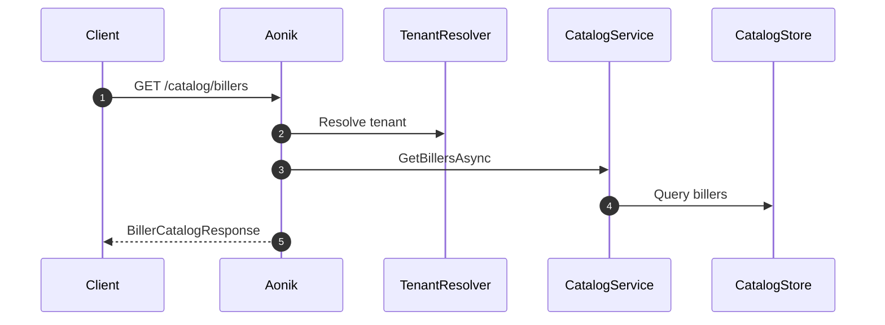

# 003.catalog-countries

## Objective
Provide catalog endpoints for countries, billers, categories, and biller service configuration so MyBillAfrica can build dynamic bill payment flows while keeping catalog data stable and referenceable from Orders.

## Scope
- `GET /catalog/countries`
- `GET /catalog/billers/categories`
- `GET /catalog/billers`
- `GET /catalog/billers/{billerId}`
- `GET /catalog/billers/{billerId}/services`
- `GET /catalog/billers/{billerId}/services/{serviceId}`

## Domain Alignment
- Catalog data is read-only reference data, not financial state.
- Orders reference catalog IDs to preserve intent and reconciliation consistency.
- Catalog entries are tenant-scoped and policy-governed (availability, pricing rules, risk tiers).

## Detailed Plan
1) Country catalog
- Serve ISO-3166-1 alpha-2 code + display name.
- Support `onlyServiceCountries=true` to return only countries with active billers.
- Order results alphabetically by name.

2) Category catalog
- Categories represent biller groupings (utility, telecom, cable, education).
- Filter by `countryCode` to surface regional offerings.
- Include stable `categoryId`, `name`, `description`, `iconUrl`.

3) Biller catalog list
- Filter by `countryCode`, `categoryId`, `search`, `page`, `pageSize`.
- Provide lightweight list response: `billerId`, `name`, `logoUrl`, `countryCode`, `categoryId`.
- Support `isActive` and `isFeatured` flags for UX curation.

4) Biller detail
- Return full metadata: `billerId`, `name`, `description`, `logoUrl`, `bannerUrl`, `supportPhone`, `supportEmail`, `countryCode`, `categoryId`.
- Include `serviceCount` and `isActive` for UI gating.

5) Biller service list
- Return `serviceId`, `name`, `type`, `currency`, `minAmount`, `maxAmount`, `isActive`.
- Include `supportsPartialPayment` and `requiresValidation` flags.

6) Biller service detail
- Return form configuration schema used by MyBillAfrica to render dynamic input fields.
- Include field-level validation, labels, and masking hints.
- Provide references to validation endpoints if pre-validation is required.

7) Observability
- Track catalog fetch usage per tenant and endpoint.
- Alert on missing or stale catalog entries referenced by Orders.

## Requirements
- Countries support `onlyServiceCountries` filter and return code + name.
- Categories are filterable by country.
- Biller list supports country, category, search, paging.
- Service detail returns configuration schema used for dynamic form fields.
- Biller detail returns name, images, description.
- Catalog items are identified by IDs to keep Orders referencing stable entities.
- All responses are tenant scoped and respect availability policy.

## API Contracts
### `GET /catalog/countries`
- Query: `onlyServiceCountries` (bool)
- Response: `CountryCatalogResponse`

### `GET /catalog/billers/categories`
- Query: `countryCode` (string)
- Response: `BillerCategoryCatalogResponse`

### `GET /catalog/billers`
- Query: `countryCode`, `categoryId`, `search`, `page`, `pageSize`
- Response: `BillerCatalogResponse`

### `GET /catalog/billers/{billerId}`
- Response: `BillerDetailResponse`

### `GET /catalog/billers/{billerId}/services`
- Response: `BillerServiceCatalogResponse`

### `GET /catalog/billers/{billerId}/services/{serviceId}`
- Response: `BillerServiceDetailResponse`

## DTO Definitions
```csharp
public record CountryCatalogResponse(
    IReadOnlyCollection<CountryItem> Countries);

public record CountryItem(
    string CountryCode,
    string Name);

public record BillerCategoryCatalogResponse(
    IReadOnlyCollection<BillerCategoryItem> Categories);

public record BillerCategoryItem(
    Guid CategoryId,
    string Name,
    string? Description,
    string? IconUrl,
    string CountryCode);

public record BillerCatalogResponse(
    IReadOnlyCollection<BillerSummaryItem> Billers,
    PaginationMetadata Pagination);

public record BillerSummaryItem(
    Guid BillerId,
    string Name,
    string? LogoUrl,
    string CountryCode,
    Guid CategoryId,
    bool IsActive,
    bool IsFeatured);

public record BillerDetailResponse(
    Guid BillerId,
    string Name,
    string? Description,
    string? LogoUrl,
    string? BannerUrl,
    string? SupportPhone,
    string? SupportEmail,
    string CountryCode,
    Guid CategoryId,
    bool IsActive,
    int ServiceCount);

public record BillerServiceCatalogResponse(
    IReadOnlyCollection<BillerServiceItem> Services);

public record BillerServiceItem(
    Guid ServiceId,
    string Name,
    string Type,
    string Currency,
    decimal? MinAmount,
    decimal? MaxAmount,
    bool SupportsPartialPayment,
    bool RequiresValidation,
    bool IsActive);

public record BillerServiceDetailResponse(
    Guid ServiceId,
    string Name,
    string Type,
    string Currency,
    decimal? MinAmount,
    decimal? MaxAmount,
    bool SupportsPartialPayment,
    bool RequiresValidation,
    IReadOnlyCollection<ServiceField> Fields,
    ServiceValidation? Validation);

public record ServiceField(
    string Key,
    string Label,
    string FieldType,
    bool Required,
    int? MinLength,
    int? MaxLength,
    string? Mask,
    string? Placeholder,
    IReadOnlyCollection<ServiceFieldOption>? Options);

public record ServiceFieldOption(
    string Value,
    string Label);

public record ServiceValidation(
    string? ValidationEndpoint,
    string? ValidationMode);

public record PaginationMetadata(
    int Page,
    int PageSize,
    int TotalCount,
    int TotalPages);
```

## Example Payloads
```json
// GET /catalog/countries
{
  "countries": [
    { "countryCode": "GH", "name": "Ghana" },
    { "countryCode": "KE", "name": "Kenya" }
  ]
}
```
```json
// GET /catalog/billers/categories?countryCode=GH
{
  "categories": [
    {
      "categoryId": "11111111-1111-1111-1111-111111111111",
      "name": "Utilities",
      "description": "Electricity and water",
      "iconUrl": "https://cdn.aonik.io/catalog/icons/utilities.png",
      "countryCode": "GH"
    }
  ]
}
```
```json
// GET /catalog/billers?countryCode=GH&page=1&pageSize=20
{
  "billers": [
    {
      "billerId": "22222222-2222-2222-2222-222222222222",
      "name": "ECG",
      "logoUrl": "https://cdn.aonik.io/billers/ecg.png",
      "countryCode": "GH",
      "categoryId": "11111111-1111-1111-1111-111111111111",
      "isActive": true,
      "isFeatured": true
    }
  ],
  "pagination": {
    "page": 1,
    "pageSize": 20,
    "totalCount": 56,
    "totalPages": 3
  }
}
```
```json
// GET /catalog/billers/2222
{
  "billerId": "22222222-2222-2222-2222-222222222222",
  "name": "ECG",
  "description": "Electricity Company of Ghana",
  "logoUrl": "https://cdn.aonik.io/billers/ecg.png",
  "bannerUrl": "https://cdn.aonik.io/billers/ecg-banner.png",
  "supportPhone": "+233200000000",
  "supportEmail": "support@ecg.com",
  "countryCode": "GH",
  "categoryId": "11111111-1111-1111-1111-111111111111",
  "isActive": true,
  "serviceCount": 2
}
```
```json
// GET /catalog/billers/2222/services
{
  "services": [
    {
      "serviceId": "33333333-3333-3333-3333-333333333333",
      "name": "Prepaid",
      "type": "prepaid",
      "currency": "GHS",
      "minAmount": 5,
      "maxAmount": 500,
      "supportsPartialPayment": false,
      "requiresValidation": true,
      "isActive": true
    }
  ]
}
```
```json
// GET /catalog/billers/2222/services/3333
{
  "serviceId": "33333333-3333-3333-3333-333333333333",
  "name": "Prepaid",
  "type": "prepaid",
  "currency": "GHS",
  "minAmount": 5,
  "maxAmount": 500,
  "supportsPartialPayment": false,
  "requiresValidation": true,
  "fields": [
    {
      "key": "meterNumber",
      "label": "Meter Number",
      "fieldType": "text",
      "required": true,
      "minLength": 6,
      "maxLength": 12,
      "mask": "############",
      "placeholder": "Enter meter number",
      "options": null
    }
  ],
  "validation": {
    "validationEndpoint": "/catalog/billers/2222/services/3333/validate",
    "validationMode": "precheck"
  }
}
```

## Validation Rules
- `countryCode` must be ISO-3166-1 alpha-2.
- `categoryId`, `billerId`, `serviceId` must be valid UUIDs.
- `page` must be >= 1 and `pageSize` between 1 and 100.
- `search` length max 100 characters.

## Error Handling
- `404 Not Found` for unknown biller or service ID.
- `400 Bad Request` for invalid filters or paging parameters.
- `403 Forbidden` when tenant context is missing or mismatched.
- `422 Unprocessable Entity` when validation schema is malformed.

## Storage and Data Flow
- Catalog data stored in dedicated reference tables per tenant.
- IDs are immutable; updates are versioned with effective dates.
- Order creation stores the `billerId` and `serviceId` snapshot for audit trace.

## Sequence Diagram (Catalog Fetch)
```text
Client -> Aonik: GET /catalog/billers
Aonik -> TenantResolver: resolve tenant
Aonik -> CatalogService: GetBillersAsync
CatalogService -> CatalogStore: filter + page
Aonik -> Client: BillerCatalogResponse
```

## Mermaid Sequence Diagram


## Application Services
- CatalogService.GetCountriesAsync
- CatalogService.GetBillCategoriesAsync
- CatalogService.GetBillersAsync
- CatalogService.GetBillerDetailAsync
- CatalogService.GetBillerServicesAsync
- CatalogService.GetBillerServiceDetailAsync

## Acceptance Criteria
- Pagination metadata matches MyBillAfrica expectations.
- Service configuration supports required/label/type fields.
- All endpoints are tenant scoped.
- Orders can persist catalog IDs for audit trace.
