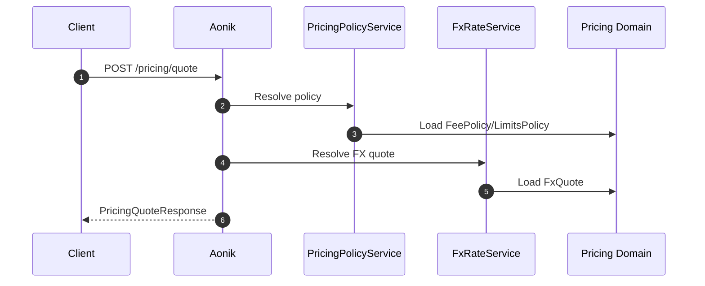

# 004.pricing-fx

## Objective
Expose a pricing and FX quote endpoint that replaces MTM charge calculation with a policy-driven, auditable flow for MyBillAfrica bill payments.

## Scope
- `POST /pricing/quote`
- Pricing policy evaluation for bill payment corridors.
- FX rate sourcing and markup application.
- Fee calculation with consistent rounding behavior.

## Existing AONIK Primitives (Targeted)
- `FxQuote` in `Aonik.Domain.Pricing.Entities` for stored FX quotes.
- `FeePolicy` and `LimitsPolicy` in `Aonik.Domain.Pricing.Entities` for pricing constraints.
- Money/currency metadata with decimal precision for rounding.
- Orders and Payments consume pricing outputs but do not compute them.

## Detailed Plan
1) Quote input validation
- Validate origin/destination currencies, amount, service code, and corridor country pair.
- Enforce that only one of destinationAmount or originAmount is provided.
- Resolve tenant context for policy selection.

2) Pricing policy selection
- Select applicable pricing policy by tenant, service code, corridor, and customer tier.
- Support default policy fallback when tenant-specific rules do not exist.
- Persist policy version metadata for auditability.

3) FX rate evaluation
- Resolve base FX rate for the currency pair.
- Apply FX markup or spread defined by policy.
- Capture rate source metadata and timestamp.

4) Fee calculation
- Apply fixed and percentage fees from policy.
- Support minimum and maximum fee caps.
- Calculate fees in origin currency with rounding applied after each component.

5) Totals and rounding
- Derive originAmount, destinationAmount, feesTotal, and totalAmount.
- Use currency-specific decimal precision and rounding mode.
- Ensure UI parity with MyBillAfrica rounding behavior.

6) Quote metadata and audit
- Include pricingPolicyId, pricingPolicyVersion, fxRateId, rateTimestamp.
- Emit pricing audit event for each quote request.
- Store optional fee breakdown for transparency.

## Requirements
- Input supports destinationAmount or originAmount (exactly one).
- Input requires originCurrency, destinationCurrency, originCountry, destinationCountry, serviceCode.
- Output includes exchangeRate, rateMarkup, feesTotal, totalAmount, destinationAmount, originAmount.
- Output includes pricingPolicyId, pricingPolicyVersion, fxRateId, and rateTimestamp.
- Response includes fee breakdown metadata when policy supplies line items.
- Pricing is policy-driven and auditable; no UI-side calculation of totals.
- Quotes do not mutate financial state; they are informational only.

## API Contracts
- `POST /pricing/quote`
  - Request: `originCurrency`, `destinationCurrency`, `originCountry`, `destinationCountry`, `serviceCode`, `destinationAmount?`, `originAmount?`, `customerId?`, `quoteContext?`
  - Response: `pricingQuoteId`, `exchangeRate`, `rateMarkup`, `feesTotal`, `totalAmount`, `originAmount`, `destinationAmount`, `pricingPolicyId`, `pricingPolicyVersion`, `fxRateId`, `rateTimestamp`, `feeBreakdown[]`

## DTO Definitions
```csharp
public record PricingQuoteRequest(
    string OriginCurrency,
    string DestinationCurrency,
    string OriginCountry,
    string DestinationCountry,
    string ServiceCode,
    decimal? DestinationAmount,
    decimal? OriginAmount,
    Guid? CustomerId,
    string? QuoteContext);

public record PricingQuoteResponse(
    Guid PricingQuoteId,
    decimal ExchangeRate,
    decimal RateMarkup,
    decimal FeesTotal,
    decimal TotalAmount,
    decimal OriginAmount,
    decimal DestinationAmount,
    Guid PricingPolicyId,
    string PricingPolicyVersion,
    Guid FxRateId,
    DateTimeOffset RateTimestamp,
    IReadOnlyCollection<FeeBreakdownItem> FeeBreakdown);

public record FeeBreakdownItem(
    string Code,
    string Description,
    decimal Amount,
    string Currency,
    string CalculationType);
```

## Example Payloads
```json
// POST /pricing/quote (destination amount)
{
  "originCurrency": "USD",
  "destinationCurrency": "KES",
  "originCountry": "US",
  "destinationCountry": "KE",
  "serviceCode": "BILLPAY",
  "destinationAmount": 12000,
  "customerId": "11111111-1111-1111-1111-111111111111",
  "quoteContext": "checkout"
}
```
```json
{
  "pricingQuoteId": "22222222-2222-2222-2222-222222222222",
  "exchangeRate": 150.25,
  "rateMarkup": 0.015,
  "feesTotal": 2.75,
  "totalAmount": 82.75,
  "originAmount": 80.0,
  "destinationAmount": 12000,
  "pricingPolicyId": "33333333-3333-3333-3333-333333333333",
  "pricingPolicyVersion": "2026-01-15",
  "fxRateId": "44444444-4444-4444-4444-444444444444",
  "rateTimestamp": "2026-01-24T10:15:00Z",
  "feeBreakdown": [
    {
      "code": "SERVICE_FEE",
      "description": "Bill payment service fee",
      "amount": 2.0,
      "currency": "USD",
      "calculationType": "Fixed"
    },
    {
      "code": "FX_MARKUP",
      "description": "FX spread",
      "amount": 0.75,
      "currency": "USD",
      "calculationType": "Percentage"
    }
  ]
}
```

## Pricing Policy Rules
- Policies are selected by tenant, serviceCode, corridor, and customer tier.
- Policies may define fixed fees, percentage fees, and caps.
- Policies define FX markup/spread applied to base rate.
- Policies are versioned; responses include version metadata.

## Example Policies
```json
// FeePolicy (bill payment corridor)
{
  "name": "BillPay-US-KE-Default",
  "fixedFee": 2.0,
  "percentageFee": 0.025,
  "conditions": {
    "serviceCode": "BILLPAY",
    "originCountry": "US",
    "destinationCountry": "KE",
    "originCurrency": "USD",
    "destinationCurrency": "KES",
    "customerTier": "Retail",
    "minFee": 1.5,
    "maxFee": 10.0
  },
  "isActive": true
}
```
```json
// LimitsPolicy (daily corridor limit)
{
  "scopeType": "Customer",
  "scopeId": "11111111-1111-1111-1111-111111111111",
  "maxAmount": 1000.0,
  "period": "Daily",
  "currency": "USD",
  "isActive": true
}
```
```json
// FX markup policy (policy metadata)
{
  "serviceCode": "BILLPAY",
  "originCountry": "US",
  "destinationCountry": "KE",
  "markupBps": 150,
  "rateProvider": "ReferenceRate",
  "effectiveFrom": "2026-01-01"
}
```

## Example Policy Schemas
```json
// FeePolicy schema
{
  "name": "string",
  "fixedFee": "decimal",
  "percentageFee": "decimal",
  "conditions": {
    "serviceCode": "string",
    "originCountry": "string",
    "destinationCountry": "string",
    "originCurrency": "string",
    "destinationCurrency": "string",
    "customerTier": "string",
    "minFee": "decimal",
    "maxFee": "decimal"
  },
  "isActive": "boolean"
}
```
```json
// LimitsPolicy schema
{
  "scopeType": "string",
  "scopeId": "guid|null",
  "maxAmount": "decimal",
  "period": "string",
  "currency": "string",
  "isActive": "boolean"
}
```
```json
// FX markup policy schema
{
  "serviceCode": "string",
  "originCountry": "string",
  "destinationCountry": "string",
  "markupBps": "integer",
  "rateProvider": "string",
  "effectiveFrom": "date"
}
```

## Worked Example (End-to-End)
```text
Input
- Origin: USD (US)
- Destination: KES (KE)
- Service: BILLPAY
- DestinationAmount: 12,000

Policy selection
- FeePolicy: BillPay-US-KE-Default
- FX markup: 150 bps

FX evaluation
- Base rate: 148.00
- Markup: 1.50% -> Effective rate 150.22

Amount conversion
- OriginAmount = 12,000 / 150.22 = 79.88 USD

Fees
- FixedFee: 2.00 USD
- PercentageFee: 2.5% of 79.88 = 2.00 USD
- FeesTotal = 4.00 USD

Totals
- TotalAmount (origin + fees) = 83.88 USD
- DestinationAmount = 12,000 KES

Output summary
- exchangeRate: 150.22
- originAmount: 79.88
- feesTotal: 4.00
- totalAmount: 83.88
```

## Worked Example (Test Fixture)
```json
{
  "case": "BillPay_US_KE_Default",
  "input": {
    "originCurrency": "USD",
    "destinationCurrency": "KES",
    "originCountry": "US",
    "destinationCountry": "KE",
    "serviceCode": "BILLPAY",
    "destinationAmount": 12000
  },
  "policy": {
    "fixedFee": 2.0,
    "percentageFee": 0.025,
    "markupBps": 150,
    "minFee": 1.5,
    "maxFee": 10.0
  },
  "fx": {
    "baseRate": 148.0,
    "effectiveRate": 150.22
  },
  "expected": {
    "originAmount": 79.88,
    "feesTotal": 4.0,
    "totalAmount": 83.88,
    "destinationAmount": 12000
  }
}
```

## Validation Matrix
```text
Case: Both amounts provided
- Input: originAmount + destinationAmount
- Expected: Validation error (exactly one amount required)

Case: Neither amount provided
- Input: originAmount = null, destinationAmount = null
- Expected: Validation error

Case: Unsupported currency
- Input: originCurrency = "XXX"
- Expected: Validation error (unknown currency)

Case: Zero-decimal currency (e.g., JPY)
- Input: destinationCurrency = "JPY"
- Expected: Round destinationAmount to 0 decimals, originAmount rounded to origin currency precision

Case: Fee min cap applied
- Input: percentage fee produces 0.25, minFee = 1.5
- Expected: fee component = 1.5

Case: Fee max cap applied
- Input: percentage fee produces 25.0, maxFee = 10.0
- Expected: fee component = 10.0

Case: FX quote expired
- Input: fxRate expiresAt < now
- Expected: Fetch new rate or return validation error (policy dependent)
```

## xUnit-Style Test Cases (PricingService)
```csharp
public class PricingServiceTests
{
    [Fact]
    public async Task GetBillPaymentQuoteAsync_Should_ReturnTotals_When_DestinationAmountProvided()
    {
        // Arrange
        var request = new PricingQuoteRequest(
            OriginCurrency: "USD",
            DestinationCurrency: "KES",
            OriginCountry: "US",
            DestinationCountry: "KE",
            ServiceCode: "BILLPAY",
            DestinationAmount: 12000m,
            OriginAmount: null,
            CustomerId: Guid.NewGuid(),
            QuoteContext: "checkout");

        var service = CreateService();

        // Act
        var response = await service.GetBillPaymentQuoteAsync(request);

        // Assert
        response.DestinationAmount.Should().Be(12000m);
        response.OriginAmount.Should().BeGreaterThan(0m);
        response.TotalAmount.Should().BeGreaterThan(response.OriginAmount);
        response.PricingPolicyId.Should().NotBe(Guid.Empty);
    }

    [Fact]
    public async Task GetBillPaymentQuoteAsync_Should_Throw_When_BothAmountsProvided()
    {
        // Arrange
        var request = new PricingQuoteRequest(
            OriginCurrency: "USD",
            DestinationCurrency: "KES",
            OriginCountry: "US",
            DestinationCountry: "KE",
            ServiceCode: "BILLPAY",
            DestinationAmount: 12000m,
            OriginAmount: 80m,
            CustomerId: Guid.NewGuid(),
            QuoteContext: "checkout");

        var service = CreateService();

        // Act
        var action = () => service.GetBillPaymentQuoteAsync(request);

        // Assert
        await action.Should().ThrowAsync<InvalidOperationException>();
    }

    [Fact]
    public async Task GetBillPaymentQuoteAsync_Should_Throw_When_NoAmountProvided()
    {
        // Arrange
        var request = new PricingQuoteRequest(
            OriginCurrency: "USD",
            DestinationCurrency: "KES",
            OriginCountry: "US",
            DestinationCountry: "KE",
            ServiceCode: "BILLPAY",
            DestinationAmount: null,
            OriginAmount: null,
            CustomerId: Guid.NewGuid(),
            QuoteContext: "checkout");

        var service = CreateService();

        // Act
        var action = () => service.GetBillPaymentQuoteAsync(request);

        // Assert
        await action.Should().ThrowAsync<InvalidOperationException>();
    }
}
```

## FX Rate Rules
- Base rate sourced from configured provider (bank rate or reference rate).
- Rate validity is time-bound; return the provider timestamp.
- FX markup applies on top of the base rate, not the destination amount.
- FX rate + markup are persisted for audit trails.

## Rounding Rules
- Use ISO currency decimals for rounding (e.g., 2 for USD, 0 for KES where applicable).
- Round fees per component before summing totals.
- Round final originAmount and destinationAmount to their respective currency precision.
- Rounding mode is consistent with MyBillAfrica UI (documented in policy config).

## Error Handling
- Return validation errors for missing corridor or mismatched currencies.
- Reject requests with both amounts or neither amount.
- Reject unsupported service codes or unknown currencies.

## Sequence Diagram (Quote Flow)
```text
Client -> Aonik: POST /pricing/quote
Aonik -> PricingPolicyService: Resolve policy (tenant + corridor + service)
PricingPolicyService -> Pricing Domain: FeePolicy, LimitsPolicy
Aonik -> FxRateService: Get FX quote
FxRateService -> Pricing Domain: FxQuote
Aonik -> Client: PricingQuoteResponse
```

## Mermaid Sequence Diagram


## Service Interfaces
```csharp
public interface IPricingService
{
    Task<PricingQuoteResponse> GetBillPaymentQuoteAsync(
        PricingQuoteRequest request,
        CancellationToken cancellationToken = default);
}
```

## Application Services
- PricingService.GetBillPaymentQuoteAsync
- PricingPolicyService.ResolvePolicyAsync
- FxRateService.GetRateAsync

## Acceptance Criteria
- Quote response includes all pricing fields required for checkout.
- Pricing output matches MyBillAfrica UI totals for known test cases.
- FX rate and policy metadata are captured for audit.
- Fee breakdown is returned when policy defines line items.
- Quote does not mutate financial state or ledger entries.
