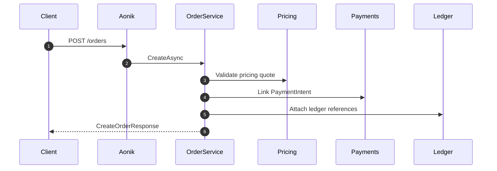

# 005.orders-intent

## Objective
Define multi-type order intent APIs for MyBillAfrica, with bill payment as the initial focus while supporting bank transfers and cash collection through a typed details model.

## Scope
- `POST /orders/validate-duplicate`
- `POST /orders`
- `GET /orders/{orderId}`
- `GET /orders`
- Order intent persistence with immutable intent fields after issuance.
- Read models that include biller or beneficiary detail and payment status.

## Existing AONIK Primitives (Targeted)
- `Order` (new entity or module-aligned model under `Aonik.Domain.Orders`).
- `PaymentIntent` linkage for funding intent.
- `Payout` linkage for fulfillment intent.
- Ledger references (journal/entry ids) attached to the order for audit.
- `PricingQuote` outputs for fee + FX components.

## Order Types
- `BillPayment`
- `BankTransfer`
- `CashCollection`
- Additional types can be added without changing base order fields.

## Detailed Plan
1) Duplicate detection criteria
- Use an idempotency key per type:
- Base: tenantId + customerId + orderType + serviceCode + amount + currency + date window
- BillPayment: + billerId + billReference
- BankTransfer: + destinationAccountId or destinationAccountNumber
- CashCollection: + recipientId or pickupToken
- Date window defaults to 24 hours unless overridden by policy.
- Return the existing order when a duplicate is found; otherwise return null.

2) Order intent creation (base)
- Validate required fields: tenantId, customerId, orderType, serviceCode, amounts, currency.
- Capture pricing fields from pricing quote: exchangeRate, rateMarkup, feesTotal, feeBreakdown, totalAmount.
- Capture parties: payer (customer), payee (biller or beneficiary), beneficiary if applicable.
- Assign immutable identifiers: orderId, orderNumber, invoiceId.

3) Order intent creation (type-specific)
- BillPayment details: billerId, billReference, billerAccountId?, billerCategory?, billerCountry?
- BankTransfer details: destinationAccountId?, destinationAccountNumber, destinationBankCode, destinationCountry, purpose?
- CashCollection details: recipientId, pickupLocation?, pickupToken?, senderId?

4) Issuance and immutability rules
- Orders are created in Draft; issuance occurs when order is confirmed by client or policy.
- Once issued, intent fields are immutable (type, serviceCode, parties, amounts, currency, type-specific details).
- Payment status may evolve independently without mutating intent fields.

5) Read model enrichment
- Order detail returns type-specific metadata (biller or beneficiary summary).
- Include payment status derived from PaymentIntent (e.g., Pending, Authorized, Settled, Failed).
- Include payout status when applicable (e.g., Queued, Sent, Confirmed).

6) Listing and filters
- Support filters: customerId, status, orderType, serviceCode, dateFrom, dateTo, billerId?, billReference?
- Support paging with pageNumber + pageSize and return totalCount.
- Default sort: most recent order first.

7) Auditability and traceability
- Store pricing policy metadata and fx rate identifiers for each order.
- Link ledger references by storing journalId and entry ids on the order.
- Preserve idempotency results and issuedBy metadata for audit.

## Requirements
- Order creation captures type, serviceCode, parties, amounts, fees, and FX metadata.
- Duplicate validation uses type-specific keys and returns the existing order if a duplicate is found.
- Order detail includes type-specific metadata and payment status.
- Order list supports filters by customerId, status, orderType, date range, and paging.
- Orders represent intent only and are immutable once issued.
- Orders link to PaymentIntents, Payouts, and ledger references (not vice versa).
- Responses include orderNumber and invoiceId.
- All responses include orderId and tenantId for traceability.

## API Contracts
- `POST /orders/validate-duplicate`
  - Request: `customerId`, `orderType`, `serviceCode`, `amount`, `currency`, `details`, `requestedAt?`
  - Response: `orderId?`, `orderNumber?`, `invoiceId?`, `status?`, `createdAt?`
- `POST /orders`
  - Request: `customerId`, `orderType`, `serviceCode`, `amount`, `currency`, `pricingQuoteId`,
             `feeBreakdown?`, `exchangeRate?`, `rateMarkup?`, `feesTotal?`, `totalAmount?`,
             `payer?`, `payee?`, `details`, `metadata?`
  - Response: `orderId`, `orderNumber`, `invoiceId`, `status`, `createdAt`, `paymentStatus?`
- `GET /orders/{orderId}`
  - Response: `orderId`, `orderNumber`, `invoiceId`, `status`, `paymentStatus`,
              `orderType`, `serviceCode`, `details`, `amounts`, `fees`, `fx`,
              `paymentIntentId?`, `payoutId?`, `ledgerReference?`
- `GET /orders`
  - Query: `customerId?`, `status?`, `orderType?`, `serviceCode?`, `dateFrom?`, `dateTo?`, `pageNumber?`, `pageSize?`
  - Response: `items[]`, `totalCount`, `pageNumber`, `pageSize`

## DTO Definitions
```csharp
public record ValidateDuplicateOrderRequest(
    Guid CustomerId,
    string OrderType,
    string ServiceCode,
    decimal Amount,
    string Currency,
    OrderDetails Details,
    DateTimeOffset? RequestedAt);

public record CreateOrderRequest(
    Guid CustomerId,
    string OrderType,
    string ServiceCode,
    decimal Amount,
    string Currency,
    Guid PricingQuoteId,
    decimal? ExchangeRate,
    decimal? RateMarkup,
    decimal? FeesTotal,
    decimal? TotalAmount,
    IReadOnlyCollection<FeeBreakdownItem>? FeeBreakdown,
    PartyRef? Payer,
    PartyRef? Payee,
    OrderDetails Details,
    IReadOnlyDictionary<string, string>? Metadata);

public record OrderDetails(
    BillPaymentDetails? BillPayment,
    BankTransferDetails? BankTransfer,
    CashCollectionDetails? CashCollection);

public record BillPaymentDetails(
    Guid BillerId,
    string BillReference,
    Guid? BillerAccountId,
    string? BillerCategory,
    string? BillerCountry);

public record BankTransferDetails(
    Guid? DestinationAccountId,
    string DestinationAccountNumber,
    string DestinationBankCode,
    string DestinationCountry,
    string? Purpose);

public record CashCollectionDetails(
    Guid RecipientId,
    string? PickupLocation,
    string? PickupToken,
    Guid? SenderId);
```

## Example Payloads
```json
// POST /orders/validate-duplicate
{
  "customerId": "11111111-1111-1111-1111-111111111111",
  "orderType": "BillPayment",
  "serviceCode": "BILLPAY",
  "amount": 12000,
  "currency": "KES",
  "details": {
    "billPayment": {
      "billerId": "22222222-2222-2222-2222-222222222222",
      "billReference": "ACC-00991234"
    }
  },
  "requestedAt": "2026-01-24T09:20:00Z"
}
```
```json
{
  "orderId": "33333333-3333-3333-3333-333333333333",
  "orderNumber": "ORD-2026-000042",
  "invoiceId": "INV-2026-000042",
  "status": "Issued",
  "createdAt": "2026-01-24T09:21:00Z"
}
```
```json
// POST /orders (bill payment)
{
  "customerId": "11111111-1111-1111-1111-111111111111",
  "orderType": "BillPayment",
  "serviceCode": "BILLPAY",
  "amount": 12000,
  "currency": "KES",
  "pricingQuoteId": "44444444-4444-4444-4444-444444444444",
  "exchangeRate": 150.22,
  "rateMarkup": 0.015,
  "feesTotal": 4.0,
  "totalAmount": 83.88,
  "details": {
    "billPayment": {
      "billerId": "22222222-2222-2222-2222-222222222222",
      "billReference": "ACC-00991234"
    }
  }
}
```
```json
{
  "orderId": "33333333-3333-3333-3333-333333333333",
  "orderNumber": "ORD-2026-000042",
  "invoiceId": "INV-2026-000042",
  "status": "Issued",
  "createdAt": "2026-01-24T09:21:00Z",
  "paymentStatus": "Pending"
}
```

## Validation Matrix
```text
Case: BillPayment missing billReference
- Input: orderType=BillPayment, billReference empty
- Expected: validation error

Case: BankTransfer missing destinationAccountNumber
- Input: orderType=BankTransfer, destinationAccountNumber empty
- Expected: validation error

Case: CashCollection missing recipientId
- Input: orderType=CashCollection, recipientId null
- Expected: validation error

Case: Duplicate order within window
- Input: same customerId + orderType + type keys + amount + currency within 24h
- Expected: existing order returned
```

## Implementation Checklist
- Define `OrderType` enum and allowed values.
- Add order details model with per-type validation rules.
- Implement `ValidateDuplicateAsync` using type-specific idempotency keys.
- Implement `CreateAsync` with pricing metadata capture.
- Enforce immutability of intent fields after issuance.
- Add list filtering for `orderType` and `serviceCode`.
- Ensure responses include `orderNumber` and `invoiceId`.
- Add tests for each order type validation case.

## xUnit-Style Test Cases (OrderService)
```csharp
public class OrderServiceTests
{
    [Fact]
    public async Task CreateAsync_Should_CreateIssuedOrder_WithPricingMetadata()
    {
        // Arrange
        var request = new CreateOrderRequest(
            CustomerId: Guid.NewGuid(),
            OrderType: "BillPayment",
            ServiceCode: "BILLPAY",
            Amount: 12000m,
            Currency: "KES",
            PricingQuoteId: Guid.NewGuid(),
            ExchangeRate: 150.22m,
            RateMarkup: 0.015m,
            FeesTotal: 4.0m,
            TotalAmount: 83.88m,
            FeeBreakdown: Array.Empty<FeeBreakdownItem>(),
            Payer: null,
            Payee: null,
            Details: new OrderDetails(
                BillPayment: new BillPaymentDetails(
                    BillerId: Guid.NewGuid(),
                    BillReference: "ACC-00991234",
                    BillerAccountId: null,
                    BillerCategory: null,
                    BillerCountry: null),
                BankTransfer: null,
                CashCollection: null),
            Metadata: null);

        var service = CreateService();

        // Act
        var response = await service.CreateAsync(request);

        // Assert
        response.OrderId.Should().NotBe(Guid.Empty);
        response.OrderNumber.Should().NotBeNullOrWhiteSpace();
        response.InvoiceId.Should().NotBeNullOrWhiteSpace();
        response.Status.Should().Be("Issued");
    }

    [Fact]
    public async Task ValidateDuplicateAsync_Should_ReturnExistingOrder_When_DuplicateFound()
    {
        // Arrange
        var request = new ValidateDuplicateOrderRequest(
            CustomerId: Guid.NewGuid(),
            OrderType: "BillPayment",
            ServiceCode: "BILLPAY",
            Amount: 12000m,
            Currency: "KES",
            Details: new OrderDetails(
                BillPayment: new BillPaymentDetails(
                    BillerId: Guid.NewGuid(),
                    BillReference: "ACC-00991234",
                    BillerAccountId: null,
                    BillerCategory: null,
                    BillerCountry: null),
                BankTransfer: null,
                CashCollection: null),
            RequestedAt: DateTimeOffset.UtcNow);

        var service = CreateService();

        // Act
        var response = await service.ValidateDuplicateAsync(request);

        // Assert
        response.OrderId.Should().NotBeNull();
    }
}
```

## Sequence Diagram (Order Creation)
```text
Client -> Aonik: POST /orders
Aonik -> OrderService: Validate + create order intent
OrderService -> Pricing: Verify pricing quote metadata
OrderService -> Payment: Create or link PaymentIntent
OrderService -> Ledger: Create reference entries
OrderService -> Client: Order response with references
```

## Mermaid Sequence Diagram


## Service Interfaces
```csharp
public interface IOrderService
{
    Task<ValidateDuplicateOrderResponse> ValidateDuplicateAsync(
        ValidateDuplicateOrderRequest request,
        CancellationToken cancellationToken = default);

    Task<CreateOrderResponse> CreateAsync(
        CreateOrderRequest request,
        CancellationToken cancellationToken = default);

    Task<OrderDetailResponse?> GetAsync(
        Guid orderId,
        CancellationToken cancellationToken = default);

    Task<OrderListResponse> ListAsync(
        OrderListQuery query,
        CancellationToken cancellationToken = default);
}

public record OrderListQuery(
    Guid? CustomerId,
    string? Status,
    string? OrderType,
    string? ServiceCode,
    DateTimeOffset? DateFrom,
    DateTimeOffset? DateTo,
    int PageNumber,
    int PageSize);
```

## Error Handling
- Return validation errors for missing type-specific details or pricingQuoteId.
- Reject create requests with negative or zero amounts.
- Reject updates to issued orders (immutable intent fields).
- Return null for not found in GetAsync.

## Acceptance Criteria
- Order creation returns orderId, orderNumber, invoiceId, and issued status.
- Duplicate validation respects orderType-specific keys.
- List endpoint supports orderType/serviceCode filters.
- Order detail exposes type-specific details and linked references.
- Orders remain intent-only; payments and ledger entries are linked, not embedded.
