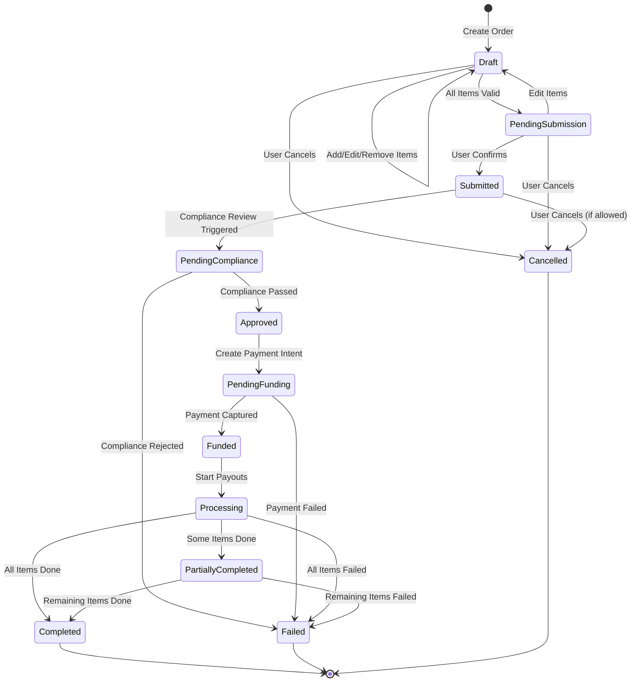
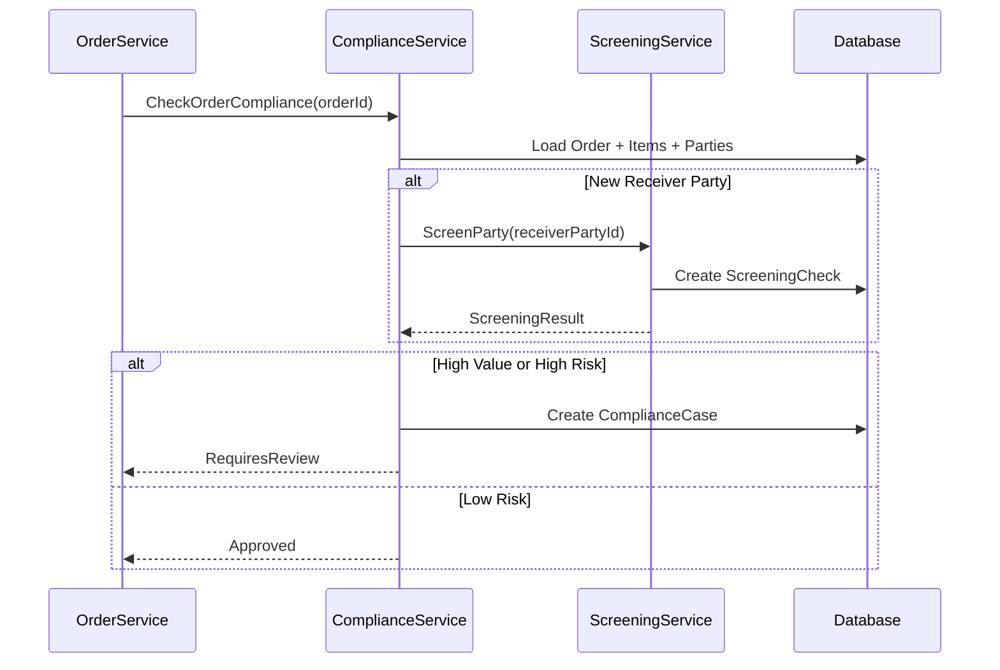
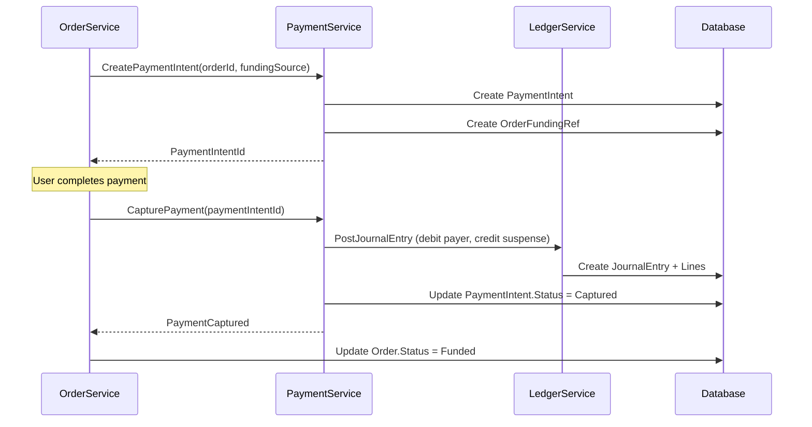
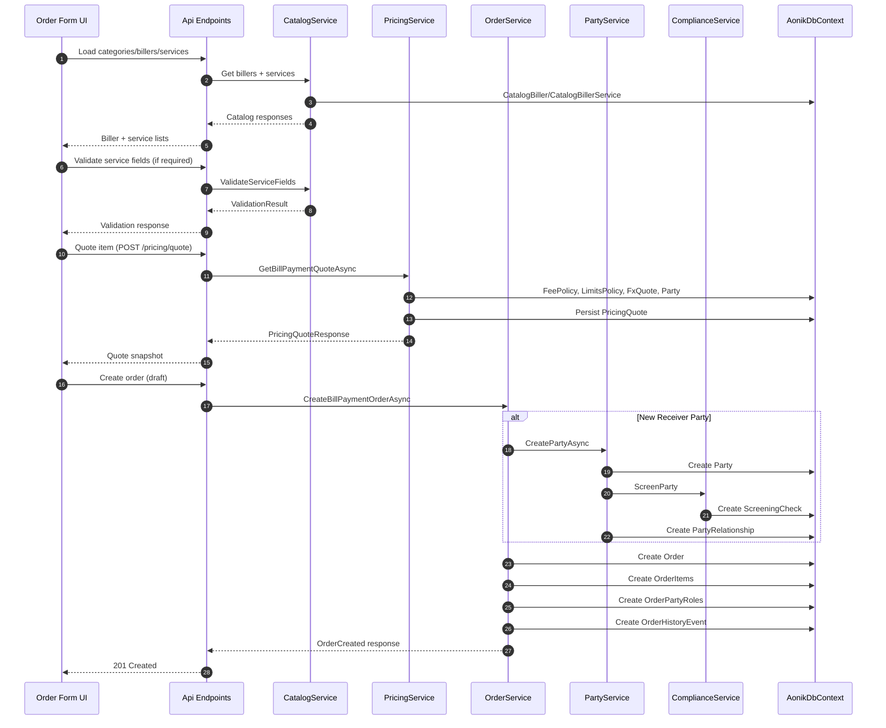
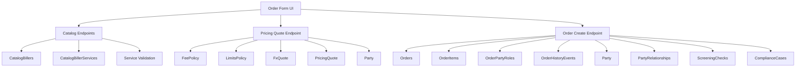

# Create Bill Payment Order Specification

## Purpose
Define the requirements and UI flow for creating a bill payment order that supports multiple bill pay items. The form uses four functional cards (2x2 grid) and a fifth basket card on the far right that auto-updates as items are added or edited.

## Goals
- Capture bill payment intent as Orders (not Payments), consistent with AONIK order-first architecture.
- Support one order with multiple bill pay items (cart-style behavior).
- Allow receiver selection with ad-hoc creation and relationship mapping to the payer.
- Provide real-time pricing quotes (read-only) without mutating financial state.

## Non-Goals
- Executing payments or posting ledger entries.
- Final settlement or payout orchestration.
- Defining AI agent workflows (separate spec).

## Layout Summary
- Left area: 2x2 grid of functional cards.
- Far right: basket card spanning both rows.
- Each item added to the basket becomes a bill pay line within a single order draft.

## Card 1: Biller Discovery (Top-Left)
Purpose: Choose the biller corridor and service.

Inputs
- Country/corridor selection (destination country)
- Biller category
- Biller search and selection
- Service selection

Data Sources
- Catalog categories: `GET /catalog/biller-categories`
- Billers list: `GET /catalog/billers`
- Biller services: `GET /catalog/billers/{billerId}/services`
- Service detail for required fields: `GET /catalog/billers/{billerId}/services/{serviceId}`

Outputs
- `billerId`, `serviceId`, `serviceCode`, `destinationCountry`, `destinationCurrency`

## Card 2: Customer & Account (Top-Right)
Purpose: Identify payer and biller-required account fields.

Inputs
- Payer selection (existing party/customer)
- Customer tier (optional, auto-resolve from party if empty)
- Service fields (from service detail), including account/reference numbers
- Optional validation trigger if `RequiresValidation = true`

Data Sources
- Service field validation: `POST /catalog/billers/{billerId}/services/{serviceId}/validate`

Outputs
- `payerPartyId`
- `customerId` (optional)
- `customerTier` (optional)
- `serviceFieldValues` (key/value)
- `validationResult` (if validation was triggered)

## Card 3: Amounts & Funding (Bottom-Left)
Purpose: Capture amounts and request pricing quote.

Inputs
- Amount mode toggle: origin or destination
- Amount value
- Origin currency (payer currency)
- Funding source (wallet/bank reference, if applicable)
- Quote context (optional label for channel/source)
- Quote action

Data Sources
- Pricing quote: `POST /pricing/quote` (read-only)

Outputs
- `originAmount` or `destinationAmount`
- `originCurrency`
- `pricingQuoteId`, `fxRateId`, `feesTotal`, `totalAmount`, `exchangeRate`
- `rateTimestamp` (FX rate timestamp from pricing response)
- `quoteExpiresAt` (timestamp for quote validity)
- `fundingSourceRef` (placeholder for PaymentIntent)

## Card 4: Receiver & Compliance (Bottom-Right)
Purpose: Capture receiver details and relationship mapping.

Inputs
- Receiver option: same as payer or different
- Receiver selection (existing party) or create new party inline
- Relationship type between payer and receiver (e.g., Mother, Spouse, Friend)
- Purpose / payout reason
- Notes / compliance metadata (freeform + structured)

Outputs
- `receiverPartyId` (existing or newly created)
- `relationshipTypeCode`
- `purposeCode`, `notes`, `provenanceJson`

## Basket Card (Far Right, Spans Both Rows)
Purpose: Shopping basket for bill pay items and order-level actions.

Behavior
- Auto-updates as any card inputs change.
- Shows item draft state, validation errors, and pricing quote status.
- Supports multiple bill pay items per order.
- Displays quote expiry warnings when quotes are near expiration.

Contents
- Items list with:
  - Biller + service name
  - Account reference summary
  - Payer + receiver names
  - Amounts, fees, totals, exchange rate
  - Quote timestamp, expiry status, and policy metadata
- Order totals (sum of item totals + fees)
- Actions:
  - Add item to basket
  - Edit item
  - Remove item
  - Refresh quote (for expired quotes)
  - Create order (disabled until all items valid and quotes current)

## Multi-Item Order Requirements
- The form represents a single order draft containing multiple bill pay items.
- Each item carries its own pricing quote snapshot and service field values.
- Basket totals are derived from item totals; no re-quoting at basket level.
- Editing an item re-runs its quote; basket totals update instantly.

## Order Creation Requirements
- Create an `Order` with `OrderType = "BillPayment"` and status `Draft`.
- Persist item-level data in a generic order item entity (see Data Model Changes).
- Attach `OrderPartyRole` entries:
  - `Payer` (order-level, one per order)
  - `Receiver` (per item, linked via OrderItemId)
- Persist pricing metadata on each item and optionally aggregate at order level.
- Aggregate item totals into existing `Order` amounts for queryability:
  - `Order.AmountIn` = sum of item `AmountIn`
  - `Order.AmountOut` = sum of item `AmountOut`
  - `Order.CurrencyIn` = payer/origin currency
  - `Order.CurrencyOut` = destination currency when single-currency; null if mixed
  - `Order.FeesJson` = JSON array of item fee totals and breakdowns
  - `Order.FxQuoteId` = nullable; only set when all items share the same FX quote
- Create `OrderHistoryEvent` entry for `OrderCreated` with actor metadata.
- All entities are tenant-scoped via `ITenantScoped` interface and `TenantId` property.

## Receiver Creation and Relationship Mapping
- If receiver is not an existing party, create a new Party record inline.
- Trigger compliance screening for newly created receiver parties.
- Create a relationship entry linking payer to receiver with a controlled type code.
- Store the relationship reference (or code) with the item details for audit.

---

## Data Model Changes

### 1) Party Relationship (New Entity)
Add a Party relationship entity to support payer-to-receiver mapping.

**Entity: `PartyRelationship`**
```csharp
public class PartyRelationship : AuditableEntity, ITenantScoped
{
    public Guid TenantId { get; set; }
    public Guid FromPartyId { get; set; }  // payer
    public Guid ToPartyId { get; set; }    // receiver
    public string RelationshipTypeCode { get; set; } = string.Empty;
    public bool IsActive { get; set; } = true;
    public string? Notes { get; set; }
}
```

**DbContext Addition:**
```csharp
DbSet<PartyRelationship> PartyRelationships { get; set; }
```

**Reference Data:**
Add `RelationshipType` entries to `ReferenceDataItem`:
- Type: `RelationshipType`
- Codes: `Self`, `Mother`, `Father`, `Spouse`, `Sibling`, `Child`, `Friend`, `Business`, `Other`

### 2) Order Items (New Entity)
Add a generic order item entity so Orders can support multiple OrderTypes.

**Entity: `OrderItem`**
```csharp
public class OrderItem : AuditableEntity, ITenantScoped
{
    public Guid TenantId { get; set; }
    public Guid OrderId { get; set; }
    public string ItemType { get; set; } = string.Empty;  // e.g., "BillPaymentLine"
    public int ItemIndex { get; set; }  // sequence within order
    public string DetailsJson { get; set; } = "{}";
    public string Status { get; set; } = string.Empty;  // Draft, Valid, Invalid
    public Guid? ReceiverPartyId { get; set; }  // denormalized for queries
    public decimal AmountIn { get; set; }
    public string CurrencyIn { get; set; } = string.Empty;
    public decimal AmountOut { get; set; }
    public string CurrencyOut { get; set; } = string.Empty;
    public decimal FeesTotal { get; set; }
    public Guid? PricingQuoteId { get; set; }
}
```

**DbContext Addition:**
```csharp
DbSet<OrderItem> OrderItems { get; set; }
```

**Bill Payment Item Payload** (stored in `OrderItem.DetailsJson`):
```json
{
  "billerId": "guid",
  "billerName": "string",
  "serviceId": "guid",
  "serviceCode": "string",
  "serviceName": "string",
  "serviceFieldValues": { "accountNumber": "123456", "customerName": "John" },
  "validationResult": { "isValid": true, "validatedAt": "iso-datetime" },
  "payerPartyId": "guid",
  "receiverPartyId": "guid",
  "relationshipTypeCode": "string",
  "purposeCode": "string",
  "notes": "string",
  "pricingSnapshot": {
    "pricingQuoteId": "guid",
    "fxRateId": "guid",
    "exchangeRate": 150.25,
    "rateMarkup": 0.02,
    "pricingPolicyId": "guid",
    "pricingPolicyVersion": "string",
    "rateTimestamp": "iso-datetime",
    "quoteTimestamp": "iso-datetime",
    "quoteExpiresAt": "iso-datetime",
    "feeBreakdown": [
      {
        "code": "FIXED_FEE",
        "description": "Fixed fee",
        "calculationType": "Fixed",
        "amount": 2.50,
        "currency": "USD"
      },
      {
        "code": "FEE_CAP_ADJUSTMENT",
        "description": "Fee cap adjustment",
        "calculationType": "CapAdjustment",
        "amount": -0.50,
        "currency": "USD"
      }
    ]
  }
}
```

### 3) Pricing Quote (New Entity)
Persist pricing quotes to enable validation at order submission.

**Entity: `PricingQuote`**
```csharp
public class PricingQuote : AuditableEntity, ITenantScoped
{
    public Guid TenantId { get; set; }
    public string QuoteType { get; set; } = string.Empty;  // "BillPayment"
    public string OriginCurrency { get; set; } = string.Empty;
    public string DestinationCurrency { get; set; } = string.Empty;
    public string OriginCountry { get; set; } = string.Empty;
    public string DestinationCountry { get; set; } = string.Empty;
    public string ServiceCode { get; set; } = string.Empty;
    public decimal OriginAmount { get; set; }
    public decimal DestinationAmount { get; set; }
    public decimal ExchangeRate { get; set; }
    public decimal RateMarkup { get; set; }
    public decimal FeesTotal { get; set; }
    public decimal TotalAmount { get; set; }
    public Guid FxRateId { get; set; }
    public DateTime RateTimestamp { get; set; }
    public string? FxRateProvider { get; set; }
    public Guid PricingPolicyId { get; set; }
    public string PricingPolicyVersion { get; set; } = string.Empty;
    public DateTime ExpiresAt { get; set; }
    public string FeeBreakdownJson { get; set; } = "[]";
    public Guid? CustomerId { get; set; }
    public string? CustomerTier { get; set; }
    public string? QuoteContext { get; set; }
}
```

**DbContext Addition:**
```csharp
DbSet<PricingQuote> PricingQuotes { get; set; }
```

### 4) Order Entity Updates
Update existing `Order` entity to support bill payment orders.

**Additional Properties:**
```csharp
// Existing Order entity additions
public string? IdempotencyKey { get; set; }  // prevent duplicate submissions
public Guid? PayerPartyId { get; set; }      // denormalized for queries
public string? PurposeCode { get; set; }
public string? OriginCountry { get; set; }
public string? DestinationCountry { get; set; }
public List<OrderItem> Items { get; set; } = new();
```

### 5) Order Status Values
Define status lifecycle for bill payment orders.

| Status | Description |
|--------|-------------|
| `Draft` | Order created, items can be added/edited/removed |
| `PendingSubmission` | All items validated, awaiting user confirmation |
| `Submitted` | User confirmed, awaiting compliance review |
| `PendingCompliance` | Under compliance review |
| `Approved` | Compliance approved, ready for funding |
| `PendingFunding` | Awaiting payment intent confirmation |
| `Funded` | Payment received, ready for processing |
| `Processing` | Payouts being executed |
| `PartiallyCompleted` | Some items completed, others pending/failed |
| `Completed` | All items successfully fulfilled |
| `Failed` | Order failed (compliance rejected, funding failed, etc.) |
| `Cancelled` | Order cancelled by user or system |

### 6) Order Item Status Values

| Status | Description |
|--------|-------------|
| `Draft` | Item added, not yet validated |
| `Valid` | Item passed validation, quote current |
| `QuoteExpired` | Pricing quote has expired, needs refresh |
| `Invalid` | Validation failed |
| `PendingPayout` | Awaiting payout execution |
| `PayoutSubmitted` | Payout sent to partner |
| `Completed` | Payout confirmed |
| `Failed` | Payout failed |

---

## Order Status State Machine



---

## Quote Lifecycle Management

### Quote Expiry Rules
- Pricing quotes are valid for a configurable duration (default: 5 minutes).
- `FxQuote.ExpiresAt` determines the underlying FX rate validity.
- `PricingQuote.ExpiresAt` is set to the earlier of:
  - FX quote expiry
  - Pricing policy configured quote TTL
- `pricingSnapshot.quoteTimestamp` uses the `FxQuote` rate timestamp to align with existing pricing responses.

### Quote Validation at Order Submission
When the user clicks "Create Order":
1. Validate all item quotes are not expired.
2. If any quote is expired:
   - Return error with list of expired items.
   - UI should prompt user to refresh quotes.
3. If all quotes are valid:
   - Proceed with order creation.
   - Lock quote snapshots in `OrderItem.DetailsJson`.

### Re-Quote Flow
- User can manually trigger re-quote for any item.
- Editing item amounts automatically triggers re-quote.
- Basket displays warning icon for items with quotes expiring within 1 minute.
- Re-quote responses must refresh `pricingSnapshot` and clear any `QuoteExpired` item status.

---

## Pricing Quote Persistence

Pricing quotes are currently generated via `POST /pricing/quote` and audited. For order workflows, persist a `PricingQuote` row alongside the audit log so order submission can validate quote validity server-side.

Persistence rules:
- Persist immediately after pricing response is computed.
- Store `RateTimestamp`, `FxQuote.Provider`, `QuoteContext`, and `FeeBreakdown` in `PricingQuote` (JSON where needed).
- Use the persisted `PricingQuoteId` when creating or updating order items.

---

## Pricing Calculation Notes

- FX markup is applied as a spread against the base FX rate (effective rate decreases as markup increases).
- Currency rounding uses metadata precision per currency and rounding mode from the pricing policy (default `AwayFromZero`).
- Fee caps can add a `FEE_CAP_ADJUSTMENT` item when the uncapped total is adjusted.

---

## Customer Tier and Limits Resolution

- If `customerTier` is not provided, resolve from the payer party profile and default to `Retail` when missing.
- Limits are evaluated in this order: customer-scoped limits (if `customerId` provided), then tenant-scoped limits.

---

## Service Field Validation

### Validation Endpoint (New)
`POST /catalog/billers/{billerId}/services/{serviceId}/validate`

**Request:**
```json
{
  "fieldValues": {
    "accountNumber": "123456789",
    "customerName": "John Doe"
  }
}
```

**Response (Success):**
```json
{
  "isValid": true,
  "validatedAt": "2026-01-25T10:30:00Z",
  "accountHolderName": "JOHN DOE",
  "additionalInfo": {
    "balance": 150.00,
    "currency": "KES"
  }
}
```

**Response (Failure):**
```json
{
  "isValid": false,
  "validatedAt": "2026-01-25T10:30:00Z",
  "errorCode": "INVALID_ACCOUNT",
  "errorMessage": "Account number not found"
}
```

### When Validation is Required
- Check `CatalogBillerService.RequiresValidation` flag.
- If `true`, validation must pass before item can be added to basket.
- Validation result is stored in item's `DetailsJson.validationResult`.

---

## Compliance Integration

### Screening Triggers
1. **New Receiver Party Creation**
   - Trigger `ScreeningCheck` with `CheckType = "KYC"` for new receivers.
   - Store screening result in `ScreeningCheck` entity.
   - If screening fails, block receiver creation.

2. **Order Submission**
   - Create `ComplianceCase` with `CaseType = "OrderReview"` for:
     - Orders exceeding value threshold (configurable).
     - Orders to high-risk corridors.
     - First-time receivers.
   - Link case via `ComplianceCase.LinkedOrderId`.

3. **High-Value Order Review**
   - Threshold configurable per tenant/corridor.
   - Auto-escalate to `PendingCompliance` status.
   - Require manual approval before funding.

### Compliance Case Flow


---

## Funding and Payment Intent

### PaymentIntent Creation
- `PaymentIntent` is created when order moves from `Approved` to `PendingFunding`.
- Links to order via `OrderFundingRef.PaymentIntentId`.

**PaymentIntent Fields:**
```csharp
PaymentIntent {
    TenantId = order.TenantId,
    Amount = order.AmountIn,  // total including fees
    Currency = order.CurrencyIn,
    PayerPartyId = order.PayerPartyId,
    PurposeType = "Order",
    PurposeId = order.Id,
    PaymentMethodType = fundingSource.Type,  // "Wallet", "BankTransfer", "Card"
    PaymentMethodRef = fundingSource.Reference,
    Status = "Pending" // align with PaymentStatus enum: Pending, Authorized, Captured, Failed, Cancelled
}
```

### Funding Flow


---

## Validation Rules

### Card 1: Biller Discovery
- Destination country is required.
- Biller selection is required.
- Service selection is required.

### Card 2: Customer & Account
- Payer party selection is required.
- All required service fields (per `CatalogBillerService.FieldsJson`) must be provided.
- If `RequiresValidation = true`, validation must pass.

### Card 3: Amounts & Funding
- Exactly one of `originAmount` or `destinationAmount` must be provided.
- Amount must be > 0.
- Amount must be within service limits (`MinAmount`, `MaxAmount`).
- Amount must be within customer/tenant limits (`LimitsPolicy`).
- Pricing quote must be obtained before adding to basket.
- Quote expiry is based on the earlier of FX quote expiration and pricing policy TTL.

### Card 4: Receiver & Compliance
- Receiver is required.
- If receiver differs from payer, `relationshipTypeCode` is required.
- Purpose code is required.

### Basket / Order Level
- At least one valid item is required.
- All item quotes must be current (not expired).
- Total order amount must be within aggregate limits.

---

## Error Handling

### Error Response Format
All API errors return a consistent structure:

```json
{
  "statusCode": 400,
  "errorCode": "VALIDATION_ERROR",
  "message": "One or more validation errors occurred.",
  "errors": [
    {
      "field": "originAmount",
      "code": "EXCEEDS_LIMIT",
      "message": "Amount exceeds maximum limit of 10,000 USD"
    }
  ],
  "traceId": "abc123"
}
```

### Error Codes

| Code | HTTP Status | Description |
|------|-------------|-------------|
| `VALIDATION_ERROR` | 400 | Input validation failed |
| `BILLER_NOT_FOUND` | 404 | Biller ID does not exist |
| `SERVICE_NOT_FOUND` | 404 | Service ID does not exist |
| `QUOTE_EXPIRED` | 400 | Pricing quote has expired |
| `QUOTE_NOT_FOUND` | 404 | Referenced quote does not exist |
| `AMOUNT_BELOW_MINIMUM` | 400 | Amount below service minimum |
| `AMOUNT_ABOVE_MAXIMUM` | 400 | Amount above service maximum |
| `LIMIT_EXCEEDED` | 400 | Customer/tenant limit exceeded |
| `VALIDATION_FAILED` | 400 | Service field validation failed |
| `PARTY_NOT_FOUND` | 404 | Party ID does not exist |
| `RECEIVER_SCREENING_FAILED` | 400 | Receiver failed compliance screening |
| `ORDER_NOT_FOUND` | 404 | Order ID does not exist |
| `ITEM_NOT_FOUND` | 404 | Order item ID does not exist |
| `INVALID_ORDER_STATUS` | 400 | Operation not allowed in current status |
| `DUPLICATE_REQUEST` | 409 | Idempotency key already used |
| `FX_RATE_UNAVAILABLE` | 503 | No valid FX rate for currency pair |
| `POLICY_NOT_FOUND` | 500 | No matching pricing policy |

---

## Idempotency

### Request Deduplication
- All mutating endpoints accept optional `Idempotency-Key` header.
- Key is stored on `Order.IdempotencyKey`.
- If duplicate key detected:
  - Return existing order (if successful).
  - Return `409 Conflict` with `DUPLICATE_REQUEST` error code.

### Idempotency Key Format
- Client-generated UUID or structured key.
- Recommended: `{userId}-{timestamp}-{random}`.
- Keys expire after 24 hours.

---

## Sequence and Data Touchpoints





---

## Application Services

### Orders Service (New)
New application service to orchestrate order creation and draft updates.

**Interface: `IOrderService`**
```csharp
public interface IOrderService
{
    Task<BillPaymentOrderResponse> CreateBillPaymentOrderAsync(
        CreateBillPaymentOrderRequest request,
        CancellationToken cancellationToken = default);

    Task<BillPaymentOrderResponse> GetOrderAsync(
        Guid orderId,
        CancellationToken cancellationToken = default);

    Task<OrderItemResponse> AddBillPaymentItemAsync(
        Guid orderId,
        CreateBillPaymentItemRequest request,
        CancellationToken cancellationToken = default);

    Task<OrderItemResponse> UpdateBillPaymentItemAsync(
        Guid orderId,
        Guid orderItemId,
        UpdateBillPaymentItemRequest request,
        CancellationToken cancellationToken = default);

    Task RemoveBillPaymentItemAsync(
        Guid orderId,
        Guid orderItemId,
        CancellationToken cancellationToken = default);

    Task<BillPaymentOrderResponse> SubmitOrderAsync(
        Guid orderId,
        CancellationToken cancellationToken = default);

    Task<BillPaymentOrderResponse> CancelOrderAsync(
        Guid orderId,
        string? reason,
        CancellationToken cancellationToken = default);
}
```

**Responsibilities:**
- Create `Order` in `Draft` status with `OrderType = "BillPayment"`.
- Persist `OrderItem` rows with structured payload.
- Create `OrderPartyRole` for payer (order-level) and receiver (per item).
- Validate pricing quotes are not expired at submission.
- Delegate party creation to `IPartyService`.
- Write `OrderHistoryEvent` entries for all state changes.
- Enforce idempotency via `IdempotencyKey`.

**Dependencies:**
- `IAonikDbContext`
- `ITenantProvider`
- `IPartyService`
- `IPricingService`
- `IComplianceService`

### Party Service (New)
Service for party and relationship management.

**Interface: `IPartyService`**
```csharp
public interface IPartyService
{
    Task<PartyResponse> CreatePartyAsync(
        CreatePartyRequest request,
        CancellationToken cancellationToken = default);

    Task<PartyResponse?> GetPartyAsync(
        Guid partyId,
        CancellationToken cancellationToken = default);

    Task<PartyRelationshipResponse> CreateRelationshipAsync(
        CreatePartyRelationshipRequest request,
        CancellationToken cancellationToken = default);

    Task<IReadOnlyList<PartyRelationshipResponse>> GetRelationshipsAsync(
        Guid partyId,
        CancellationToken cancellationToken = default);
}
```

### Compliance Service (New/Extended)
Service for compliance checks and case management.

**Interface: `IComplianceService`**
```csharp
public interface IComplianceService
{
    Task<ScreeningResult> ScreenPartyAsync(
        Guid partyId,
        string checkType,
        CancellationToken cancellationToken = default);

    Task<ComplianceCaseResponse> CreateOrderReviewCaseAsync(
        Guid orderId,
        CancellationToken cancellationToken = default);

    Task<bool> RequiresComplianceReviewAsync(
        Guid orderId,
        CancellationToken cancellationToken = default);
}
```

---

## DTOs and Models

### Request Models

**CreateBillPaymentOrderRequest**
```csharp
public record CreateBillPaymentOrderRequest(
    Guid PayerPartyId,
    string OriginCountry,
    string OriginCurrency,
    string? PurposeCode,
    string? Notes,
    string? IdempotencyKey,
    List<CreateBillPaymentItemRequest>? Items);
```

**CreateBillPaymentItemRequest**
```csharp
public record CreateBillPaymentItemRequest(
    Guid BillerId,
    Guid ServiceId,
    string ServiceCode,
    Dictionary<string, string> ServiceFieldValues,
    Guid? ReceiverPartyId,
    CreateReceiverRequest? NewReceiver,
    string? RelationshipTypeCode,
    decimal? OriginAmount,
    decimal? DestinationAmount,
    string DestinationCurrency,
    string DestinationCountry,
    Guid PricingQuoteId,
    string? PurposeCode,
    string? Notes);
```

**CreateReceiverRequest**
```csharp
public record CreateReceiverRequest(
    string DisplayName,
    string PartyType,  // "Person" or "Business"
    string? FirstName,
    string? LastName,
    string? Phone,
    string? Email,
    string? CountryCode);
```

**UpdateBillPaymentItemRequest**
```csharp
public record UpdateBillPaymentItemRequest(
    Dictionary<string, string>? ServiceFieldValues,
    Guid? ReceiverPartyId,
    string? RelationshipTypeCode,
    decimal? OriginAmount,
    decimal? DestinationAmount,
    Guid? PricingQuoteId,
    string? PurposeCode,
    string? Notes);
```

**CreatePartyRelationshipRequest**
```csharp
public record CreatePartyRelationshipRequest(
    Guid FromPartyId,
    Guid ToPartyId,
    string RelationshipTypeCode,
    string? Notes);
```

### Response Models

**BillPaymentOrderResponse**
```csharp
public record BillPaymentOrderResponse(
    Guid OrderId,
    string OrderType,
    string Status,
    Guid PayerPartyId,
    string PayerName,
    string OriginCountry,
    string OriginCurrency,
    decimal TotalAmountIn,
    decimal TotalFeesAmount,
    decimal TotalAmountOut,
    string? DestinationCurrency,
    string? PurposeCode,
    DateTime CreatedAt,
    DateTime? SubmittedAt,
    IReadOnlyList<OrderItemResponse> Items);
```

**OrderItemResponse**
```csharp
public record OrderItemResponse(
    Guid OrderItemId,
    int ItemIndex,
    string ItemType,
    string Status,
    Guid BillerId,
    string BillerName,
    Guid ServiceId,
    string ServiceName,
    Dictionary<string, string> ServiceFieldValues,
    Guid ReceiverPartyId,
    string ReceiverName,
    string? RelationshipTypeCode,
    decimal AmountIn,
    string CurrencyIn,
    decimal AmountOut,
    string CurrencyOut,
    decimal FeesTotal,
    decimal ExchangeRate,
    Guid? PricingQuoteId,
    DateTime? QuoteExpiresAt,
    bool IsQuoteExpired);
```

**PartyRelationshipResponse**
```csharp
public record PartyRelationshipResponse(
    Guid RelationshipId,
    Guid FromPartyId,
    string FromPartyName,
    Guid ToPartyId,
    string ToPartyName,
    string RelationshipTypeCode,
    string RelationshipTypeName,
    bool IsActive);
```

---

## Endpoints

### Order Draft Creation
**`POST /orders/bill-payments`**

Creates a draft order with optional initial items.

Request Headers:
- `Idempotency-Key` (optional): Client-generated unique key

Request Body: `CreateBillPaymentOrderRequest`

Response: `201 Created` with `BillPaymentOrderResponse`

### Order Draft Retrieval
**`GET /orders/{orderId}`**

Returns order draft with items and basket summary.

Response: `200 OK` with `BillPaymentOrderResponse`

### Order Draft Item Management
**`POST /orders/{orderId}/items/bill-payments`**

Adds a bill payment item to an existing draft order.

Request Body: `CreateBillPaymentItemRequest`

Response: `201 Created` with `OrderItemResponse`

**`PUT /orders/{orderId}/items/{orderItemId}`**

Updates a bill payment item.

Request Body: `UpdateBillPaymentItemRequest`

Response: `200 OK` with `OrderItemResponse`

**`DELETE /orders/{orderId}/items/{orderItemId}`**

Removes a bill payment item.

Response: `204 No Content`

### Order Submission
**`POST /orders/{orderId}/submit`**

Validates all items and submits order for processing.

Response: `200 OK` with `BillPaymentOrderResponse`

Possible Errors:
- `400 QUOTE_EXPIRED` - One or more quotes expired
- `400 INVALID_ORDER_STATUS` - Order not in Draft status

### Order Cancellation
**`POST /orders/{orderId}/cancel`**

Cancels a draft or pending order.

Request Body:
```json
{
  "reason": "User requested cancellation"
}
```

Response: `200 OK` with `BillPaymentOrderResponse`

### Service Field Validation (New)
**`POST /catalog/billers/{billerId}/services/{serviceId}/validate`**

Validates service-specific fields (e.g., account number).

Request Body:
```json
{
  "fieldValues": {
    "accountNumber": "123456789"
  }
}
```

Response: `200 OK` with validation result

### Supporting Endpoints (Existing)
- `POST /pricing/quote` - Get pricing quote (enhanced to persist quotes)
- `GET /catalog/biller-categories`
- `GET /catalog/billers`
- `GET /catalog/billers/{billerId}/services`
- `GET /catalog/billers/{billerId}/services/{serviceId}`

---

## Audit and Compliance

### Order History Events
Record `OrderHistoryEvent` for all significant actions:

| EventType | Description |
|-----------|-------------|
| `OrderCreated` | Order draft created |
| `ItemAdded` | Item added to order |
| `ItemUpdated` | Item modified |
| `ItemRemoved` | Item removed from order |
| `QuoteRefreshed` | Item quote refreshed |
| `OrderSubmitted` | Order submitted for processing |
| `ComplianceReviewStarted` | Compliance case opened |
| `ComplianceApproved` | Compliance review passed |
| `ComplianceRejected` | Compliance review failed |
| `FundingRequested` | Payment intent created |
| `FundingReceived` | Payment captured |
| `PayoutInitiated` | Payout started for item |
| `PayoutCompleted` | Payout confirmed |
| `PayoutFailed` | Payout failed |
| `OrderCompleted` | All items fulfilled |
| `OrderFailed` | Order failed |
| `OrderCancelled` | Order cancelled |

### Audit Log Integration
All events are also written to `AuditLog` via `IAuditLogWriter`:
- `AuditEventNames.OrderCreated`
- `AuditEventNames.OrderItemAdded`
- `AuditEventNames.OrderSubmitted`
- etc.

### Compliance Metadata
Store with each item:
- Pricing policy ID and version
- FX rate ID and timestamp
- Quote timestamp and expiry
- Receiver relationship type
- Screening check reference (if applicable)

---

## Entity Relationship Diagram

```mermaid
erDiagram
    Order ||--o{ OrderItem : contains
    Order ||--o{ OrderPartyRole : has
    Order ||--o{ OrderFundingRef : has
    Order ||--o{ OrderFulfilmentRef : has
    Order ||--o{ OrderHistoryEvent : has
    Order ||--o{ OrderNote : has
    Order }o--|| Party : payer

    OrderItem }o--|| Party : receiver
    OrderItem }o--o| PricingQuote : references

    OrderPartyRole }o--|| Party : references

    Party ||--o{ PartyRelationship : from
    Party ||--o{ PartyRelationship : to
    Party ||--o{ ScreeningCheck : has

    Order }o--o| ComplianceCase : linked

    PricingQuote }o--|| FxQuote : references
    PricingQuote }o--|| FeePolicy : references

    OrderFundingRef }o--|| PaymentIntent : references
    OrderFulfilmentRef }o--|| Payout : references
```

---

## Implementation Checklist

### Domain Layer
- [ ] Create `PartyRelationship` entity
- [ ] Create `OrderItem` entity
- [ ] Create `PricingQuote` entity
- [ ] Update `Order` entity with new properties

### Infrastructure Layer
- [ ] Add `PartyRelationshipConfiguration` EF configuration
- [ ] Add `OrderItemConfiguration` EF configuration
- [ ] Add `PricingQuoteConfiguration` EF configuration
- [ ] Update `OrderConfiguration` with new properties
- [ ] Add DbSet entries to `IAonikDbContext` and `AonikDbContext`
- [ ] Create database migration

### Application Layer
- [ ] Create `IOrderService` interface
- [ ] Implement `OrderService`
- [ ] Create `IPartyService` interface
- [ ] Implement `PartyService`
- [ ] Extend `IComplianceService` with order review methods
- [ ] Update `IPricingService` to persist quotes
- [ ] Create all DTO models

### API Layer
- [ ] Create `CreateBillPaymentOrderEndpoint`
- [ ] Create `GetOrderEndpoint`
- [ ] Create `AddBillPaymentItemEndpoint`
- [ ] Create `UpdateBillPaymentItemEndpoint`
- [ ] Create `RemoveBillPaymentItemEndpoint`
- [ ] Create `SubmitOrderEndpoint`
- [ ] Create `CancelOrderEndpoint`
- [ ] Create `ValidateServiceFieldsEndpoint`
- [ ] Create API contracts

### Reference Data
- [ ] Seed `RelationshipType` reference data items
- [ ] Seed `OrderStatus` reference data items
- [ ] Seed `OrderItemStatus` reference data items
- [ ] Seed `PurposeCode` reference data items

### Testing
- [ ] Unit tests for `OrderService`
- [ ] Unit tests for `PartyService`
- [ ] Integration tests for order endpoints
- [ ] Integration tests for validation endpoint
