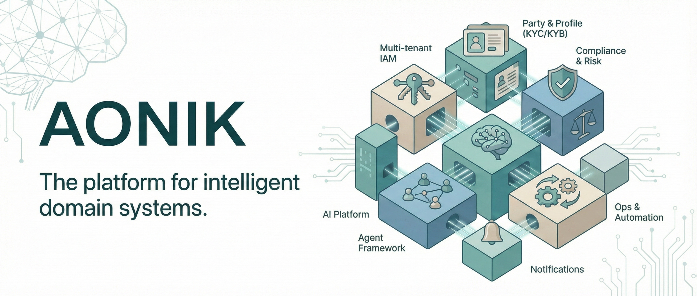

<p align="center">
  
</p>

<h1 align="center">AONIK</h1>

<p align="center">
  <strong>AI-native financial infrastructure.</strong><br>
  Identity. Compliance. Agents. Ledger. Payments. One foundation.
</p>

<p align="center">
  <code>.NET 10</code> &middot; <code>SQL Server</code> &middot; <code>FastEndpoints</code> &middot; <code>EF Core 10</code> &middot; <code>Microsoft Agent Framework</code> &middot; <code>Qdrant</code>
</p>

<p align="center">
  <em>Active development &mdash; APIs and data models are evolving.</em>
</p>

---

## What is AONIK?

AONIK is an AI-native, modular financial platform that powers multiple products: **Payabo** (B2C personal finance), **MyBillAfrica** (B2B billing), and **RemitExchange** (cross-border remittance). It is the foundational platform layer, not a single application.

The platform is **modular by design**. Each capability is a self-contained module with its own entities, services, endpoints, and persistence. Modules communicate through contracts and integration events, not direct coupling. New verticals plug in without touching the core.

---

## Platform Core

The platform provides horizontal capabilities that any domain module can consume:

**Identity and Access** &mdash; Multi-tenant identity with users, roles, permissions, and tenant isolation. Auth0 for external authentication, with Azure Entra ID as an alternative provider. Every request is scoped to a tenant. Every entity is tenant-aware.

**Party and Profile** &mdash; Unified party model for people and businesses. KYC/KYB scaffolding, address/contact management, relationship tracking, and external account linking.

**Compliance and Risk** &mdash; Screening checks, compliance cases, audit logging, document management with verification workflows. Policy-governed and auditable.

**AI Platform** &mdash; Multi-provider LLM routing with model selection policies. Runtime-configurable AI provider (OpenAI or Stub for development). Prompts and tools are versioned. Every AI execution is recorded as an `AiRun` with cost tracking and feedback loops.

**Vector Store (Qdrant)** &mdash; Semantic search over document embeddings for retrieval-augmented generation (RAG). Agents retrieve domain context before reasoning. Multi-tenant isolation ensures document privacy across tenants.

**User Memory** &mdash; Per-user memory system that agents use to recall context across conversations. Supports SQL Server (key-value) and Qdrant (semantic vector search) backends, configurable at runtime via platform settings.

**Agent Framework** &mdash; Five domain-specific agents built on Microsoft Agent Framework. Agents reason, plan, and use tools &mdash; but they never directly mutate state. Mutating tools are wrapped with `ApprovalRequiredAIFunction` for human-in-the-loop approval:

```
Agent calls mutating tool  -->  ApprovalRequiredAIFunction gates  -->  Human or policy approves  -->  Tool executes
```

This flow is never bypassed. Agents propose. Systems apply. Humans stay in control.

**Operations** &mdash; Background jobs (Quartz.NET), notifications, webhook subscriptions, content management, text-to-speech, and autonumbering. The runtime plumbing that domain modules need but shouldn't have to build.

---

## Domain Agents

AONIK ships with five domain agents, each backed by MCP tool servers:

| Agent | Domain | Description |
|---|---|---|
| **Finance** | Billing, Ledger, Payments | Creates invoices, issues payments, queries ledger balances. Full billing lifecycle. |
| **Personal Finance** | Budgets, Goals, Accounts | Manages household budgets, savings goals, bill tracking, and spending insights. Requires user brief. |
| **Obligation Planning** | Recurring obligations | Plans and optimises recurring financial obligations with structured output. |
| **Spending Intelligence** | Transaction analysis | Analyses spending patterns, categorisation, and anomaly detection. |
| **Platform** | Admin, Tenancy, Settings | Manages tenants, users, roles, platform configuration, and system operations. |

Agents produce structured outputs and use tools scoped to their domain. The orchestrator (`MasterOrchestratorService`) routes conversations to the appropriate agent based on intent.

---

## Finance Module

The Finance module (`Aonik.Finance`) provides production-grade financial primitives. It is the B2B / cross-border money plumbing — Ledger, Orders, Payments, Billing, Pricing, Partners, Catalog. The B2C personal-finance substrate now lives in its own sibling module (see below).

- **Ledger** &mdash; Double-entry, immutable. The source of financial truth. Journal entries, chart of accounts, balance snapshots.
- **Payments** &mdash; Payment intents, processing, payouts, refunds, chargebacks. Provider-abstracted.
- **Orders** &mdash; Business intent hub. Orders capture *why* money moves, link parties, reference funding and fulfilment. They are not payments.
- **Billing** &mdash; Invoices, line items, allocations, customer accounts, dunning plans.
- **Pricing** &mdash; Fee policies, FX rate sources, spread policies, limits, pricing quotes.
- **Partners** &mdash; Correspondent network with connectors, routing rules, payout schemas, transmissions.
- **Accounts** &mdash; External account linking, connection syncing, transaction import and reconciliation at the tenant level.
- **Catalog** &mdash; Product and service catalogue for pricing and order creation.

## Personal Finance Module

The PersonalFinance module (`Aonik.PersonalFinance`) is a sibling of Finance and the entire substrate of the **Payabo** product. Extracted from `Aonik.Finance` per [ADR-006](docs/decisions/006-extract-personal-finance-module.md) so the B2C cadence (households, life-graph, customer insights) evolves independently of the Ledger/Orders/Payments core that powers MyBillAfrica and RemitExchange.

- **Households** &mdash; Multi-member groups, invitations, roles, shared accounts and budgets.
- **Personal Accounts &amp; Transactions** &mdash; Plaid-linked accounts, manual accounts, transaction import, categorisation, attachments.
- **Bills, Subscriptions, Debt Repayments** &mdash; Recurring commitments with verification status, next-due tracking, and AI-detected proposals.
- **Budgets &amp; Goals** &mdash; Per-category budget lines tied to transaction taxonomy; savings goals with funding-account links.
- **Financial Life Graph** &mdash; Node-edge graph stitching accounts, merchants, obligations, parties; agents read from it for context and propose new edges for approval.
- **Customer Insight Snapshots** &mdash; Deterministic snapshots of a user's financial position with AI-generated narrative summaries.
- **Financial Connections** &mdash; Plaid link/sync flow, webhook ingestion, account reconciliation.

PersonalFinance does **not** reference `Aonik.Finance` directly. Cross-module reads (Orders, Invoices, Payment Intents, FxQuotes, Parties, Users) go through `SharedKernel.Abstractions.{Finance,Platform}` reader contracts &mdash; the same pattern used by other inter-module boundaries.

---

## Products

| Product | Domain | Stack |
|---|---|---|
| **Payabo** | B2C personal finance &mdash; budgets, bills, subscriptions, goals | React (web) + Flutter (mobile) |
| **MyBillAfrica** | B2B billing and collections | React (web) |
| **RemitExchange** | Cross-border remittance | React (web) |

---

## Architecture

AONIK is a **module-first modular monolith**. Each domain module owns its vertical slice &mdash; entities, services, endpoints, persistence configuration &mdash; with a module-scoped DbContext over a shared physical database.

```
src/
  Aonik.SharedKernel/       Cross-cutting primitives, interfaces, integration events, cross-module read contracts
  Aonik.Platform/           Identity, tenancy, party/profile, compliance, notifications
  Aonik.Finance/            Ledger, payments, orders, billing, pricing, partners (B2B / cross-border core)
  Aonik.PersonalFinance/    Households, transactions, bills, budgets, goals, life-graph, customer insights (B2C / Payabo)
  Aonik.Ai/                 Model routing, prompts, user memory, AI execution records
  Aonik.Agents/             Domain agents, orchestration, proposal workflows
  Aonik.Application/        Shared application abstractions
  Aonik.Infrastructure/     EF migrations, external adapters, Qdrant, Quartz
  Aonik.Api/                HTTP API composition root (FastEndpoints)
  Aonik.Api.Contracts/      Shared API contracts
  Aonik.Worker/             Background jobs (Quartz)
  Aonik.Migrator/           Database migration host
  Aonik.AppHost/            .NET Aspire orchestration
  Aonik.ServiceDefaults/    Shared service configuration (OpenTelemetry, health checks)
  Aonik.AdminUi/            Admin interface (React 19, Vite 7, Tailwind CSS 4, Dockview)
  Aonik.AdminDesktop/       Electron desktop wrapper for Admin UI
  Aonik.Cli/                Command-line interface
  Aonik.Finance.Mcp/        Finance MCP server
  Aonik.Platform.Mcp/       Platform MCP server

apps/
  Payabo/                   B2C personal finance web app (React, Vite)
  payabo_mobile/            Payabo mobile app (Flutter, Firebase, Plaid)
  website/                  Marketing website (React, Vite, Framer Motion)
  docs-site/                Documentation site (Docusaurus, OpenAPI)

tests/
  Aonik.SharedKernel.Tests/
  Aonik.Application.Tests/
  Aonik.Infrastructure.Tests/
  Aonik.Api.Tests/
  Aonik.Cli.Tests/
  fixtures/
```

### Module Boundaries

Modules depend on `SharedKernel` for primitives, contracts, and integration events. They do not reference each other directly. Cross-module communication uses:

- **SharedKernel contracts** &mdash; Interfaces like `IPartyService`, `IComplianceService` that one module implements and another consumes via DI.
- **SharedKernel read contracts** &mdash; Thin readers like `ICustomerOrderHistoryReader`, `ICustomerInvoiceHistoryReader`, `ICustomerPaymentHistoryReader`, `IFxQuoteReader` (in `SharedKernel.Abstractions.Finance/`) and `IPartyReader`, `IUserDirectoryReader` (in `SharedKernel.Abstractions.Platform/`). Implementations live in the owning module; consumers depend on the contract, not the entity.
- **Integration events** &mdash; `TenantProvisionedEvent`, `OrderCreatedEvent`, `PaymentCompletedEvent`, etc. Published by one module, subscribed to by others.
- **Read models** &mdash; Lightweight projections for cross-module queries where eventual consistency is acceptable.

Each module registers itself in the API composition root:

```csharp
services.AddPlatformModule(configuration);
services.AddFinanceModule(configuration);
services.AddPersonalFinanceModule(configuration);
services.AddAiModule(configuration);
services.AddAgentsModule(configuration);
```

### Design Principles

- **Ledger is the source of financial truth.** Double-entry, immutable.
- **Orders represent business intent.** They are not payments.
- **Agents propose; systems execute.** Every material action follows Propose, Approve, Apply.
- **Every AI action is auditable.** Every execution is an `AiRun`. Financially material outputs reference an `AiRunId`.
- **Risk tier determines AI autonomy.** Human approval is explicit for high-risk actions.
- **Modules own their boundaries.** No cross-module project references. Contracts and events only.
- **Domain entities are anemic.** All business logic lives in services, not entities.

---

## Getting Started

### Prerequisites

- [.NET 10 SDK](https://dotnet.microsoft.com/download/dotnet/10.0)
- SQL Server (LocalDB is used by default in development)
- [Docker](https://www.docker.com/products/docker-desktop) (for Qdrant vector store)
- [Node.js](https://nodejs.org/) (for Admin UI and consumer apps)
- Git

### Quick Start with Aspire

The fastest way to run the full stack locally:

```bash
git clone https://github.com/michaeljosiah/aonik.git
cd aonik

# Start everything (API + Worker + Qdrant + Admin UI + Payabo)
dotnet run --project src/Aonik.AppHost
```

This starts:

| Service | URL |
|---|---|
| API (HTTPS) | `https://localhost:5001` |
| Admin UI | `http://localhost:5173` |
| Payabo | `http://localhost:5174` |
| Qdrant REST | `http://localhost:6333` |
| Swagger | `https://localhost:5001/swagger` |

Aspire automatically provisions SQL Server (LocalDB), starts Qdrant with Docker, configures connection strings, runs migrations, and seeds base data.

### Build and Run Individually

```bash
# Build
dotnet build Aonik.sln

# Initialize database (runs migrations + seeds global base data)
dotnet run --project src/Aonik.Migrator

# Run the API
dotnet run --project src/Aonik.Api

# Run the Admin UI
cd src/Aonik.AdminUi && npm install && npm run dev

# Run Payabo
cd apps/Payabo && npm install && npm run dev
```

### Run Tests

```bash
# All tests
dotnet test Aonik.sln

# Specific project
dotnet test tests/Aonik.Application.Tests

# Specific test
dotnet test --filter "DisplayName~CreateInvoice"
```

---

## Technology

| Layer | Stack |
|---|---|
| Runtime | .NET 10 |
| API | FastEndpoints |
| ORM | Entity Framework Core 10 |
| Database | SQL Server |
| Vector Store | Qdrant (semantic search, RAG, user memory) |
| AI/Agents | Microsoft Agent Framework, MCP, OpenAI |
| Background Jobs | Quartz.NET |
| Orchestration | .NET Aspire |
| Caching | FusionCache |
| Auth | Auth0, Azure Entra ID (MSAL) |
| Observability | OpenTelemetry (metrics, traces) |
| Admin UI | React 19, Vite 7, Tailwind CSS 4, Dockview, Radix UI |
| Mobile | Flutter, Firebase, Plaid |
| Testing | xUnit, FluentAssertions |
| IaC | Bicep (Azure Container Apps) |
| CI/CD | GitHub Actions (9 workflows) |
| Docs | Docusaurus, OpenAPI |

---

## Admin UI

The Admin UI (`src/Aonik.AdminUi`) is a workspace-oriented dashboard built with React 19, Vite 7, and Tailwind CSS 4. It uses Dockview for a multi-panel workspace layout and Radix UI for accessible primitives.

Key features:
- **Workspace mode** &mdash; Multi-panel layout with drag-and-drop, split views, and workspace templates
- **Agent Playground** &mdash; Interactive chat with domain agents, tool toggle, model comparison, and scenario management
- **Settings** &mdash; Combined tabbed settings page with cross-tab search, conditional visibility, and inline help
- **Financial Life Graph** &mdash; React Flow-based visualisation of financial relationships and obligations
- **Text-to-Speech** &mdash; AI-powered audio generation for content blocks
- **Auth0 integration** &mdash; Multi-tenant login with organisation selection

---

## CI/CD

GitHub Actions workflows handle the full lifecycle:

| Workflow | Purpose |
|---|---|
| `ci.yml` | Build, test, and validate on push/PR |
| `cd-images.yml` | Build and publish container images |
| `cd-deploy.yml` | Deploy to environments (dev, staging, prod) |
| `cd-infra.yml` | Provision Azure infrastructure via Bicep |
| `cd-migrate.yml` | Run database migrations against target environments |
| `release.yml` | Release automation |
| `docs.yml` | Build and publish documentation |
| `drift-detection.yml` | Detect IaC drift in deployed environments |
| `lint.yml` | Code quality checks |

---

## Documentation

| Document | Description |
|---|---|
| [CLAUDE.md](CLAUDE.md) | Claude Code guidelines, architecture rules, and build commands |
| [Architecture Overview](docs/architecture/overview.md) | System design and module boundaries |
| [Module Organization](docs/architecture/module-organization.md) | How code is structured within modules |
| [Technology Stack](docs/architecture/technology-stack.md) | Detailed technology choices and rationale |
| [ADR-005: Modular Monolith](docs/decisions/005-adopt-module-first-modular-monolith.md) | Why and how AONIK is module-first |
| [ADR-006: Extract PersonalFinance](docs/decisions/006-extract-personal-finance-module.md) | Splitting PersonalFinance out of Finance as a sibling module |
| [Financial Life Graph](docs/features/financial-life-graph.md) | Personal-finance node-edge graph and inferred proposals |
| [Insight Generation Pipeline](docs/features/insight-generation-pipeline.md) | Customer-insight snapshots and AI summaries |
| [Transaction Classification](docs/features/transaction-classification.md) | Categorisation rules and AI-assisted classification |
| [Authentication](docs/features/authentication-authorization.md) | Auth0/Entra ID setup, endpoint security |
| [Ledger](docs/features/ledger.md) / [Billing](docs/features/billing.md) / [Payments](docs/features/payments.md) / [Pricing](docs/features/pricing.md) | Finance domain feature guides |
| [CHANGELOG](CHANGELOG.md) | Version history |

End-user / operator documentation lives in the docs site (`apps/docs-site/`) under `content/docs/{operate,tenant-admin,api}`. Architecture-level documents (ADRs, contributor guides, specifications) live under `docs/` in this repo.

---

## Contributing

AONIK is open to contributions. The project is evolving &mdash; expect refactors and breaking changes.

Before submitting code:
1. `dotnet build Aonik.sln` must succeed with 0 errors
2. `dotnet test Aonik.sln` must pass
3. Follow the standards in [CLAUDE.md](CLAUDE.md)
4. Update [CHANGELOG.md](CHANGELOG.md) with your changes

See [Contributing Guide](docs/contributing/) for more detail.

---

## License

Apache License, Version 2.0. See [LICENSE](LICENSE).

---

<p align="center">
  <strong>Agents propose. Systems apply. Humans stay in control.</strong>
</p>
