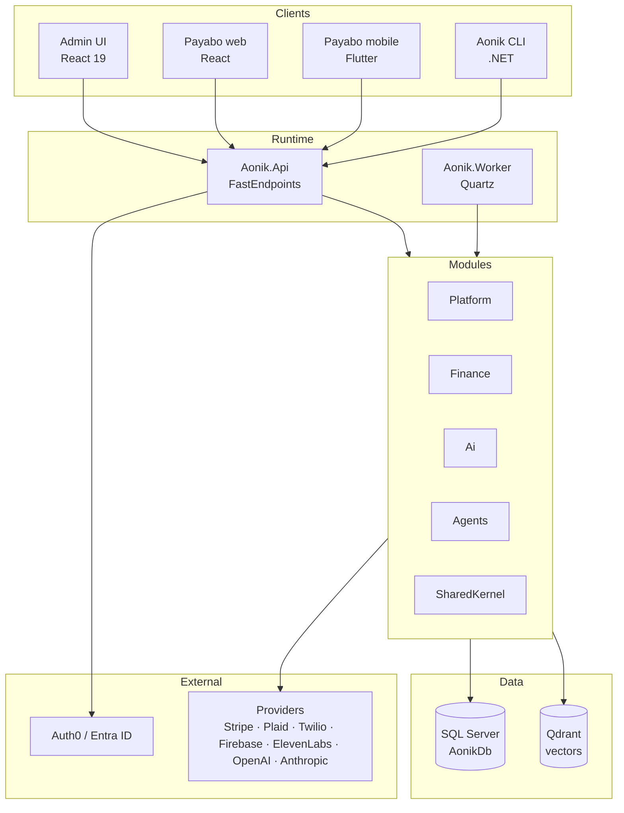

# Architecture at a glance

:::info
A one-page tour of how Aonik is put together. Deeper architectural detail and the rationale for each choice lives in [For Contributors](../for-contributors/index.md).
:::

## Why this matters

You don't need to understand every module to run Aonik, but you do need a mental model of which process serves which traffic, where data lives, and how AI work flows through the system. This page gives you enough to navigate the rest of the docs.

## Shape of the platform

Aonik is a **modular monolith**. One solution, one shared SQL Server database, but modules are vertical slices that own their entities, services, endpoints, and persistence configuration. Modules talk to each other through contracts in `SharedKernel` and integration events — never through direct references.

## Runtime processes

| Process | What it does |
| --- | --- |
| `Aonik.Api` | HTTP composition root. FastEndpoints, OpenAPI/Scalar, auth, multi-tenancy middleware. |
| `Aonik.Worker` | Quartz-scheduled background jobs: AI cost guard, snapshots, stale sessions, reconciliation. |
| `Aonik.AppHost` | Aspire orchestrator. Launches API + Worker + Admin UI + Payabo + Qdrant locally. |
| `Aonik.AdminUi` | React 19 + Vite + Dockview workspace UI for operators. |
| `Aonik.Cli` | .NET CLI for terminal-driven agent chat and approvals. |

The mobile app (`apps/payabo_mobile`) is a Flutter client that talks to the same API.

## Modules

Each module owns a vertical slice — entities, services, endpoints, persistence configurations:

- **`SharedKernel`** — cross-cutting primitives, contracts, integration events
- **`Platform`** — identity, tenancy, party/profile, compliance, notifications, settings, reference data, registration
- **`Finance`** — ledger, orders, payment intents, billing, personal finance, catalog, pricing & FX, partners
- **`Ai`** — providers, route policies, prompts, AiRuns, user memory
- **`Agents`** — domain agents, tool wiring, approval and proposal workflows, voice
- **`Infrastructure`** — EF Core migrations, external adapters, plumbing
- **`Api`** — HTTP composition root
- **`Worker`** — background jobs

Modules never reference each other directly. Cross-module needs go through `SharedKernel` contracts (interfaces like `IPartyService`, integration events like `TenantProvisionedEvent`).

## Data

**Single SQL Server database** (`AonikDb`). All migrations are generated against the canonical `AonikDbContext`. Module-scoped contexts (`PlatformDbContext`, `FinanceDbContext`, `AiDbContext`, `AgentsDbContext`) exist for DI scoping at runtime but do **not** have their own migration streams. This rule is non-negotiable — see [the contributor deep dive](../for-contributors/index.md) for why.

**Qdrant** holds vectors for RAG, user memory, and AI search. One collection per tenant, prefixed by tenant ID.

Every entity is tenant-scoped via `ITenantScoped` and `TenantId`. Soft deletes and audit columns (`CreatedAt`, `UpdatedAt`, `CreatedBy`, `UpdatedBy`) are enforced by the base `AonikDbContextBase`.

## The money triad: Orders, Payments, Ledger

Three concepts that are easy to conflate and must stay separate:

- **Order** — the canonical record of a requested financial service (bill payment, transfer, invoice, remittance). It captures *what was asked for* and *why money should move*.
- **Payment / Payment Intent** — *how* the order is funded or executed. One order can have many payment attempts.
- **Ledger** — *what actually happened*. Immutable double-entry journal entries are the source of financial truth.

If a feature is conflating any two of these, it's a design smell. The [Glossary](glossary.md) defines each precisely.

## How AI runs

Every AI invocation flows through a fixed pipeline:

1. A route policy picks the model and provider for the request.
2. A versioned prompt is rendered and dispatched.
3. The provider responds; the call is recorded as an immutable **AiRun** with cost, tokens, latency, and outcome.
4. If the agent's response is a **proposal** to mutate state, it is wrapped in an `ApprovalRequiredAIFunction` and surfaced to the operator (or user) for approval. **Agents propose; systems apply.** No agent bypasses this contract.

Read-only tools execute directly. Mutating tools (`CreateInvoice`, `IssueInvoice`, `CapturePayment`, etc.) always require approval.

## Where to look next

- **For everyday vocabulary** — [Glossary](glossary.md)
- **For the full per-module breakdown** — [Platform Capabilities](../platform-capabilities/index.md)
- **For the architectural rationale** — [For Contributors](../for-contributors/index.md)
- **For the runtime endpoints** — [API Reference](/api/aonik-api)

## What's next

- [What you get out of the box](what-you-get.md) — the modules × products matrix
- [Glossary](glossary.md) — canonical platform terms
- [Quickstart](quickstart.md) — if you haven't run it yet
