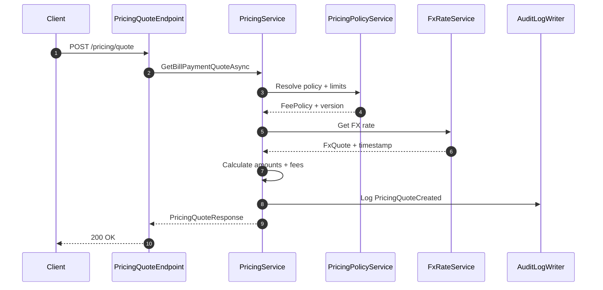

:::warning Legacy content

This page predates the docs rewrite. It may be inaccurate or out of date. See the current sidebar for the new home of this topic.

:::

<!-- LEGACY_BANNER -->

# Data Flow

This describes the typical request/response path for API calls.

## Request Path

1. **HTTP request** hits `Aonik.Api`.
2. **FastEndpoints endpoint** validates and maps the request into an Application DTO.
3. **Application service** performs business logic.
4. **Infrastructure** persists via `IAonikDbContext` (EF Core).

## Response Path

1. Service returns a DTO.
2. Endpoint maps/returns DTO using `Send.*Async()` helpers.

## Cross-Cutting

- Authentication/authorization runs before endpoints.
- Tenant validation middleware runs after authorization.
- Audit fields are applied in `AonikDbContext.SaveChangesAsync()`.

## Pricing Quote Flow

The pricing quote endpoint returns an FX rate, fees, and totals without mutating financial state.

