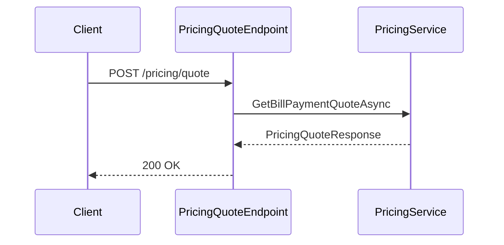

:::warning Legacy content

This page predates the docs rewrite. It may be inaccurate or out of date. See the current sidebar for the new home of this topic.

:::

<!-- LEGACY_BANNER -->

# API Endpoints

AONIK uses **FastEndpoints** for HTTP endpoints.

## Structure

- Endpoints live under `src/Aonik.Api/Endpoints/{Module}`.
- Endpoints call Application services and return DTOs.

## Conventions

- Inherit from `Endpoint<TRequest, TResponse>`.
- Override `Configure()` to set route and auth.
- Override `HandleAsync()` and use `Send.*Async()` helpers.

Examples of response helpers:

- `await Send.OkAsync(response, ct)`
- `await Send.CreatedAtAsync<GetEndpoint>(new { id = response.Id }, response, ct)`
- `await Send.NotFoundAsync(ct)`

Avoid using `SendAsync()` directly.

## Mapping

- Map API contracts (API layer) to DTOs (Application layer) inside the endpoint.

## Pricing Quote Endpoint

`POST /pricing/quote` returns a pricing and FX quote for bill payment corridors. It is read-only and does not change financial state.

Request fields:
- `originCurrency`, `destinationCurrency`
- `originCountry`, `destinationCountry`
- `serviceCode`
- exactly one of `originAmount` or `destinationAmount`
- optional `customerId` and `customerTier`

Response fields include `exchangeRate`, `feesTotal`, `totalAmount`, plus policy and FX metadata.

## Admin Reference Data Endpoint

`PUT /admin/reference-data/{type}/{code}` creates or updates a reference data item (such as `CustomerTier`).

Request fields:
- `displayName`
- `sortOrder`
- `isActive`
