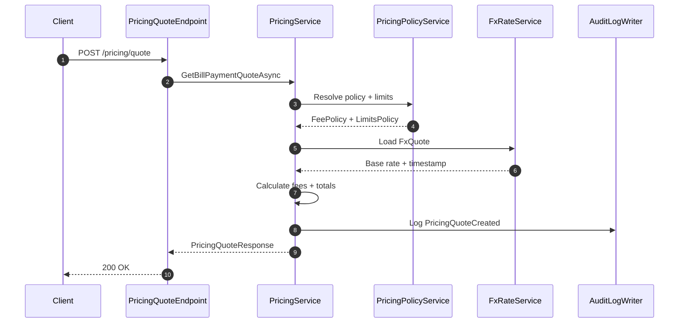
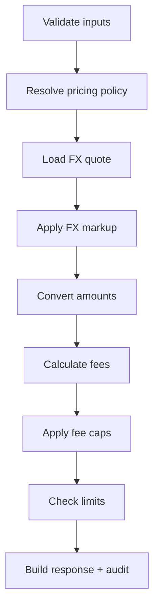

# Pricing, Fees, and FX Quotes

This guide explains how AONIK calculates pricing quotes for bill payments. The pricing flow is policy-driven, auditable, and read-only. It does not post ledger entries or change balances.

## What a Pricing Quote Is

A pricing quote is a snapshot of:

- the FX rate used to convert currencies
- the fees applied to the payment
- the totals the user will pay
- the policy and FX metadata used for audit

Quotes are informational only. They do not create payments or orders.

## Core Inputs

Every quote request requires:

- `originCurrency` and `destinationCurrency`
- `originCountry` and `destinationCountry`
- `serviceCode`
- exactly one of `originAmount` or `destinationAmount`

`customerId` is optional. When it is missing, tenant-level limits still apply.

## Outputs You Can Expect

The response returns:

- `exchangeRate` and `rateMarkup`
- `feesTotal` and `totalAmount`
- `originAmount` and `destinationAmount`
- `pricingPolicyId`, `pricingPolicyVersion`
- `fxRateId`, `rateTimestamp`
- optional `feeBreakdown` items

## How Policies Affect Pricing

Pricing policies are stored in `FeePolicy` with `ConditionsJson` for corridor matching. Policies define:

- fixed fees
- percentage fees
- FX markup (basis points)
- minimum and maximum fee caps
- optional fee breakdown definitions

Limits policies are stored in `LimitsPolicy` and cap allowed amounts. The engine checks:

1. customer-scoped limits (if `customerId` provided)
2. tenant-scoped limits (fallback)

## FX Rate Sources

FX rates are pulled from stored `FxQuote` records for the currency pair. The quote must not be expired. Markup is applied on top of the base rate.

## Rounding Rules

Rounding uses currency precision rules (for example, USD uses 2 decimals and KES uses 0). Rounding happens:

1. per fee component
2. after fee caps
3. for final totals

The rounding mode is controlled by the policy (defaults to `AwayFromZero`).

## Quote Flow (Simple)

## Calculation Steps

## Example

Input:

- `originCurrency`: USD
- `destinationCurrency`: KES
- `originAmount`: 10.00
- FX rate: 2.00
- Fixed fee: 1.00
- Percentage fee: 10%

Output:

- `destinationAmount`: 20.00
- `feesTotal`: 2.00
- `totalAmount`: 12.00

## Common Errors

- Missing corridor inputs (country/currency/service)
- Both amounts provided or neither amount provided
- Unsupported currency
- No matching pricing policy
- No valid FX quote
- Amount exceeds limits
