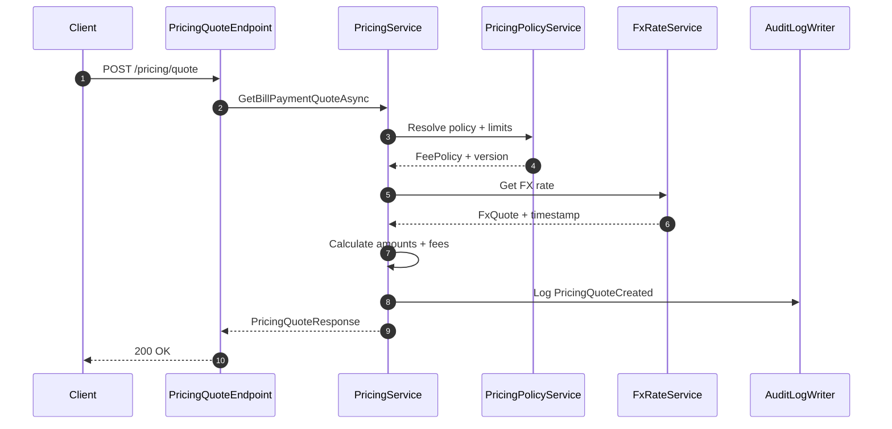

# Data Flow

This describes the typical request/response path for API calls in the modular monolith.

## Request Path

1. **HTTP request** arrives at `Aonik.Api` (composition root).
2. **Middleware** runs: authentication, tenant resolution (`TenantContextMiddleware`).
3. **FastEndpoints endpoint** (in the owning module, e.g., `Aonik.Finance/Endpoints/`) validates and maps the request.
4. **Module service** performs business logic using the module's DbContext.
5. **Module DbContext** persists changes (e.g., `FinanceDbContext`).

## Response Path

1. Service returns a DTO.
2. Endpoint maps/returns DTO using `Send.*Async()` helpers.

## Cross-Cutting

- Authentication/authorization runs before endpoints.
- Tenant validation middleware runs after authorization and injects `ITenantProvider`.
- Audit fields (`CreatedAt`, `UpdatedAt`, `CreatedBy`, etc.) are applied in each module's DbContext `SaveChangesAsync()` override.

## Example: Create Invoice

```
[Client]
   ↓ POST /billing/invoices
[Aonik.Api] → middleware (auth, tenant)
   ↓
[Aonik.Finance/Endpoints/Billing/CreateInvoiceEndpoint]
   ↓ CreateInvoiceRequest
[Aonik.Finance/Services/Billing/BillingService]
   ↓ new Invoice { ... }
[FinanceDbContext]
   ↓ await SaveChangesAsync()
[SQL Server Database]
   ↑ InvoiceResponse (201 Created)
[Client]
```

## Example: AI Agent Execution

```
[Client]
   ↓ POST /api/agents/orchestrator/chat
[Aonik.Agents/Endpoints/ChatEndpoint]
   ↓
[MasterOrchestratorService]
   ↓ Builds ChatClientAgent orchestrator with domain agents as tools
   ↓ Creates/resumes AgentSession for conversation history
   ↓ Routes to domain agent descriptor (e.g., FinanceAgentDescriptor)
[ChatClientAgent (finance-agent)] → uses AIFunction tools
   ↓ Read tools execute directly
   ↓ Mutating tools gated by ApprovalRequiredAIFunction
[BillingService / LedgerService / PaymentService]
   ↓ Results returned to agent
[AuditMiddleware] → records AiRun with token usage
[MasterOrchestratorService]
   ↑ Chat response
[Client]
```

Key details:
- Domain agents are registered as `IDomainAgentDescriptor` implementations and composed into the orchestrator via `agent.AsAIFunction()`
- MCP tools from `McpToolProvider` are also available to the orchestrator
- `AgentSession` (via `agent.CreateSessionAsync`) manages conversation history natively
- `AuditMiddleware` in the `IChatClient` pipeline records every LLM call as an `AiRun`

## Pricing Quote Flow

The pricing quote endpoint returns an FX rate, fees, and totals without mutating financial state.


