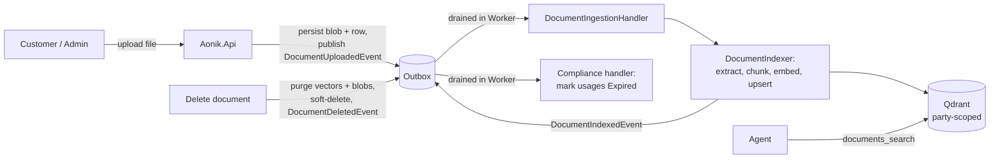
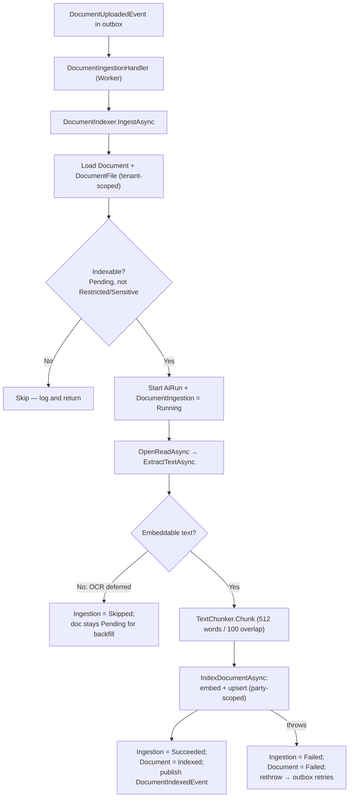
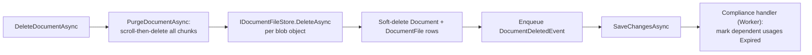

# Documents

The Documents feature gives AONIK a first-class, tenant-and-party-scoped substrate for files: a customer uploads a tax return, a payslip, a contract, or an ID scan; it is stored, classified, and — when its classification permits — automatically embedded into the vector store so an agent can answer *"what did my last tax return say?"* over **only that customer's** evidence. It lives in the standalone `Aonik.Documents` module and is consumed everywhere through `SharedKernel.Abstractions.Documents` contracts, with no module taking a project reference on it.

This is the implementation of [Spec 035](../specifications/035.extract-documents-module.html) / [ADR-009](../decisions/009-extract-documents-module.md). The conceptual evidence model is described in [Document-Model.md](../architecture/Document-Model.md).

---

## Overview

Documents has two cleanly separated concerns:

| | Generic document capability | Compliance verification |
|---|---|---|
| Question it answers | "A file exists, who owns it, where is it, can the AI read it?" | "Does this evidence satisfy a KYC purpose?" |
| Owner | `Aonik.Documents` (this module) | `Aonik.Platform` / Compliance |
| Entities | `Document`, `DocumentFile`, `DocumentVersion`, `DocumentIngestion`, `DocumentExtraction` | `DocumentUsage`, `DocumentVerification` |
| Applies to a tax return? | Yes — stored, classified, indexed | No |

A document is the durable record of a file; a verification is a compliance decision that happens to *reference* a document. Compliance keeps its `DocumentUsage` / `DocumentVerification` tables and resolves document detail through `IDocumentReader` — it holds the document id as a plain `Guid`, never an EF navigation.

The end-to-end lifecycle:



Three invariants hold throughout:

1. **Tenant + party isolation is structural, not optional.** Every blob path, every vector payload, and every retrieval query is scoped by `TenantId` and (for personal classifications) `OwnerPartyId`. There is no code path that reads documents or vectors without a scope.
2. **Ingestion is asynchronous.** Upload returns `201` immediately; embedding happens off the request path via the transactional outbox, with durable retry / back-off / dead-letter.
3. **Every AI contribution is auditable.** Each ingestion run records a `DocumentIngestion` row carrying an `AiRunId`.

---

## Architecture & boundaries

`Aonik.Documents` is a sibling module to `Aonik.Finance` / `Aonik.PersonalFinance`, following the [ADR-006](../decisions/006-extract-personal-finance-module.md) precedent.

- **`Aonik.Documents` references only `Aonik.SharedKernel`.** The blob store, the scoped vector index, and the text extractor are SharedKernel *interfaces* implemented in `Aonik.Infrastructure` and injected at the composition root — so Documents never references Infrastructure either.
- **No module holds a `ProjectReference` to `Aonik.Documents`.** Finance, PersonalFinance, Platform/Compliance, Ai, and Agents consume documents exclusively through `SharedKernel.Abstractions.Documents` and the integration events. The only reverse edge is `Aonik.Infrastructure → Aonik.Documents`, which exists so the canonical migration stream can see the entities.
- **Single migration stream.** All schema lives in `AonikDbContext` (`Aonik.Infrastructure`). `DocumentsDbContext` is a runtime-only DI-scoping context with **no migrations**. Tables keep the `Ank` prefix in the `dbo` schema.

The `ModuleDependencyDirectionTests` architecture test enforces these edges.

---

## Domain model

Entities are anemic (`{ get; set; }` only), inherit `AuditableEntity`, and implement `ITenantScoped`. The generic entities (`Document`, `DocumentFile`, `DocumentVersion`) deliberately **keep the `Aonik.Platform.Entities.Compliance` namespace** even though they now live in `Aonik.Documents` — this preserves the EF model-snapshot CLR-type strings so the relocation migration was a single FK drop, not a destructive table rebuild (ADR-006 Phase 2 technique).

### Database tables

All in the `dbo` schema with the `Ank` prefix.

| Table | Module | Purpose |
|-------|--------|---------|
| `AnkDocuments` | Documents | The generic evidence record (owner, type, classification, index status) |
| `AnkDocumentFiles` | Documents | A physical file: blob reference + metadata + extracted-text status |
| `AnkDocumentVersions` | Documents | Re-submission snapshots |
| `AnkDocumentIngestions` | Documents | One RAG ingestion run per file (chunk count, model, cost, `AiRunId`, status) |
| `AnkDocumentExtractions` | Documents | OCR / structured-extraction output (`AiRunId`) — populated once an OCR adapter lands |
| `AnkDocumentUsages` | Platform / Compliance | Links a document to a KYC purpose (holds `DocumentId` as a scalar `Guid`) |
| `AnkDocumentVerifications` | Platform / Compliance | Verification decision for a usage |

### `Document` (key fields)

| Field | Notes |
|-------|-------|
| `Id`, `TenantId`, `OwnerPartyId` | Identity + scope |
| `DocumentType` | e.g. `TaxReturn`, `BankStatement`, `NationalId`, `UtilityBill`, `Contract` |
| `Status` | `Draft`, `Submitted`, `Verified`, `Rejected`, `Expired`, `Revoked` |
| `Classification` | `Public` / `Internal` / `Personal` / `Sensitive` / `Restricted` — drives indexing + retrieval scope |
| `Source` | `CustomerUpload`, `AdminUpload`, `StatementImport`, `PartnerCallback` |
| `IndexStatus` | `NotIndexable` / `Pending` / `Indexed` / `Failed` |
| `IndexedAt` | When the document last became searchable |
| `IssuedOn`, `ExpiresOn`, `IssuerName`, `CountryCode`, `ReferenceNumber` | Evidence metadata |
| `TagsJson`, `AttributesJson` | Flexible, versionable extras |

### `DocumentFile` (key fields)

`StorageProvider`, `StorageContainer`, `StorageKey`, `ContentType`, `FileName`, `FileSizeBytes`, `Sha256`, `PageIndex`, `Side`, `MetadataJson`, and `ExtractedTextStatus` (`Native` / `OcrRequired` / `OcrDone` / `Unsupported` — whether embeddable text is available now or must be deferred to OCR).

### `DocumentIngestion`

| Field | Notes |
|-------|-------|
| `DocumentId`, `DocumentFileId` | Cross-aggregate references (scalar `Guid`s) |
| `VectorCollection` | The Qdrant collection the chunks landed in (`documents`) |
| `ChunkCount`, `EmbeddingModel`, `EmbeddingCost` | RAG audit + per-tenant cost |
| `Status` | `Pending` / `Running` / `Succeeded` / `Skipped` / `Failed` |
| `Attempts`, `LastError`, `CompletedAt` | Run history |
| `AiRunId` | Links the embedding run to `AnkAiRuns` (R9) |

---

## SharedKernel contracts

Everything cross-module flows through `Aonik.SharedKernel.Abstractions.Documents`. DTOs are records; consumers never see the entity types.

| Contract | Responsibility | Implemented by |
|----------|----------------|----------------|
| `IDocumentReader` | `GetDocumentAsync`, `ListDocumentsAsync`, `GetFilesAsync`, `GetReadUrlAsync` | `DocumentService` (Documents) |
| `IDocumentWriter` | `CreateDocumentAsync`, `UploadFileAsync`, `DeleteDocumentAsync` | `DocumentService` (Documents) |
| `IDocumentSearch` | `SearchAsync(query, scope, topK)` under a **mandatory** `DocumentSearchScope` | `ScopedDocumentVectorIndex` (Infrastructure) |
| `IDocumentVectorIndex` | `IndexDocumentAsync` → `DocumentIndexResult`; `PurgeDocumentAsync` | `ScopedDocumentVectorIndex` (Infrastructure) |
| `IDocumentFileStore` | `UploadDocumentFileAsync`, `OpenReadAsync`, `DeleteAsync` (blob) | `DocumentFileStore` (Infrastructure) |
| `IDocumentTextExtractor` | `ExtractTextAsync(stream, contentType)` → `DocumentTextExtractionResult` | `DocumentTextExtractor` (Infrastructure) |
| `IDocumentOcrExtractor` | OCR hook for image/scanned content (`IsAvailable`) | `DeferredDocumentOcrExtractor` (default no-op) |
| `IUserPartyResolver` | `GetPartyIdForUserAsync(tenantId, userId)` — derives the search owner-party from auth | `UserPartyResolver` (Platform) |

**Integration events** (`Aonik.SharedKernel.Events.Integration`, carried through the transactional outbox):

| Event | Raised when | Consumed by |
|-------|-------------|-------------|
| `DocumentUploadedEvent(TenantId, DocumentId, DocumentFileId, OwnerPartyId, Classification, ContentType)` | An indexable file is uploaded | `DocumentIngestionHandler` (Documents) |
| `DocumentIndexedEvent(TenantId, DocumentId, ChunkCount)` | A document's chunks become searchable | (open for consumers) |
| `DocumentDeletedEvent(TenantId, DocumentId, OwnerPartyId)` | A document is erased | `DocumentDeletedComplianceHandler` (Platform) |

---

## Classification & index policy

"Index all documents" is the intent, but `all` is gated by a classification so the pipeline never blindly embeds something it shouldn't.

| Classification | Examples | Index behaviour | Retrieval scope |
|----------------|----------|-----------------|-----------------|
| `Public` | Product terms, notices | Indexed | Tenant |
| `Internal` | Operational docs | Indexed | Tenant |
| `Personal` | Tax return, payslip, statement | Indexed | Tenant + `OwnerPartyId` |
| `Sensitive` | ID scans, proof-of-address images | Metadata-only until OCR + redaction | Tenant + `OwnerPartyId` + purpose |
| `Restricted` | Explicitly excluded evidence | Never indexed | Direct read only |

`DocumentService.ResolveInitialIndexStatus` sets `IndexStatus` at upload: `Restricted`/`Sensitive` → `NotIndexable`; everything else → `Pending`. Only `Pending` documents raise `DocumentUploadedEvent`, so `Restricted`/`Sensitive`/`NotIndexable` documents cost nothing — no event, no embedding, no handler work.

---

## Upload (synchronous path)

A document is created first, then files are uploaded into it.

```
POST /documents                 → DocumentService.CreateDocumentAsync
POST /documents/{id}/files      → DocumentService.UploadFileAsync
   1. IDocumentFileStore.UploadDocumentFileAsync → blob (tenant-scoped key, Sha256)
   2. persist DocumentFile (ExtractedTextStatus resolved from content type)
   3. if Document.IndexStatus == Pending:
        EnqueueIntegrationEvent(DocumentUploadedEvent)   ← transactional outbox
   4. SaveChangesAsync  (file row + outbox row commit together)
   5. return 201
```

The `DocumentUploadedEvent` is enqueued **before** `SaveChangesAsync`, so the outbox row commits in the same transaction as the file — the upload either fully happens (with its ingestion queued) or not at all.

---

## RAG ingestion pipeline (asynchronous)

Ingestion runs as an `IEventHandler<DocumentUploadedEvent>` (`DocumentIngestionHandler`) dispatched by the transactional outbox. The outbox processor runs **only in the Worker host**, with the originating tenant restored from the outbox row, so ingestion happens exactly once, off the request path, inheriting the outbox's durable retry / back-off / dead-letter behaviour. (This realises Spec 035 §26's "in-process handler" option while staying Worker-isolated — there is no separate cron polling job for the steady-state path.)



### Text extraction

`DocumentTextExtractor` (Infrastructure) handles the formats that yield embeddable text without a third-party dependency:

- **Plain-text family** (`text/*`, `application/json`, `application/xml`) — read natively (UTF-8) → `Native`.
- **DOCX** — parsed from the package's `word/document.xml` with the BCL `ZipArchive` (paragraphs, runs, tabs, breaks) → `Native`. No external library.
- **PDF / images** — routed to `IDocumentOcrExtractor`. The default `DeferredDocumentOcrExtractor` reports `IsAvailable == false`, so the file is recorded `OcrRequired` and the document stays `Pending` for a future backfill rather than failing. A real OCR/document-intelligence adapter (Azure AI Document Intelligence, Textract, …) is a drop-in replacement registered in place of the deferred hook.
- **Anything else** → `Unsupported`.

### Chunking

`TextChunker` (a pure, deterministic utility) splits text into 512-word chunks with 100-word overlap, so context straddling a boundary is retrievable from either side. It was lifted unchanged in behaviour from the legacy RAG endpoint.

### Embedding & audit

`IDocumentVectorIndex.IndexDocumentAsync` embeds the chunks and upserts them, returning a `DocumentIndexResult(ChunkCount, EmbeddingModel, EstimatedCost)`. The indexer records those on the `DocumentIngestion` row and the `AiRun`, so per-tenant embedding model and cost are auditable.

### Failure & retry

A genuine failure (embedding provider down, etc.) marks the `DocumentIngestion` row `Failed` with `LastError`, sets `Document.IndexStatus = Failed`, marks the `AiRun` failed, and **rethrows** — driving the outbox's exponential back-off and eventual dead-letter. A non-embeddable file (OCR deferred) is **not** a failure: it is recorded `Skipped` and the event is consumed, leaving the document `Pending`. If the tenant's agent kill-switch is engaged, `StartRunAsync` throws and the outbox retries until the operator lifts it.

---

## Vector-store scoping (the P0 fix)

The shared vector store (`QdrantVectorStore`) already enforces **tenant** isolation fail-closed — it stamps `tenant_id` on every upsert and adds a `tenant_id` `must` clause to every search and scroll. What it lacked was **owner-party** isolation: in a shared-tenant B2C product (Payabo) one customer's agent could otherwise retrieve another customer's documents within the same tenant.

`ScopedDocumentVectorIndex` (Infrastructure) layers the missing sub-tenant guarantees on top of `IVectorStore`. Every chunk it upserts carries:

```
payload = {
  // tenant_id injected fail-closed by the vector store
  owner_party_id,   classification,   purpose?,
  document_id,      document_type,    chunk_index,
  content,          created_at
}
```

- **Mandatory scope.** `IDocumentSearch.SearchAsync` takes a non-optional `DocumentSearchScope`; there is no unscoped overload. It adds an `owner_party_id` `must` clause (plus optional classification/purpose `match.any` clauses) on top of the store's tenant clause.
- **Fail-closed defaults.** A search with no explicit classification filter defaults to a positive allow-list (`Public`/`Internal`, plus `Personal` only when an owner party is supplied) and **never** `Sensitive` — which requires an explicit purpose scope. `Personal`/`Sensitive` retrieval without an owner party is rejected, not silently widened.
- **Write-side guard.** `IndexDocumentAsync` mirrors the same validation, rejecting party-scoped content with an empty owner before any side effect, so a chunk is never written with `owner_party_id = Guid.Empty`.
- **Deterministic point ids.** Each chunk's Qdrant point id is a UUID derived from `(documentId, chunkIndex)`, so re-indexing overwrites in place rather than duplicating.

The `ScopedDocumentVectorIndexTests` assert a document indexed for party X yields zero hits for a scope of party Y in the same tenant.

---

## Scoped agent search tool

`documents_search` (`DocumentSearchTools`, in `Aonik.SharedKernel/Agents/Tools/`) is a read-only, cross-cutting agent tool wired into the master orchestrator alongside the memory tools. It lets an agent answer questions over the signed-in customer's own documents.

The security-critical property: the **retrieval scope is derived entirely from authenticated context** — `ITenantProvider` for the tenant, `ICurrentUserProvider` → `IUserPartyResolver` for the owner party — and **never from model input**, so a prompt cannot widen its own scope across parties. An unlinked user (e.g. an operator) resolves to no owner party, which keeps results tenant-wide (`Public`/`Internal`) rather than surfacing anyone's personal documents. The tool self-disables if its backends are not registered.

Because the tool is read-only, it passes the Spec 032 approval gate untouched (no manifest classification needed).

---

## Deletion & right-to-erasure

`IDocumentWriter.DeleteDocumentAsync` (and `DELETE /documents/{id}`, admin-gated) erases a document with a **privacy-first ordering**:



Vectors are purged **first** so retrieval can never return the document again; then blob objects are removed; then the rows are soft-deleted and `DocumentDeletedEvent` is published — atomically via the outbox. Every external step is idempotent (purge re-scrolls to empty; blob delete no-ops on a missing object), so an interrupted run is safe to retry, and the worst intermediate state has the vectors already gone — never an orphaned searchable vector.

`DocumentDeletedComplianceHandler` (Platform) reacts by marking dependent `DocumentUsage` rows **`Expired`** — never deleting them — so the KYC audit trail survives even though the underlying evidence is gone.

Agent-initiated deletion is **not** exposed as an in-band tool; per Spec 032 / R8 it must be approval-gated. Customer-lifecycle erasure (account closure, [Spec 026](../specifications/026.user-lifecycle-closure.html)) calls `DeleteDocumentAsync` directly under a system context.

---

## HTTP endpoints

| Method | Route | Policy | Purpose |
|--------|-------|--------|---------|
| `POST` | `/documents` | `UserPolicy` | Create a document record |
| `POST` | `/documents/{id}/files` | `UserPolicy` | Upload a file into a document (triggers indexing if indexable) |
| `GET` | `/documents/{id}` | `UserPolicy` | Get a document's metadata |
| `GET` | `/documents` | `UserPolicy` | List documents (paged, filterable by type/status/owner/classification/tag/search) |
| `DELETE` | `/documents/{id}` | `AdminPolicy` | Erase a document (purge vectors + blobs, soft-delete, emit event) |

`/documents/*` are customer-accessible (`UserPolicy`), so an end user can upload personal documents — unlike the old admin-only `/compliance/documents`. Deletion is admin-gated; customer self-service erasure goes through the lifecycle-closure flow.

> The legacy one-shot RAG endpoint `POST /ai/documents/upload` has been **removed** — the unified `/documents/*` path plus the async pipeline replaces it.

---

## Configuration

### Vector store (Qdrant)

Bound from the `Qdrant` configuration section (`QdrantConfiguration`). The collection is `{CollectionPrefix}-documents` (e.g. `aonik-documents`). The embedding model and dimensions must match the configured provider (`text-embedding-3-small` / 1536 by default).

### Ingestion backfill job (opt-in)

`DocumentIngestionBackfillJob` is a Quartz job that re-publishes `DocumentUploadedEvent` for indexable documents that never completed ingestion (e.g. a dead-lettered file). It is **disabled by default**:

```
Quartz:ScheduledJobs:DocumentIngestionBackfill:Enabled = false   # turn on to drain, then off
Quartz:ScheduledJobs:DocumentIngestionBackfill:CronExpression = "0 0/10 * * * ?"
Quartz:ScheduledJobs:DocumentIngestionBackfill:BatchSize = 200
```

It reads across tenants (`AcrossTenants()` with explicit `!IsDeleted` guards), only touches documents already `IndexStatus == Pending`, and reuses the idempotent pipeline — so it is self-limiting (a document indexed between runs is skipped on the next pass). It deliberately does **not** reclassify legacy `Internal`/`NotIndexable` evidence; that is a separate, opt-in data migration.

### OCR adapter

The default `IDocumentOcrExtractor` is a no-op (`DeferredDocumentOcrExtractor`). To enable PDF/image extraction, register a real implementation — it is wired with `TryAddSingleton`, so a later registration replaces the default without touching the composition root.

### Local / test database

`DocumentsDbContext` honours `UseInMemoryDatabase` for tests; otherwise it uses `ConnectionStrings:DefaultConnection` (the same physical database as `AonikDbContext`).

---

## Where the code lives

```
src/Aonik.SharedKernel/Abstractions/Documents/
├── IDocumentReader.cs / IDocumentWriter.cs / IDocumentSearch.cs / IDocumentVectorIndex.cs
├── IDocumentFileStore.cs / IDocumentTextExtractor.cs            # + IDocumentOcrExtractor
├── DocumentContracts.cs                                        # DTOs, commands, DocumentIndexResult
└── DocumentEnums.cs                                            # Classification / IndexStatus / ExtractedTextStatus
src/Aonik.SharedKernel/Abstractions/Platform/IUserPartyResolver.cs
src/Aonik.SharedKernel/Events/Integration/DocumentEvents.cs     # Uploaded / Indexed / Deleted
src/Aonik.SharedKernel/Agents/Tools/DocumentSearchTools.cs      # documents_search

src/Aonik.Documents/
├── DocumentsModule.cs                                          # DI registration + event-handler scan
├── Entities/                                                   # Document*, DocumentIngestion, DocumentExtraction
├── Persistence/DocumentsDbContext.cs + Configurations/
├── Services/DocumentService.cs                                 # IDocumentReader/IDocumentWriter
├── Services/DocumentIndexer.cs + IDocumentIndexer.cs           # extract → chunk → index
├── Services/TextChunker.cs
├── IntegrationEvents/DocumentIngestionHandler.cs               # IEventHandler<DocumentUploadedEvent>
└── Endpoints/                                                  # /documents/*

src/Aonik.Infrastructure/
├── Storage/DocumentFileStore.cs                                # IDocumentFileStore (blob)
├── VectorStore/ScopedDocumentVectorIndex.cs                    # IDocumentSearch + IDocumentVectorIndex
└── Documents/DocumentTextExtractor.cs                          # + DeferredDocumentOcrExtractor

src/Aonik.Platform/
├── Services/Party/UserPartyResolver.cs                         # IUserPartyResolver
├── Services/Compliance/DocumentVerificationService.cs          # usage/verification (consumes IDocumentReader)
└── IntegrationEvents/DocumentDeletedComplianceHandler.cs       # marks usages Expired

src/Aonik.Worker/Jobs/DocumentIngestionBackfillJob.cs           # opt-in catch-up
```

---

## Testing

| Area | Tests | Project |
|------|-------|---------|
| Vector scoping & purge | Deterministic point ids, fail-closed Personal/Sensitive scope, owner-party filter, multi-page purge, `DocumentIndexResult` | `Aonik.Infrastructure.Tests` |
| Text extraction | Plain-text family, real DOCX, OCR-hook routing, deferral, unsupported | `Aonik.Infrastructure.Tests` |
| Chunker | Blank input, single chunk, multi-chunk overlap, determinism, non-advancing-overlap guard | `Aonik.Application.Tests` |
| Indexer | Index + audit on success, scope passthrough, OCR deferral, fail-and-rethrow, non-indexable skip | `Aonik.Application.Tests` |
| Search tool | Scope derived from auth (not model), limit clamping, fail-closed with no tenant, tenant-wide fallback, self-disable | `Aonik.Application.Tests` |
| Backfill | Eligibility, cross-tenant reach, exclusion of succeeded/non-Pending/soft-deleted | `Aonik.Application.Tests` |
| Deletion | Purge + blob delete + soft-delete + event; not-found no-ops | `Aonik.Application.Tests` |
| Compliance reaction | Dependent usages expired (rows preserved), other documents untouched | `Aonik.Application.Tests` |
| Module boundary | Documents references only SharedKernel | `Aonik.Architecture.Tests` |

---

## Key design decisions

1. **Two-concern split.** Generic documents (`Aonik.Documents`) vs compliance verification (`Aonik.Platform`) are never collapsed — mirroring the platform's Order-vs-Payment-vs-Ledger discipline. Compliance is a *consumer* via `IDocumentReader`.
2. **Async, event-driven ingestion.** Upload never blocks on embedding. Running ingestion as an outbox `IEventHandler` in the Worker reuses the existing durable retry / back-off / dead-letter and per-tenant restoration rather than hand-rolling a polling state machine.
3. **Party scoping is non-negotiable.** The owner-party retrieval filter ships *with* RAG-by-default, not as a follow-up — routing personal evidence through an unscoped collection is a privacy incident waiting to happen. Search scope always comes from authenticated context.
4. **Native-first extraction, OCR behind a hook.** Text and DOCX are handled in-process with the BCL; image/PDF defer gracefully behind `IDocumentOcrExtractor` rather than failing, so "index all documents" degrades instead of breaking.
5. **Auditable AI.** Every ingestion records a `DocumentIngestion` row with an `AiRunId`, model, and cost — consistent with the platform's "every AI action is auditable" rule.
6. **Erasure preserves the audit trail.** Deletion purges vectors first (privacy), then blobs, then soft-deletes rows; Compliance marks dependent usages `Expired` rather than deleting them.
7. **Namespaces preserved on move.** Relocating the entities kept their original namespace so the migration was a single FK drop, not a destructive rebuild — the ADR-006 technique.

---

## References

- [Spec 035](../specifications/035.extract-documents-module.html) — full specification (current-state inventory, classification policy, risk register).
- [ADR-009](../decisions/009-extract-documents-module.md) — the extraction decision and phased rollout.
- [Document-Model.md](../architecture/Document-Model.md) — the conceptual evidence model.
- [ADR-006](../decisions/006-extract-personal-finance-module.md) / [Spec 027](../specifications/027.extract-personal-finance-module.html) — the module-extraction precedent.
- [Spec 032](../specifications/032.tiered-ai-mutation-approval.html) — tiered AI mutation approval (governs agent-initiated deletion).
- [Spec 026](../specifications/026.user-lifecycle-closure.html) — user lifecycle closure (document erasure on account closure).
- [AI Observability](ai-observability.md) — how `AiRun` records surface in monitoring.
</content>
