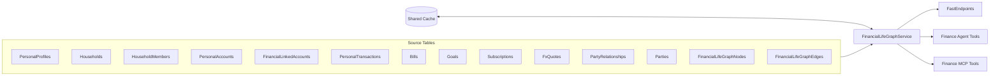
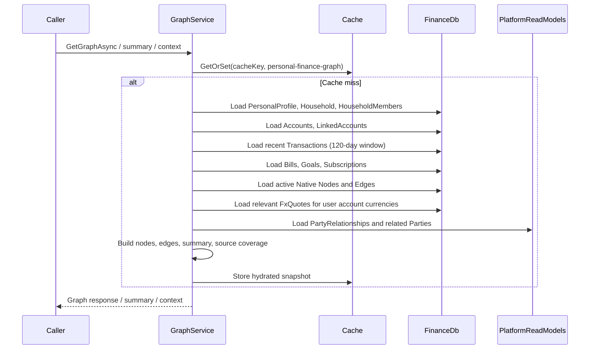
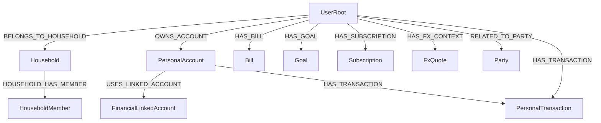
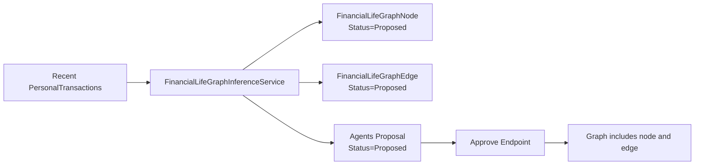

# Financial Life Graph

The Financial Life Graph is a tenant-scoped Personal Finance read model that projects a user's financial context into a graph-shaped response for UI, API, agent, and MCP consumers.

It is the implementation companion to `.specifications/013.financial-life-graph.md`, but this document describes the code that exists today rather than the full aspirational design.

## What It Is

- A graph-shaped read model built inside `Aonik.Finance`
- A projection over existing Personal Finance and Platform data
- A place for graph-native annotations and inferred relationships that do not belong in canonical source tables
- A context layer for reasoning, not a replacement for ledger, orders, payments, bills, goals, or subscriptions as systems of record

## What It Is Not

- Not a separate graph database
- Not a replacement for relational source tables
- Not an execution engine for financial state changes
- Not a free-form graph where any node can connect to any other node

## Current Architecture

## Main Code Locations

### Core Services

- `src/Aonik.Finance/Services/PersonalFinance/FinancialLifeGraphService.cs`
- `src/Aonik.Finance/Services/PersonalFinance/FinancialLifeGraphWriteService.cs`
- `src/Aonik.Finance/Services/PersonalFinance/FinancialLifeGraphValidationService.cs`
- `src/Aonik.Finance/Services/PersonalFinance/FinancialLifeGraphSchema.cs`
- `src/Aonik.Finance/Services/PersonalFinance/FinancialLifeGraphInferenceService.cs`

### Persistence

- `src/Aonik.Finance/Entities/PersonalFinance/FinancialLifeGraphNode.cs`
- `src/Aonik.Finance/Entities/PersonalFinance/FinancialLifeGraphEdge.cs`
- `src/Aonik.Finance/Persistence/Configurations/PersonalFinance/FinancialLifeGraphNodeConfiguration.cs`
- `src/Aonik.Finance/Persistence/Configurations/PersonalFinance/FinancialLifeGraphEdgeConfiguration.cs`

### Contracts

- `src/Aonik.Finance/Contracts/Models/PersonalFinance/PersonalFinanceModels.cs`
- `src/Aonik.Finance/Contracts/Models/PersonalFinance/FinancialLifeGraphStatusValues.cs`
- `src/Aonik.Finance/Contracts/Services/PersonalFinance/IFinancialLifeGraphService.cs`

### API Endpoints

- `src/Aonik.Finance/Endpoints/PersonalFinance/GetFinancialLifeGraphEndpoint.cs`
- `src/Aonik.Finance/Endpoints/PersonalFinance/GetFinancialLifeGraphSummaryEndpoint.cs`
- `src/Aonik.Finance/Endpoints/PersonalFinance/GetFinancialLifeUpcomingObligationsEndpoint.cs`
- `src/Aonik.Finance/Endpoints/PersonalFinance/GetHouseholdFinanceContextEndpoint.cs`
- `src/Aonik.Finance/Endpoints/PersonalFinance/GetRelatedPartyFinanceContextEndpoint.cs`
- `src/Aonik.Finance/Endpoints/PersonalFinance/CreateFinancialLifeGraphNodeEndpoint.cs`
- `src/Aonik.Finance/Endpoints/PersonalFinance/CreateFinancialLifeGraphEdgeEndpoint.cs`
- `src/Aonik.Finance/Endpoints/PersonalFinance/DeleteFinancialLifeGraphNodeEndpoint.cs`
- `src/Aonik.Finance/Endpoints/PersonalFinance/DeleteFinancialLifeGraphEdgeEndpoint.cs`
- `src/Aonik.Finance/Endpoints/PersonalFinance/ProposeRecurringMerchantGraphAnnotationsEndpoint.cs`
- `src/Aonik.Finance/Endpoints/PersonalFinance/GetPendingFinancialLifeGraphProposalsEndpoint.cs`
- `src/Aonik.Finance/Endpoints/PersonalFinance/ApproveFinancialLifeGraphProposalEndpoint.cs`

### Agent / MCP Integration

- `src/Aonik.Finance/Agents/Tools/FinancialLifeGraphTools.cs`
- `src/Aonik.Finance.Mcp/Tools/FinancialLifeGraphMcpTools.cs`

## Snapshot Loading Pipeline

The current graph is built on demand in `FinancialLifeGraphService.LoadSnapshotAsync`.

## Data Loading Filters

Every source query is tenant-scoped, and most are also user-scoped.

| Source | Current filter | Notes |
| --- | --- | --- |
| `PersonalProfiles` | `TenantId + UserId` | Root of user-scoped graph context |
| `Households` | `TenantId + HouseholdId` | Only loaded when profile has a household |
| `HouseholdMembers` | `TenantId + HouseholdId` | Tenant-scoped and household-scoped |
| `PersonalAccounts` | `TenantId + UserId` | Account roots for most money context |
| `FinancialLinkedAccounts` | `TenantId + UserId + PersonalAccountId in loaded accounts` | Only linked accounts owned by the current user |
| `PersonalTransactions` | `TenantId + UserId + OccurredAt >= now - 120 days` | Current graph uses a bounded recent-history window |
| `Bills` | `TenantId + UserId` | User bill obligations |
| `Goals` | `TenantId + UserId` | User savings/target goals |
| `Subscriptions` | `TenantId + UserId` | User recurring subscriptions |
| `FxQuotes` | `TenantId + relevant account currencies only` | Only pairs relevant to the current user's account currencies |
| `PartyRelationships` | `TenantId + current user's PartyId` | Anchored to the current user's party |
| `Parties` | `TenantId + related party ids from relationships` | Only parties reachable from the user's relationships |
| `FinancialLifeGraphNodes` | `TenantId + UserId + Status == Active` | Proposed/rejected nodes are not shown in the active graph |
| `FinancialLifeGraphEdges` | `TenantId + UserId + Status == Active` | Proposed/rejected edges are not shown in the active graph |

## Automatic Mirror Projection

The graph is built from source records plus graph-native records. The following projections are created automatically today.

### Node Key Format

Every projected node gets a graph node key.

| Node key prefix | Example | Backing source |
| --- | --- | --- |
| `user:` | `user:GUID` | current authenticated user |
| `household:` | `household:GUID` | `Household` |
| `household-member:` | `household-member:GUID` | `HouseholdMember` |
| `personal-account:` | `personal-account:GUID` | `PersonalAccount` |
| `linked-account:` | `linked-account:GUID` | `FinancialLinkedAccount` |
| `personal-transaction:` | `personal-transaction:GUID` | `PersonalTransaction` |
| `bill:` | `bill:GUID` | `Bill` |
| `goal:` | `goal:GUID` | `Goal` |
| `subscription:` | `subscription:GUID` | `Subscription` |
| `fx-quote:` | `fx-quote:GUID` | `FxQuote` |
| `party:` | `party:GUID` | `PartyReadModel` |
| `native-node:` | `native-node:GUID` | `FinancialLifeGraphNode` |

### Projection Matrix

| Source entity | Projected node type | Current display name | Key metadata fields | Automatically projected edges |
| --- | --- | --- | --- | --- |
| authenticated user | `UserRoot` | `Current User` | `TenantId`, `UserId`, `PartyId`, `HouseholdId` | root node only |
| `Household` | `Household` | `Household.Name` | `MemberCount`, `CreatedAt` | `UserRoot --BELONGS_TO_HOUSEHOLD--> Household` |
| `HouseholdMember` | `HouseholdMember` | `You` or `Member {UserId}` | `UserId`, `Role`, `PermissionsJson` | `Household --HOUSEHOLD_HAS_MEMBER--> HouseholdMember` |
| `PersonalAccount` | `PersonalAccount` | `PersonalAccount.Name` | `AccountType`, `Currency`, `InstitutionName`, `Status`, `AccountSubtype`, `Last4`, `IsArchived` | `UserRoot --OWNS_ACCOUNT--> PersonalAccount` |
| `FinancialLinkedAccount` | `FinancialLinkedAccount` | `FinancialLinkedAccount.Name` | `ProviderAccountReference`, `AccountType`, `AccountSubtype`, `Currency`, `Status`, `Last4`, `LastSyncedAt`, `LastSyncStatus` | `PersonalAccount --USES_LINKED_ACCOUNT--> FinancialLinkedAccount` |
| `PersonalTransaction` | `PersonalTransaction` | `Merchant ?? Description ?? fallback id label` | `Amount`, `Currency`, `OccurredAt`, `Category`, `SourceType`, `ClassificationMethod`, `ReviewStatus` | `PersonalAccount --HAS_TRANSACTION--> PersonalTransaction` when `PersonalAccountId` exists, otherwise `UserRoot --HAS_TRANSACTION--> PersonalTransaction` |
| `Bill` | `Bill` | `Bill.Payee` | `ExpectedAmount`, `Currency`, `NextDueDate`, `Frequency`, `Autopay`, `Status`, `LinkedOrderId`, `LinkedInvoiceId` | `UserRoot --HAS_BILL--> Bill` |
| `Goal` | `Goal` | `Goal.Name` | `TargetAmount`, `ProgressAmount`, `Currency`, `TargetDate`, `Status` | `UserRoot --HAS_GOAL--> Goal` |
| `Subscription` | `Subscription` | `Subscription.Merchant` | `ExpectedAmount`, `Currency`, `RenewalDate`, `Status`, `DetectedBy` | `UserRoot --HAS_SUBSCRIPTION--> Subscription` |
| `FxQuote` | `FxQuote` | `{BaseCurrency}/{TargetCurrency}` | `BaseCurrency`, `TargetCurrency`, `Rate`, `ExpiresAt`, `Provider` | `UserRoot --HAS_FX_CONTEXT--> FxQuote` |
| `PartyReadModel` + `PartyRelationshipReadModel` | `Party` | `Party.DisplayName` | `Status`, `CustomerTierCode`, `RelationshipTypeCode`, `Notes` | `UserRoot --RELATED_TO_PARTY--> Party` |
| `FinancialLifeGraphNode` | native node type from row | `DisplayName` | `PropertiesJson` (normalized) | none by itself |
| `FinancialLifeGraphEdge` | no node; edge only | n/a | `PropertiesJson` (normalized) | emitted exactly as stored |

### Important Current Notes

- `Summary.TransactionsCount` is the count of loaded transactions in the current `120`-day projection window, not lifetime transaction history.
- `FxQuote` projection is optional and depends on the user having at least two distinct account currencies.
- Native graph rows are only included when their status is `Active`.

## Relationships Currently Auto-Projected

The following relationships are emitted automatically by the graph builder today.

## Schema and Validation

`FinancialLifeGraphSchema` is the current schema contract for graph nodes and predicates.

### Current Node Types Known to the Schema

| Node type | Mirror projected | Natively creatable |
| --- | --- | --- |
| `UserRoot` | yes | no |
| `Household` | yes | no |
| `HouseholdMember` | yes | no |
| `Party` | yes | no |
| `PersonalAccount` | yes | no |
| `FinancialLinkedAccount` | yes | no |
| `PersonalTransaction` | yes | no |
| `Bill` | yes | no |
| `Goal` | yes | no |
| `Subscription` | yes | no |
| `FxQuote` | yes | no |
| `OrderRef` | reserved | no |
| `InvoiceRef` | reserved | no |
| `PaymentIntentRef` | reserved | no |
| `NativeAnnotation` | no | yes |
| `RelationshipAnnotation` | no | yes |
| `InferredAnnotation` | no | yes |

### Current Predicate Matrix

| Predicate | Allowed from -> to | Auto-projected today | Natively creatable |
| --- | --- | --- | --- |
| `OWNS_ACCOUNT` | `UserRoot -> PersonalAccount` | yes | no |
| `HAS_TRANSACTION` | `UserRoot -> PersonalTransaction`, `PersonalAccount -> PersonalTransaction` | yes | no |
| `USES_ACCOUNT` | `PersonalTransaction -> PersonalAccount`, `PersonalAccount -> FinancialLinkedAccount` | no | no |
| `USES_LINKED_ACCOUNT` | `PersonalAccount -> FinancialLinkedAccount` | yes | no |
| `HAS_BILL` | `UserRoot -> Bill` | yes | no |
| `HAS_GOAL` | `UserRoot -> Goal` | yes | no |
| `HAS_SUBSCRIPTION` | `UserRoot -> Subscription` | yes | no |
| `BELONGS_TO_HOUSEHOLD` | `UserRoot -> Household` | yes | no |
| `HOUSEHOLD_HAS_MEMBER` | `Household -> HouseholdMember` | yes | no |
| `RELATED_TO_PARTY` | `UserRoot -> Party` | yes | yes |
| `LINKED_TO_ORDER` | `Bill -> OrderRef` | not yet emitted | no |
| `LINKED_TO_INVOICE` | `Bill -> InvoiceRef` | not yet emitted | no |
| `LINKED_TO_PAYMENT_INTENT` | `Bill -> PaymentIntentRef` | not yet emitted | no |
| `FUNDED_BY_ACCOUNT` | `Goal -> PersonalAccount`, `Bill -> PersonalAccount` | not yet emitted | yes |
| `HAS_FX_CONTEXT` | `UserRoot -> FxQuote` | yes | no |
| `ANNOTATED_AS` | annotatable mirror node -> annotation node | only for persisted/inferred native edges | yes |

### Validation Rules Enforced Today

`FinancialLifeGraphValidationService` currently enforces:

- node type must exist in the schema
- mirror-only node types cannot be created through native graph write APIs
- edge predicate must exist in the schema
- `(fromType, predicate, toType)` must be allowed by the schema matrix for native writes
- `AiRunId` is required for inferred nodes and edges
- duplicate native node display names are rejected for the same user/node type
- duplicate native node source references are rejected
- duplicate native edge shapes are rejected
- household-scoped writes require household access
- edge creation validates node existence against the database-scoped graph view, not only a cached snapshot

## Native Augmentation Model

The graph has two Finance-owned native tables:

| Table | Purpose |
| --- | --- |
| `FinancialLifeGraphNodes` | stores graph-native nodes such as user annotations and inferred annotations |
| `FinancialLifeGraphEdges` | stores graph-native edges linking graph nodes or mirror nodes |

Typical native use cases:

- user-curated annotations on an account, bill, goal, party, or transaction
- relationship labels not modeled as first-class source data
- inferred annotations created by AI but not yet approved

### Status Values

Allowed graph entity statuses are defined in `src/Aonik.Finance/Contracts/Models/PersonalFinance/FinancialLifeGraphStatusValues.cs`.

| Graph entity status | Meaning |
| --- | --- |
| `Active` | included in the graph read model |
| `Proposed` | pending approval, not included in active graph reads |
| `Rejected` | retained for audit/history, excluded from active graph reads |

Proposal record statuses are tracked separately for the shared Agents `Proposal` entity:

| Proposal status | Meaning |
| --- | --- |
| `Proposed` | awaiting approval |
| `Approved` | explicitly approved |
| `Rejected` | explicitly rejected |

## Inference and Proposal Flow

The current inference implementation is intentionally conservative.

- Source: recent `PersonalTransaction` rows
- Rule: recurring outgoing merchant pattern
- Output: a proposed `InferredAnnotation` node, a proposed `ANNOTATED_AS` edge, and a shared Agents `Proposal` row

Current implementation files:

- `src/Aonik.Finance/Services/PersonalFinance/FinancialLifeGraphInferenceService.cs`
- `src/Aonik.Agents/Entities/Proposal.cs`

## Caching and Invalidation

Graph caching uses the shared cache stack rather than ad-hoc in-memory state.

### Cache Components

- `src/Aonik.SharedKernel/Caching/ICacheStore.cs`
- `src/Aonik.SharedKernel/Caching/ICacheInvalidationPublisher.cs`
- `src/Aonik.Infrastructure/Caching/FusionCacheStore.cs`
- `src/Aonik.Infrastructure/Caching/FusionCacheInvalidationHandler.cs`
- `src/Aonik.Finance/Services/PersonalFinance/IFinancialLifeGraphCacheInvalidator.cs`

### Cache Behavior

- Cache set name: `personal-finance-graph`
- Cache key: tenant + user scoped
- Snapshot is rebuilt on cache miss and reused for:
  - full graph
  - summary
  - household context
  - related-party context
  - upcoming obligations

### Invalidation Sources

Graph cache invalidation currently happens on relevant Finance writes, including:

- personal accounts
- personal transactions
- statement imports
- transaction classifications
- household membership changes
- linked account sync and account-link workflows
- native graph node/edge writes
- inference approval flow

It also happens on Platform party relationship writes via `PartyService`, because related-party projections are part of the graph.

## API Surface

### Read Endpoints

| Route | Purpose | File |
| --- | --- | --- |
| `GET /personal-finance/graph` | full graph payload | `src/Aonik.Finance/Endpoints/PersonalFinance/GetFinancialLifeGraphEndpoint.cs` |
| `GET /personal-finance/graph/summary` | compact counts and scope ids | `src/Aonik.Finance/Endpoints/PersonalFinance/GetFinancialLifeGraphSummaryEndpoint.cs` |
| `GET /personal-finance/graph/upcoming-obligations` | bills, subscriptions, dated goals | `src/Aonik.Finance/Endpoints/PersonalFinance/GetFinancialLifeUpcomingObligationsEndpoint.cs` |
| `GET /personal-finance/graph/household-context` | household-only graph slice | `src/Aonik.Finance/Endpoints/PersonalFinance/GetHouseholdFinanceContextEndpoint.cs` |
| `GET /personal-finance/graph/related-party-context` | related-party slice | `src/Aonik.Finance/Endpoints/PersonalFinance/GetRelatedPartyFinanceContextEndpoint.cs` |

### Native Write Endpoints

| Route | Purpose | File |
| --- | --- | --- |
| `POST /personal-finance/graph/nodes` | create native graph node | `src/Aonik.Finance/Endpoints/PersonalFinance/CreateFinancialLifeGraphNodeEndpoint.cs` |
| `POST /personal-finance/graph/edges` | create native graph edge | `src/Aonik.Finance/Endpoints/PersonalFinance/CreateFinancialLifeGraphEdgeEndpoint.cs` |
| `DELETE /personal-finance/graph/nodes/{id}` | delete native graph node | `src/Aonik.Finance/Endpoints/PersonalFinance/DeleteFinancialLifeGraphNodeEndpoint.cs` |
| `DELETE /personal-finance/graph/edges/{id}` | delete native graph edge | `src/Aonik.Finance/Endpoints/PersonalFinance/DeleteFinancialLifeGraphEdgeEndpoint.cs` |

### Inference / Approval Endpoints

| Route | Purpose | File |
| --- | --- | --- |
| `POST /personal-finance/graph/proposals/recurring-merchants` | create inferred proposals | `src/Aonik.Finance/Endpoints/PersonalFinance/ProposeRecurringMerchantGraphAnnotationsEndpoint.cs` |
| `GET /personal-finance/graph/proposals/pending` | list pending graph proposals | `src/Aonik.Finance/Endpoints/PersonalFinance/GetPendingFinancialLifeGraphProposalsEndpoint.cs` |
| `POST /personal-finance/graph/proposals/{proposalId}/approve` | approve a proposal | `src/Aonik.Finance/Endpoints/PersonalFinance/ApproveFinancialLifeGraphProposalEndpoint.cs` |

## Agent and MCP Tooling

Finance agent and MCP consumers call the same graph service through tool wrappers.

### Finance Agent Tools

Defined in `src/Aonik.Finance/Agents/Tools/FinancialLifeGraphTools.cs`.

- `finance_get_financial_life_graph_summary`
- `finance_get_upcoming_obligations`
- `finance_get_financial_life_graph`
- `finance_get_household_finance_context`
- `finance_get_related_party_finance_context`

### Finance MCP Tools

Defined in `src/Aonik.Finance.Mcp/Tools/FinancialLifeGraphMcpTools.cs` with equivalent coverage.

## Response Shape Conventions

### Metadata Normalization

Metadata values are normalized before being returned.

- empty metadata -> `null`
- serialized `null` -> `null`
- serialized `{}` -> `null`
- non-empty metadata -> JSON string

This keeps consumers from receiving string payloads like `"null"` or `{}` when there is effectively no metadata.

### Source Coverage

The full graph response also returns `SourceCoverage` counts for the snapshot build. This is useful for:

- quickly understanding which source domains contributed to the graph
- operational debugging
- sanity-checking that cache misses rebuild expected source slices

## Operational Characteristics

### Transaction Windowing

- Current default transaction projection window: `120` days
- The service also logs total transaction count separately
- If history was truncated, the service logs a warning

### High-Volume Warning Threshold

- Current warning threshold: `1000` items for bills, goals, subscriptions, native nodes, or native edges
- These warnings are intended to highlight when the current snapshot strategy may need paging or a more hierarchical load model

### Tenant Safety

- Source queries are tenant-scoped
- `HouseholdMember` is now tenant-scoped and participates in tenant query filters
- FX quotes are tenant-scoped and further filtered by the user's relevant account currencies
- related-party projection is anchored to the current user's `PersonalProfile.PartyId` and tenant-scoped relationship rows

## What Is Implemented vs Reserved

The schema currently includes some reserved node types and predicates that are not yet emitted by the graph builder. This is intentional so validation can stay ahead of future expansion.

### Reserved but Not Yet Auto-Projected

- `OrderRef`
- `InvoiceRef`
- `PaymentIntentRef`
- `LINKED_TO_ORDER`
- `LINKED_TO_INVOICE`
- `LINKED_TO_PAYMENT_INTENT`
- `FUNDED_BY_ACCOUNT`
- `USES_ACCOUNT` (schema-defined, not currently emitted by the builder)

## Current Tests

The main coverage for this feature is currently here:

- `tests/Aonik.Application.Tests/PersonalFinance/FinancialLifeGraphServiceTests.cs`
- `tests/Aonik.Application.Tests/PersonalFinance/FinancialLifeGraphSchemaTests.cs`
- `tests/Aonik.Api.Tests/PersonalFinanceFinancialLifeGraphEndpointsTests.cs`

These tests cover:

- graph read projection
- transaction windowing
- FX quote relevance filtering
- native graph writes
- schema-backed validation
- duplicate detection
- stale-graph edge creation protection
- inference proposal creation and approval
- endpoint behavior for read/write/inference flows

## Summary

The current Financial Life Graph implementation is a tenant-safe, graph-shaped Personal Finance read model with:

- automatic mirror projection from current Finance and Platform data
- schema-backed native graph writes
- proposal-gated inferred annotations
- shared-cache-backed hydration
- agent and MCP tool integration

It is intentionally narrower than the full specification, but the current code now has a much clearer projection model, validation contract, and operational behavior than a simple "graph wrapper" over Personal Finance tables.
