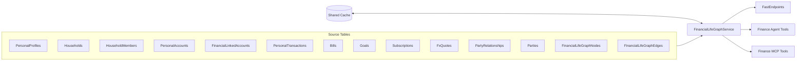
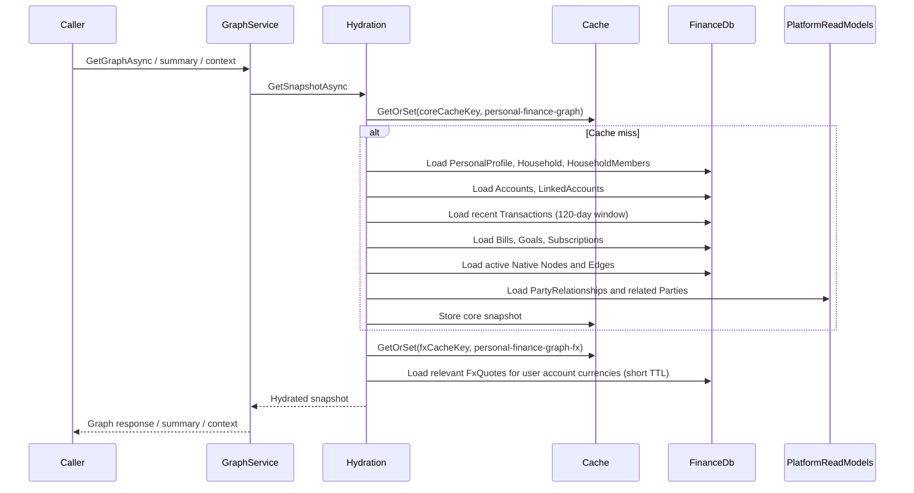
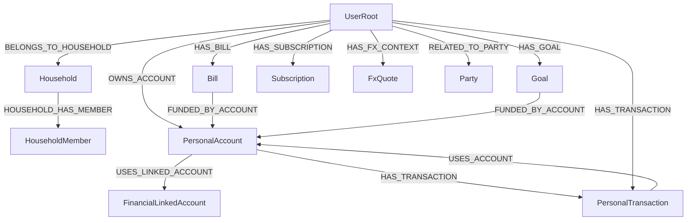
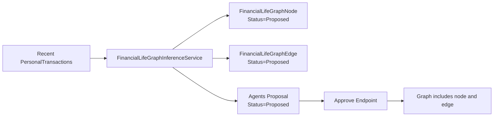

# Financial Life Graph

The Financial Life Graph is a tenant-scoped Personal Finance read model that projects a user's financial context into a graph-shaped response for UI, API, agent, and MCP consumers.

It is the implementation companion to `docs/specifications/013.financial-life-graph.md`, but this document describes the code that exists today rather than the full aspirational design.

## What It Is

- A graph-shaped read model built inside `Aonik.Finance`
- A projection over existing Personal Finance and Platform data
- A place for graph-native annotations and inferred relationships that do not belong in canonical source tables
- A context layer for reasoning, not a replacement for ledger, orders, payments, bills, goals, or subscriptions as systems of record

## What It Is Not

- Not a separate graph database
- Not a replacement for relational source tables
- Not an execution engine for financial state changes
- Not a free-form graph where any node can connect to any other node

## Current Architecture

## Main Code Locations

### Core Services

- `src/Aonik.Finance/Services/PersonalFinance/FinancialLifeGraphHydrationService.cs`
- `src/Aonik.Finance/Services/PersonalFinance/FinancialLifeGraphLoader.cs`
- `src/Aonik.Finance/Services/PersonalFinance/FinancialLifeGraphSnapshotMetrics.cs`
- `src/Aonik.Finance/Services/PersonalFinance/FinancialLifeGraphService.cs`
- `src/Aonik.Finance/Services/PersonalFinance/FinancialLifeGraphWriteService.cs`
- `src/Aonik.Finance/Services/PersonalFinance/FinancialLifeGraphValidationService.cs`
- `src/Aonik.Finance/Services/PersonalFinance/FinancialLifeGraphSchema.cs`
- `src/Aonik.Finance/Services/PersonalFinance/FinancialLifeGraphInferenceService.cs`
- `src/Aonik.Finance/Services/PersonalFinance/FinancialLifeGraphFormatting.cs`
- `src/Aonik.Finance/Services/PersonalFinance/FinancialLifeGraphNodeKeys.cs`
- `src/Aonik.Finance/Services/PersonalFinance/FinancialLifeGraphNodeKey.cs`
- `src/Aonik.Finance/Services/PersonalFinance/FinancialLifeGraphMetadata.cs`

### Persistence

- `src/Aonik.Finance/Entities/PersonalFinance/FinancialLifeGraphNode.cs`
- `src/Aonik.Finance/Entities/PersonalFinance/FinancialLifeGraphEdge.cs`
- `src/Aonik.Finance/Persistence/Configurations/PersonalFinance/FinancialLifeGraphNodeConfiguration.cs`
- `src/Aonik.Finance/Persistence/Configurations/PersonalFinance/FinancialLifeGraphEdgeConfiguration.cs`

### Contracts

- `src/Aonik.Finance/Contracts/Models/PersonalFinance/PersonalFinanceModels.cs`
- `src/Aonik.Finance/Contracts/Models/PersonalFinance/FinancialLifeGraphStatuses.cs`
- `src/Aonik.Finance/Contracts/Models/PersonalFinance/FinancialLifeGraphNodeTypes.cs`
- `src/Aonik.Finance/Contracts/Models/PersonalFinance/FinancialLifeGraphPredicates.cs`
- `src/Aonik.Finance/Contracts/Services/PersonalFinance/IFinancialLifeGraphService.cs`

### API Endpoints

- `src/Aonik.Finance/Endpoints/PersonalFinance/GetFinancialLifeGraphEndpoint.cs`
- `src/Aonik.Finance/Endpoints/PersonalFinance/GetFinancialLifeGraphSummaryEndpoint.cs`
- `src/Aonik.Finance/Endpoints/PersonalFinance/GetFinancialLifeUpcomingObligationsEndpoint.cs`
- `src/Aonik.Finance/Endpoints/PersonalFinance/GetHouseholdFinanceContextEndpoint.cs`
- `src/Aonik.Finance/Endpoints/PersonalFinance/GetRelatedPartyFinanceContextEndpoint.cs`
- `src/Aonik.Finance/Endpoints/PersonalFinance/CreateFinancialLifeGraphNodeEndpoint.cs`
- `src/Aonik.Finance/Endpoints/PersonalFinance/CreateFinancialLifeGraphEdgeEndpoint.cs`
- `src/Aonik.Finance/Endpoints/PersonalFinance/DeleteFinancialLifeGraphNodeEndpoint.cs`
- `src/Aonik.Finance/Endpoints/PersonalFinance/DeleteFinancialLifeGraphEdgeEndpoint.cs`
- `src/Aonik.Finance/Endpoints/PersonalFinance/ProposeRecurringMerchantGraphAnnotationsEndpoint.cs`
- `src/Aonik.Finance/Endpoints/PersonalFinance/GetPendingFinancialLifeGraphProposalsEndpoint.cs`
- `src/Aonik.Finance/Endpoints/PersonalFinance/ApproveFinancialLifeGraphProposalEndpoint.cs`

### Agent / MCP Integration

- `src/Aonik.Finance/Agents/Tools/FinancialLifeGraphTools.cs`
- `src/Aonik.Finance.Mcp/Tools/FinancialLifeGraphMcpTools.cs`

## Snapshot Loading Pipeline

The current graph is built on demand by `FinancialLifeGraphHydrationService`, which orchestrates caching and delegates database loading to `FinancialLifeGraphLoader` and metrics logging to `FinancialLifeGraphSnapshotMetrics`. `FinancialLifeGraphService` then focuses on transforming hydrated snapshots into API read models.

## Data Loading Filters

Every source query is tenant-scoped, and most are also user-scoped.

| Source | Current filter | Notes |
| --- | --- | --- |
| `PersonalProfiles` | `TenantId + UserId` | Root of user-scoped graph context |
| `Households` | `TenantId + HouseholdId` | Only loaded when profile has a household |
| `HouseholdMembers` | `TenantId + HouseholdId` | Tenant-scoped and household-scoped |
| `PersonalAccounts` | `TenantId + UserId` | Account roots for most money context |
| `FinancialLinkedAccounts` | `TenantId + UserId + PersonalAccountId in loaded accounts` | Only linked accounts owned by the current user |
| `PersonalTransactions` | `TenantId + UserId + OccurredAt >= now - 120 days` | Current graph uses a bounded recent-history window |
| `Bills` | `TenantId + UserId` | User bill obligations |
| `Goals` | `TenantId + UserId` | User savings/target goals |
| `Subscriptions` | `TenantId + UserId` | User recurring subscriptions |
| `FxQuotes` | `TenantId + relevant account currencies only` | Only pairs relevant to the current user's account currencies |
| `PartyRelationships` | `TenantId + current user's PartyId` | Anchored to the current user's party |
| `Parties` | `TenantId + related party ids from relationships` | Only parties reachable from the user's relationships |
| `FinancialLifeGraphNodes` | `TenantId + UserId + Status == Active` | Proposed/rejected nodes are not shown in the active graph |
| `FinancialLifeGraphEdges` | `TenantId + UserId + Status == Active` | Proposed/rejected edges are not shown in the active graph |

## Automatic Mirror Projection

The graph is built from source records plus graph-native records. The following projections are created automatically today.

### Node Key Format

Every projected node gets a graph node key.

| Node key prefix | Example | Backing source |
| --- | --- | --- |
| `user:` | `user:GUID` | current authenticated user |
| `household:` | `household:GUID` | `Household` |
| `household-member:` | `household-member:GUID` | `HouseholdMember` |
| `personal-account:` | `personal-account:GUID` | `PersonalAccount` |
| `linked-account:` | `linked-account:GUID` | `FinancialLinkedAccount` |
| `personal-transaction:` | `personal-transaction:GUID` | `PersonalTransaction` |
| `bill:` | `bill:GUID` | `Bill` |
| `goal:` | `goal:GUID` | `Goal` |
| `subscription:` | `subscription:GUID` | `Subscription` |
| `fx-quote:` | `fx-quote:GUID` | `FxQuote` |
| `party:` | `party:GUID` | `PartyReadModel` |
| `native-node:` | `native-node:GUID` | `FinancialLifeGraphNode` |
| `order-ref:` | `order-ref:GUID` | `Order` |
| `invoice-ref:` | `invoice-ref:GUID` | `Invoice` |
| `payment-intent-ref:` | `payment-intent-ref:GUID` | `PaymentIntent` |

Node key parsing and construction are centralized in `src/Aonik.Finance/Services/PersonalFinance/FinancialLifeGraphNodeKeys.cs` and wrapped by the `FinancialLifeGraphNodeKey` value object in `src/Aonik.Finance/Services/PersonalFinance/FinancialLifeGraphNodeKey.cs`.

### Projection Matrix

| Source entity | Projected node type | Current display name | Key metadata fields | Automatically projected edges |
| --- | --- | --- | --- | --- |
| authenticated user | `UserRoot` | `Current User` | `TenantId`, `UserId`, `PartyId`, `HouseholdId` | root node only |
| `Household` | `Household` | `Household.Name` | `MemberCount`, `CreatedAt` | `UserRoot --BELONGS_TO_HOUSEHOLD--> Household` |
| `HouseholdMember` | `HouseholdMember` | `You`, party display name, user email fallback, or `Member {UserId}` | `UserId`, `Role`, `PermissionsJson` | `Household --HOUSEHOLD_HAS_MEMBER--> HouseholdMember` |
| `PersonalAccount` | `PersonalAccount` | `PersonalAccount.Name` | `AccountType`, `Currency`, `InstitutionName`, `Status`, `AccountSubtype`, `Last4`, `IsArchived` | `UserRoot --OWNS_ACCOUNT--> PersonalAccount` |
| `FinancialLinkedAccount` | `FinancialLinkedAccount` | `FinancialLinkedAccount.Name` | `ProviderAccountReference`, `AccountType`, `AccountSubtype`, `Currency`, `Status`, `Last4`, `LastSyncedAt`, `LastSyncStatus` | `PersonalAccount --USES_LINKED_ACCOUNT--> FinancialLinkedAccount` |
| `PersonalTransaction` | `PersonalTransaction` | `Merchant ?? Description ?? fallback id label` | `Amount`, `Currency`, `OccurredAt`, `Category`, `SourceType`, `ClassificationMethod`, `ReviewStatus` | `PersonalAccount --HAS_TRANSACTION--> PersonalTransaction` when `PersonalAccountId` exists, otherwise `UserRoot --HAS_TRANSACTION--> PersonalTransaction`; additionally `PersonalTransaction --USES_ACCOUNT--> PersonalAccount` when `PersonalAccountId` exists |
| `Bill` | `Bill` | `Bill.Payee` | `PaidFromAccountId`, `ExpectedAmount`, `Currency`, `NextDueDate`, `Frequency`, `Autopay`, `Status`, `LinkedOrderId`, `LinkedInvoiceId` | `UserRoot --HAS_BILL--> Bill`; additionally `Bill --FUNDED_BY_ACCOUNT--> PersonalAccount` when `PaidFromAccountId` exists and points to a loaded user account |
| `Goal` | `Goal` | `Goal.Name` | `FundingAccountId`, `TargetAmount`, `ProgressAmount`, `Currency`, `TargetDate`, `Status` | `UserRoot --HAS_GOAL--> Goal`; additionally `Goal --FUNDED_BY_ACCOUNT--> PersonalAccount` when `FundingAccountId` exists and points to a loaded user account |
| `Subscription` | `Subscription` | `Subscription.Merchant` | `ExpectedAmount`, `Currency`, `RenewalDate`, `Status`, `DetectedBy` | `UserRoot --HAS_SUBSCRIPTION--> Subscription` |
| `FxQuote` | `FxQuote` | `{BaseCurrency}/{TargetCurrency}` | `BaseCurrency`, `TargetCurrency`, `Rate`, `QuotedAt`, `ExpiresAt`, `Provider` | `UserRoot --HAS_FX_CONTEXT--> FxQuote` |
| `PartyReadModel` + `PartyRelationshipReadModel` | `Party` | `Party.DisplayName (RelationshipTypeCode)` when available | `Status`, `CustomerTierCode`, `RelationshipTypeCode`, `RelationshipNotes` | `UserRoot --RELATED_TO_PARTY--> Party` |
| `FinancialLifeGraphNode` | native node type from row | `DisplayName` | `PropertiesJson` (normalized) | none by itself |
| `FinancialLifeGraphEdge` | no node; edge only | n/a | `PropertiesJson` (normalized) | emitted exactly as stored |

### Important Current Notes

- `Summary.TransactionsCount` is the count of loaded transactions in the current `120`-day projection window, not lifetime transaction history.
- `Summary.FundingRelationshipCount` is the number of currently projected `FUNDED_BY_ACCOUNT` edges derived from bill and goal funding fields.
- `Summary.InferredAnnotationCount` is the number of active inferred native annotations currently included in the graph.
- `FxQuote` projection is optional and depends on the user having at least two distinct account currencies.
- Native graph rows are only included when their status is `Active`.

## Relationships Currently Auto-Projected

The following relationships are emitted automatically by the graph builder today.

## Schema and Validation

`FinancialLifeGraphSchema` is the current schema contract for graph nodes and predicates.

### Current Node Types Known to the Schema

| Node type | Mirror projected | Natively creatable |
| --- | --- | --- |
| `UserRoot` | yes | no |
| `Household` | yes | no |
| `HouseholdMember` | yes | no |
| `Party` | yes | no |
| `PersonalAccount` | yes | no |
| `FinancialLinkedAccount` | yes | no |
| `PersonalTransaction` | yes | no |
| `Bill` | yes | no |
| `Goal` | yes | no |
| `Subscription` | yes | no |
| `FxQuote` | yes | no |
| `OrderRef` | yes | no |
| `InvoiceRef` | yes | no |
| `PaymentIntentRef` | yes | no |
| `NativeAnnotation` | no | yes |
| `RelationshipAnnotation` | no | yes |
| `InferredAnnotation` | no | yes |

### Node Type Semantics

| Node type | Meaning | Typical usage |
| --- | --- | --- |
| `UserRoot` | root context for the current authenticated user | anchor for most user-owned edges |
| `Household` | shared household grouping | household context and member traversal |
| `HouseholdMember` | a member of the user's household | shared finance context |
| `Party` | related person/business from canonical Party relationships | support/family/related-party reasoning |
| `PersonalAccount` | user-owned personal finance account | funding, transaction, and balance context |
| `FinancialLinkedAccount` | externally linked provider account backing a personal account | source connectivity and sync context |
| `PersonalTransaction` | recent transaction inside the projection window | spend and transaction reasoning |
| `Bill` | recurring or scheduled payment obligation | obligations and payment planning |
| `Goal` | savings or target goal | future commitments and trade-offs |
| `Subscription` | recurring merchant subscription | obligations and spend optimization |
| `FxQuote` | relevant FX quote enrichment | cross-currency context |
| `OrderRef` | mirror reference to a linked order | order-aware bill reasoning |
| `InvoiceRef` | mirror reference to a linked invoice | billing-aware bill reasoning |
| `PaymentIntentRef` | mirror reference to a linked payment intent | payment-execution context |
| `NativeAnnotation` | user-created graph-native annotation | manual context not represented in canonical tables |
| `RelationshipAnnotation` | user-created relationship annotation | non-canonical relationship meaning |
| `InferredAnnotation` | AI-proposed annotation awaiting approval | policy-governed inference workflow |

### Current Predicate Matrix

| Predicate | Allowed from -> to | Auto-projected today | Natively creatable |
| --- | --- | --- | --- |
| `OWNS_ACCOUNT` | `UserRoot -> PersonalAccount` | yes | no |
| `HAS_TRANSACTION` | `UserRoot -> PersonalTransaction`, `PersonalAccount -> PersonalTransaction` | yes | no |
| `USES_ACCOUNT` | `PersonalTransaction -> PersonalAccount` | yes | no |
| `USES_LINKED_ACCOUNT` | `PersonalAccount -> FinancialLinkedAccount` | yes | no |
| `HAS_BILL` | `UserRoot -> Bill` | yes | no |
| `HAS_GOAL` | `UserRoot -> Goal` | yes | no |
| `HAS_SUBSCRIPTION` | `UserRoot -> Subscription` | yes | no |
| `BELONGS_TO_HOUSEHOLD` | `UserRoot -> Household` | yes | no |
| `HOUSEHOLD_HAS_MEMBER` | `Household -> HouseholdMember` | yes | no |
| `RELATED_TO_PARTY` | `UserRoot -> Party` | yes | yes |
| `LINKED_TO_ORDER` | `Bill -> OrderRef` | yes, when `Bill.LinkedOrderId` resolves to a loaded order | no |
| `LINKED_TO_INVOICE` | `Bill -> InvoiceRef` | yes, when `Bill.LinkedInvoiceId` resolves to a loaded invoice | no |
| `LINKED_TO_PAYMENT_INTENT` | `Bill -> PaymentIntentRef` | yes, when a payment intent references the bill's linked order or invoice | no |
| `FUNDED_BY_ACCOUNT` | `Goal -> PersonalAccount`, `Bill -> PersonalAccount` | yes, when the funding account fields are populated | yes |
| `HAS_FX_CONTEXT` | `UserRoot -> FxQuote` | yes | no |
| `ANNOTATED_AS` | annotatable mirror node -> annotation node | only for persisted/inferred native edges | yes |

## Predicate Semantics

The predicate constants are defined in `src/Aonik.Finance/Contracts/Models/PersonalFinance/FinancialLifeGraphPredicates.cs`.

| Predicate | Meaning |
| --- | --- |
| `OWNS_ACCOUNT` | the user root owns a projected personal account |
| `HAS_TRANSACTION` | a user or account contains a projected transaction |
| `USES_ACCOUNT` | a projected transaction uses a specific personal account |
| `USES_LINKED_ACCOUNT` | a personal account is backed by a linked provider account |
| `HAS_BILL` | the user root has a bill obligation |
| `HAS_GOAL` | the user root has a goal |
| `HAS_SUBSCRIPTION` | the user root has a subscription |
| `BELONGS_TO_HOUSEHOLD` | the user belongs to a household |
| `HOUSEHOLD_HAS_MEMBER` | a household contains a member |
| `RELATED_TO_PARTY` | the user has a related-party relationship anchored by PartyRelationship data |
| `FUNDED_BY_ACCOUNT` | a bill or goal is funded by a specific user account |
| `HAS_FX_CONTEXT` | the user graph is enriched by a relevant FX quote |
| `ANNOTATED_AS` | a mirror node is decorated by a native or inferred annotation |
| `LINKED_TO_ORDER` | reserved link from bill to order reference |
| `LINKED_TO_INVOICE` | reserved link from bill to invoice reference |
| `LINKED_TO_PAYMENT_INTENT` | reserved link from bill to payment-intent reference |

### Validation Rules Enforced Today

`FinancialLifeGraphValidationService` currently enforces:

- node type must exist in the schema
- mirror-only node types cannot be created through native graph write APIs
- edge predicate must exist in the schema
- `(fromType, predicate, toType)` must be allowed by the schema matrix for native writes
- `AiRunId` is required for inferred nodes and edges
- duplicate native node display names are rejected for the same user/node type
- duplicate native node source references are rejected
- duplicate native edge shapes are rejected
- household-scoped writes require household access
- edge creation validates node existence against the database-scoped graph view, not only a cached snapshot

## Native Augmentation Model

The graph has two Finance-owned native tables:

| Table | Purpose |
| --- | --- |
| `FinancialLifeGraphNodes` | stores graph-native nodes such as user annotations and inferred annotations |
| `FinancialLifeGraphEdges` | stores graph-native edges linking graph nodes or mirror nodes |

Typical native use cases:

- user-curated annotations on an account, bill, goal, party, or transaction
- relationship labels not modeled as first-class source data
- inferred annotations created by AI but not yet approved

### Status Values

Allowed graph entity statuses are defined in `src/Aonik.Finance/Contracts/Models/PersonalFinance/FinancialLifeGraphStatuses.cs`.

| Graph entity status | Meaning |
| --- | --- |
| `Active` | included in the graph read model |
| `Proposed` | pending approval, not included in active graph reads |
| `Rejected` | retained for audit/history, excluded from active graph reads |

Proposal record statuses are tracked separately for the shared Agents `Proposal` entity:

| Proposal status | Meaning |
| --- | --- |
| `Proposed` | awaiting approval |
| `Approved` | explicitly approved |
| `Rejected` | explicitly rejected |

## Inference and Proposal Flow

The current inference implementation is intentionally conservative.

- Source: recent `PersonalTransaction` rows
- Rule: recurring outgoing merchant pattern
- Output: a proposed `InferredAnnotation` node, a proposed `ANNOTATED_AS` edge, and a shared Agents `Proposal` row

Current implementation files:

- `src/Aonik.Finance/Services/PersonalFinance/FinancialLifeGraphInferenceService.cs`
- `src/Aonik.Agents/Entities/Proposal.cs`

## Caching and Invalidation

Graph caching uses the shared cache stack rather than ad-hoc in-memory state.

### Cache Components

- `src/Aonik.SharedKernel/Caching/ICacheStore.cs`
- `src/Aonik.SharedKernel/Caching/ICacheInvalidationPublisher.cs`
- `src/Aonik.Infrastructure/Caching/FusionCacheStore.cs`
- `src/Aonik.Infrastructure/Caching/FusionCacheInvalidationHandler.cs`
- `src/Aonik.Finance/Services/PersonalFinance/IFinancialLifeGraphCacheInvalidator.cs`
- `src/Aonik.Finance/Services/PersonalFinance/FinancialLifeGraphHydrationService.cs`
- `src/Aonik.Finance/Services/PersonalFinance/FinancialLifeGraphLoader.cs`
- `src/Aonik.Finance/Services/PersonalFinance/FinancialLifeGraphSnapshotMetrics.cs`

### Cache Behavior

- Core cache set name: `personal-finance-graph`
- FX cache set name: `personal-finance-graph-fx`
- Cache keys: tenant + user scoped
- Snapshot is rebuilt on cache miss and reused for:
  - full graph
  - summary
  - household context
  - related-party context
  - upcoming obligations

FX quotes are cached separately with a shorter cache policy than the core snapshot because they change more quickly than the rest of the projected graph.

### Metadata Handling

- Graph metadata is normalized through `FinancialLifeGraphMetadata` in `src/Aonik.Finance/Services/PersonalFinance/FinancialLifeGraphMetadata.cs`
- Empty metadata, whitespace, `{}`, and serialized `null` all normalize to no metadata
- This keeps node and edge metadata consistent for API, agent, and MCP consumers

### Invalidation Sources

Graph cache invalidation currently happens on relevant Finance writes, including:

- personal accounts
- personal transactions
- statement imports
- transaction classifications
- household membership changes
- linked account sync and account-link workflows
- native graph node/edge writes
- inference approval flow

It also happens on Platform party relationship writes via `PartyService`, because related-party projections are part of the graph.

## API Surface

### Read Endpoints

| Route | Purpose | File |
| --- | --- | --- |
| `GET /personal-finance/graph` | full graph payload | `src/Aonik.Finance/Endpoints/PersonalFinance/GetFinancialLifeGraphEndpoint.cs` |
| `GET /personal-finance/graph/summary` | compact counts and scope ids | `src/Aonik.Finance/Endpoints/PersonalFinance/GetFinancialLifeGraphSummaryEndpoint.cs` |
| `GET /personal-finance/graph/upcoming-obligations` | bills, subscriptions, dated goals | `src/Aonik.Finance/Endpoints/PersonalFinance/GetFinancialLifeUpcomingObligationsEndpoint.cs` |
| `GET /personal-finance/graph/household-context` | household-only graph slice | `src/Aonik.Finance/Endpoints/PersonalFinance/GetHouseholdFinanceContextEndpoint.cs` |
| `GET /personal-finance/graph/related-party-context` | related-party slice | `src/Aonik.Finance/Endpoints/PersonalFinance/GetRelatedPartyFinanceContextEndpoint.cs` |

### Native Write Endpoints

| Route | Purpose | File |
| --- | --- | --- |
| `POST /personal-finance/graph/nodes` | create native graph node | `src/Aonik.Finance/Endpoints/PersonalFinance/CreateFinancialLifeGraphNodeEndpoint.cs` |
| `POST /personal-finance/graph/edges` | create native graph edge | `src/Aonik.Finance/Endpoints/PersonalFinance/CreateFinancialLifeGraphEdgeEndpoint.cs` |
| `DELETE /personal-finance/graph/nodes/{id}` | delete native graph node | `src/Aonik.Finance/Endpoints/PersonalFinance/DeleteFinancialLifeGraphNodeEndpoint.cs` |
| `DELETE /personal-finance/graph/edges/{id}` | delete native graph edge | `src/Aonik.Finance/Endpoints/PersonalFinance/DeleteFinancialLifeGraphEdgeEndpoint.cs` |

Current deletion behavior relies on the platform's soft-delete infrastructure in `AonikDbContextBase`, so audit history is preserved even when graph-native annotations are removed from active reads.

### Inference / Approval Endpoints

| Route | Purpose | File |
| --- | --- | --- |
| `POST /personal-finance/graph/proposals/recurring-merchants` | create inferred proposals | `src/Aonik.Finance/Endpoints/PersonalFinance/ProposeRecurringMerchantGraphAnnotationsEndpoint.cs` |
| `GET /personal-finance/graph/proposals/pending` | list pending graph proposals | `src/Aonik.Finance/Endpoints/PersonalFinance/GetPendingFinancialLifeGraphProposalsEndpoint.cs` |
| `POST /personal-finance/graph/proposals/{proposalId}/approve` | approve a proposal | `src/Aonik.Finance/Endpoints/PersonalFinance/ApproveFinancialLifeGraphProposalEndpoint.cs` |
| `POST /personal-finance/graph/proposals/{proposalId}/reject` | reject a proposal | `src/Aonik.Finance/Endpoints/PersonalFinance/RejectFinancialLifeGraphProposalEndpoint.cs` |

## Agent and MCP Tooling

Finance agent and MCP consumers call the same graph service through tool wrappers.

### Finance Agent Tools

Defined in `src/Aonik.Finance/Agents/Tools/FinancialLifeGraphTools.cs`.

- `finance_get_financial_life_graph_summary`
- `finance_get_upcoming_obligations`
- `finance_get_financial_life_graph`
- `finance_get_household_finance_context`
- `finance_get_related_party_finance_context`

### Finance MCP Tools

Defined in `src/Aonik.Finance.Mcp/Tools/FinancialLifeGraphMcpTools.cs` with equivalent coverage.

## Response Shape Conventions

### Metadata Normalization

Metadata values are normalized before being returned.

- empty metadata -> `null`
- serialized `null` -> `null`
- serialized `{}` -> `null`
- non-empty metadata -> JSON string

This keeps consumers from receiving string payloads like `"null"` or `{}` when there is effectively no metadata.

### Source Coverage

The full graph response also returns `SourceCoverage` counts for the snapshot build. This is useful for:

- quickly understanding which source domains contributed to the graph
- operational debugging
- sanity-checking that cache misses rebuild expected source slices

## Operational Characteristics

### Transaction Windowing

- Current default transaction projection window: `120` days
- The service also logs total transaction count separately
- If history was truncated, the service logs a warning

### High-Volume Warning Threshold

- Current warning threshold: `1000` items for bills, goals, subscriptions, native nodes, or native edges
- These warnings are intended to highlight when the current snapshot strategy may need paging or a more hierarchical load model

### Tenant Safety

- Source queries are tenant-scoped
- `HouseholdMember` is now tenant-scoped and participates in tenant query filters
- FX quotes are tenant-scoped and further filtered by the user's relevant account currencies
- related-party projection is anchored to the current user's `PersonalProfile.PartyId` and tenant-scoped relationship rows

## Conditional Projection Notes

- `FUNDED_BY_ACCOUNT` is emitted only when `Goal.FundingAccountId` or `Bill.PaidFromAccountId` is populated and matches a loaded user account
- `USES_ACCOUNT` is emitted for transactions that have `PersonalAccountId`
- `USES_LINKED_ACCOUNT` is emitted for linked accounts attached to a loaded personal account
- `LINKED_TO_ORDER`, `LINKED_TO_INVOICE`, and `LINKED_TO_PAYMENT_INTENT` are emitted only when the underlying bill links resolve to loaded order, invoice, and payment-intent rows

## Current Tests

The main coverage for this feature is currently here:

- `tests/Aonik.Application.Tests/PersonalFinance/FinancialLifeGraphServiceTests.cs`
- `tests/Aonik.Application.Tests/PersonalFinance/FinancialLifeGraphSchemaTests.cs`
- `tests/Aonik.Api.Tests/PersonalFinanceFinancialLifeGraphEndpointsTests.cs`

These tests cover:

- graph read projection
- transaction windowing
- FX quote relevance filtering
- native graph writes
- schema-backed validation
- duplicate detection
- stale-graph edge creation protection
- inference proposal creation and approval
- endpoint behavior for read/write/inference flows

## Summary

The current Financial Life Graph implementation is a tenant-safe, graph-shaped Personal Finance read model with:

- automatic mirror projection from current Finance and Platform data
- schema-backed native graph writes
- proposal-gated inferred annotations
- shared-cache-backed hydration
- agent and MCP tool integration

It is intentionally narrower than the full specification, but the current code now has a much clearer projection model, validation contract, and operational behavior than a simple "graph wrapper" over Personal Finance tables.
