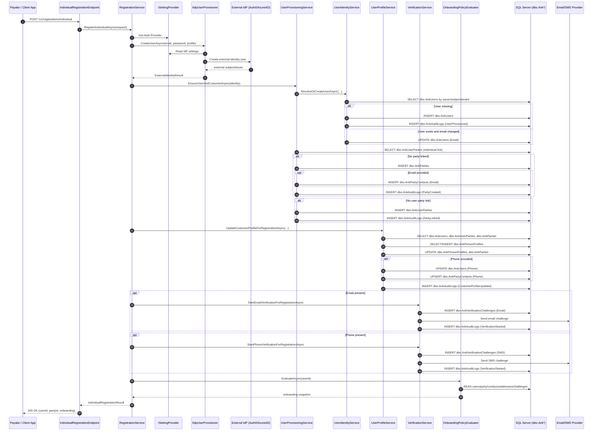
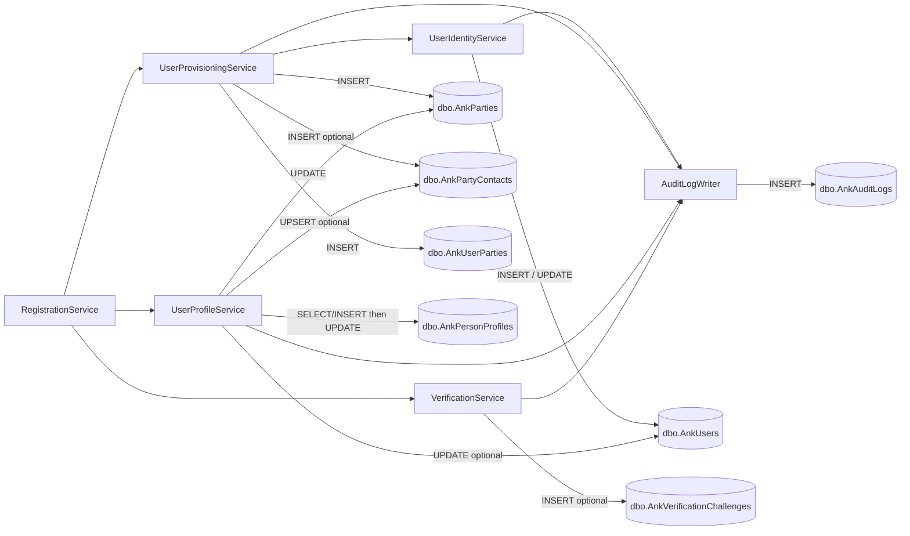

# Individual Registration Flow

This document explains the backend execution path for `POST /v1/registrations/individual`, including service orchestration and database tables that are read or written.

## Endpoint

- Route: `POST /v1/registrations/individual`
- Endpoint class: `src/Aonik.Platform/Endpoints/Registrations/IndividualRegistrationEndpoint.cs`
- Entry service: `RegistrationService.RegisterIndividualAsync(...)`

The endpoint resolves `TenantId` from:

1. request body (`tenantId`), else
2. header (`X-Tenant-Id`) when header routing is enabled, else
3. subdomain lookup when subdomain routing is enabled.

## End-to-End Sequence

## Service Responsibilities

- `RegistrationService`
  - Orchestrates provider selection, external user creation, local provisioning, profile update, verification start, onboarding evaluation.
  - Registration-specific behavior:
    - Uses `UpdateCustomerProfileForRegistrationAsync` (permission bypass for initial signup flow).
    - Uses `Start*VerificationForRegistrationAsync` methods.
    - Catches verification delivery exceptions and still returns successful registration.

- `Auth0UserProvisioner` / `AzureAdUserProvisioner`
  - Creates identity in external IdP.
  - No AONIK table writes.

- `UserProvisioningService`
  - Ensures local `User`, `Party`, and `UserParty` link exist.

- `UserIdentityService`
  - Creates or resolves user by `(TenantId, ExternalIssuer, ExternalSubject)`.

- `UserProfileService`
  - Persists first/last/title/country/phone details onto user-party profile structures.

- `VerificationService`
  - Creates verification challenge records and dispatches notifications.

- `OnboardingPolicyEvaluator`
  - Read-only evaluation of onboarding gates (`EmailVerified`, `PhoneVerified`, `ProfileComplete`).

## Table Mutation Map

## Table-Level Details

| Table | Writes during registration | Conditions |
|---|---|---|
| `dbo.AnkUsers` | `INSERT` (new user), `UPDATE` email, optional `UPDATE` phone | New external identity creates row; existing user email may update; phone updates when provided |
| `dbo.AnkParties` | `INSERT` individual party, `UPDATE` display/profile fields | Insert when no existing individual party link; update during profile step |
| `dbo.AnkPartyContacts` | `INSERT` email contact, optional phone upsert | Email contact on new party create; phone contact when phone provided |
| `dbo.AnkUserParties` | `INSERT` individual link | Insert when no existing `LinkType = "Individual"` link |
| `dbo.AnkPersonProfiles` | `INSERT` if missing, then `UPDATE` profile data | Always ensured by profile step |
| `dbo.AnkVerificationChallenges` | Optional `INSERT` email/sms challenge | Email and/or phone present in registration request |
| `dbo.AnkAuditLogs` | Multiple `INSERT`s | User provisioned, party created, party linked, profile updated, verification started |

## Read-Only Tables During Registration

- `dbo.AnkSettings` (auth provider and IdP credentials)
- `dbo.AnkTenants` (tenant existence/active validation in user creation path)
- `dbo.AnkPartyAddresses` (onboarding profile-complete gate evaluation)
- `dbo.AnkVerificationChallenges` (onboarding verified gates evaluation)

## Important Operational Notes

- There is no single outer transaction across the entire flow; persistence occurs across multiple `SaveChangesAsync` calls in different services.
- If external IdP creation fails, local DB writes do not start.
- Verification send failures do not fail registration (current behavior), but challenge inserts may already exist because the challenge row is written before dispatch.
- No finance-domain tables are touched by individual registration.

## Source Files

- `src/Aonik.Platform/Endpoints/Registrations/IndividualRegistrationEndpoint.cs`
- `src/Aonik.Platform/Services/Registration/RegistrationService.cs`
- `src/Aonik.Infrastructure/Authentication/Provisioning/Auth0UserProvisioner.cs`
- `src/Aonik.Infrastructure/Authentication/Provisioning/AzureAdUserProvisioner.cs`
- `src/Aonik.Platform/Services/Identity/UserProvisioningService.cs`
- `src/Aonik.Platform/Services/Identity/UserIdentityService.cs`
- `src/Aonik.Platform/Services/Identity/UserProfileService.cs`
- `src/Aonik.Platform/Services/Identity/VerificationService.cs`
- `src/Aonik.Platform/Services/Onboarding/OnboardingPolicyEvaluator.cs`
