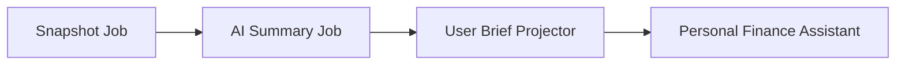
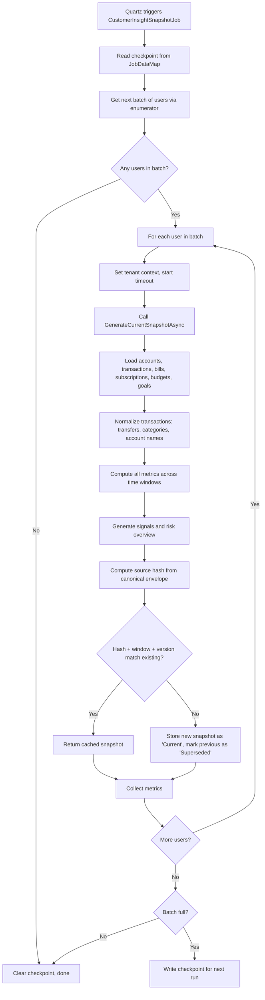
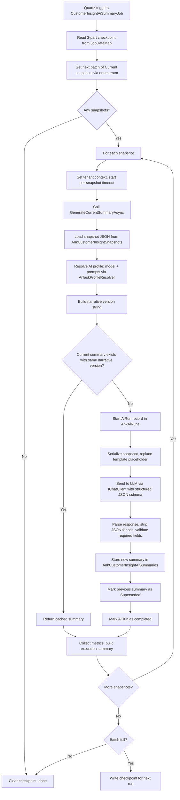
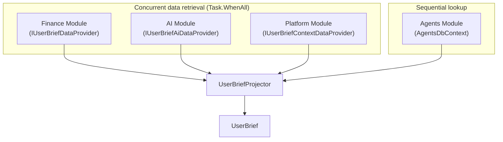
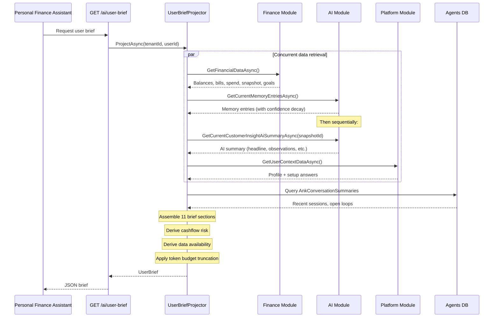
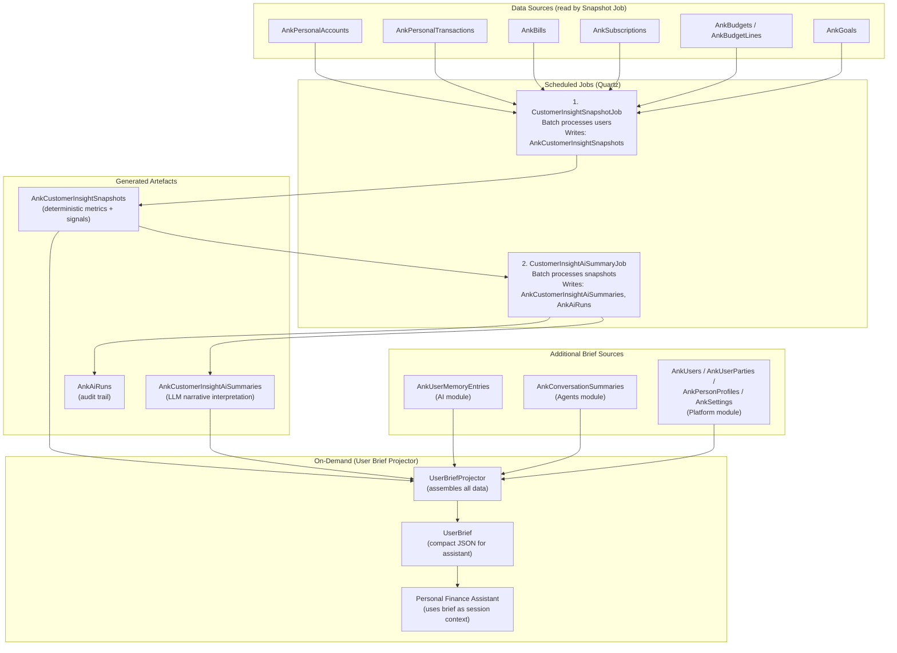

# Customer Insight Generation Pipeline

This document explains how AONIK generates financial insights for a customer, produces an AI summary of those insights, and assembles the User Brief that powers the Personal Finance Assistant.

---

## Overview

The pipeline has **two scheduled jobs** that run sequentially and one **on-demand projector** that assembles everything into a brief:

1. **Snapshot Job** — Crunches raw financial data into a deterministic insight snapshot
2. **AI Summary Job** — Sends the snapshot to an LLM for a human-readable narrative
3. **User Brief Projector** — Assembles snapshot + AI summary + user context into a brief (on-demand, when the assistant starts a session)



---

## Database Tables

All tables live in the `dbo` schema and use the `Ank` prefix (via `ModuleTablePrefixes`).

### Pipeline tables (written to)

| Table | Module | Purpose |
|-------|--------|---------|
| `AnkCustomerInsightSnapshots` | Finance | Deterministic insight snapshots (full JSON document + metadata) |
| `AnkCustomerInsightAiSummaries` | AI | LLM-generated narrative summaries linked to snapshots |
| `AnkAiRuns` | AI | Audit trail for every LLM invocation (input refs, output ref, outcome) |

### Source data tables (read during snapshot generation)

| Table | Module | What it provides |
|-------|--------|-----------------|
| `AnkPersonalAccounts` | Finance | Account balances, currency, status |
| `AnkPersonalTransactions` | Finance | Transaction history (180-day window) |
| `AnkBills` | Finance | Active bills, next due dates |
| `AnkSubscriptions` | Finance | Active subscriptions, renewal dates |
| `AnkBudgets` / `AnkBudgetLines` | Finance | Active budgets and per-category lines |
| `AnkGoals` | Finance | Savings goals with targets and progress |
| `AnkPersonalProfiles` | Finance | User financial profile |

### User Brief assembly tables (read during brief projection)

| Table | Module | What it provides |
|-------|--------|-----------------|
| `AnkUserMemoryEntries` | AI | Identity, communication style, household context (with confidence decay) |
| `AnkConversationSummaries` | Agents | Recent conversation history, open loops, recommendation outcomes |
| `AnkUsers` | Platform | User identity (email, phone) |
| `AnkUserParties` | Platform | User-to-party mapping |
| `AnkPersonProfiles` | Platform | Party profile (first name, last name) |
| `AnkParties` | Platform | Party display name |
| `AnkSettings` | Platform | Setup profile (onboarding answers) |

### AI configuration tables (read during summary generation)

| Table | Module | Purpose |
|-------|--------|---------|
| `AnkAiRoutePolicies` | AI | Model routing per use-case (tenant-specific or global) |
| `AnkAiModels` | AI | Registered AI models |
| `AnkPromptSpecs` | AI | Tenant-overridable prompt templates (DB-first, file-fallback) |

### Quartz scheduler tables

| Table | Purpose |
|-------|---------|
| `QRTZ_JOB_DETAILS` | Job definitions and `JobDataMap` (stores batch checkpoints) |
| `QRTZ_TRIGGERS` / `QRTZ_CRON_TRIGGERS` | Trigger schedules and state |
| `QRTZ_FIRED_TRIGGERS` | Currently executing triggers |
| `QRTZ_LOCKS` | Cluster-wide locks for concurrency control |

---

## Step 1: Generate the Deterministic Snapshot

**What:** Analyse a customer's raw financial data (accounts, transactions, bills, subscriptions, budgets, goals) and produce a structured, deterministic snapshot of their financial situation.

**When:** The `CustomerInsightSnapshotJob` runs on a Quartz cron schedule. It processes users in batches using a checkpoint cursor (tenant + user ID) persisted in the Quartz `JobDataMap` so it can resume across runs.

**Where the code lives:**
- Job: `src/Aonik.Worker/Jobs/CustomerInsightSnapshotJob.cs`
- User enumerator: `src/Aonik.Worker/Jobs/CustomerInsightSnapshotJobUserEnumerator.cs`
Service / Generator / Reader currently still live in `Aonik.Finance` (they touch Orders / Parties directly and are blocked on a SharedKernel write-contract refactor — see [ADR-006](../decisions/006-extract-personal-finance-module.md)). The entities + contracts have already moved to `Aonik.PersonalFinance`.

- Service: `src/Aonik.Finance/Services/PersonalFinance/CustomerInsightSnapshotService.cs`
- Generator: `src/Aonik.Finance/Services/PersonalFinance/CustomerInsightSnapshotGenerator.cs`
- Reader: `src/Aonik.Finance/Services/PersonalFinance/CustomerInsightSnapshotReader.cs`
- Entity: `src/Aonik.PersonalFinance/Entities/PersonalFinance/CustomerInsightSnapshot.cs`
- Models: `src/Aonik.PersonalFinance/Contracts/Models/PersonalFinance/CustomerInsightSnapshotModels.cs`
- Configuration: `src/Aonik.PersonalFinance/Persistence/Configurations/PersonalFinance/CustomerInsightSnapshotConfiguration.cs`

### Batch processing and checkpoints

The job uses `[DisallowConcurrentExecution]` and `[PersistJobDataAfterExecution]` to prevent overlapping runs and persist state.

**Checkpoint keys** (stored in Quartz `JobDataMap`):
- `CustomerInsightSnapshotJob.CheckpointTenantId`
- `CustomerInsightSnapshotJob.CheckpointUserId`

**User enumeration** (`CustomerInsightSnapshotJobUserEnumerator`):
1. Queries `PersonalProfiles`, `PersonalAccounts`, `PersonalTransactions`, `Bills`, `Subscriptions`, `Goals`, `Budgets` for distinct `(TenantId, UserId)` tuples
2. Uses `IgnoreQueryFilters()` to bypass tenant and soft-delete filters (system-wide batch)
3. Unions all results, deduplicates, orders by `TenantId` then `UserId`
4. If a checkpoint exists, skips users at or before the checkpoint
5. Returns the next `batchSize` users

**Batch flow:**
1. Read checkpoint from `JobDataMap`
2. Fetch next batch of eligible users
3. For each user:
   - Set tenant context
   - Apply per-user timeout (configurable, with cancellation token)
   - Call `GenerateCurrentSnapshotAsync`
   - Collect metrics (status, partial coverage, signals, durations)
   - Log warnings for slow or failed users
4. If batch count < `batchSize`: clear checkpoint (dataset exhausted)
5. If batch count == `batchSize`: write checkpoint from last processed user
6. Return execution summary with processed/failed counts and top signals

**Configurable options** (`ScheduledJobOptions.CustomerInsightSnapshot`):
- `BatchSize` — users per run
- `UserWarningThresholdSeconds` — log warning if a single user exceeds this
- `UserTimeoutSeconds` — per-user cancellation timeout

### What the snapshot captures

The generator loads data from six source tables and computes metrics across four time windows:

| Window | Duration | Purpose |
|--------|----------|---------|
| Operational | 30 days back | Current spending, balances, income |
| Trend | 90 days back | Month-over-month changes |
| Behaviour | 180 days back | Longer-term patterns and signal detection |
| Obligations lookahead | 30 days forward | Upcoming bills and subscriptions |

**Computed metrics:**

| Metric | Key computations |
|--------|-----------------|
| **Cash position** | Account count, total/available balance by currency, per-account share, liquidity concentration |
| **Income summary** | Total inflows, recurring estimate (2+ months observed), cadence, top 10 sources, by-account flows, MoM deltas |
| **Expense summary** | Total outflows, fixed/variable/essential/discretionary estimates, by-account flows, MoM deltas, weekly/monthly averages |
| **Category insights** | Top categories by amount/share, trend deltas (25%+ highlighted), concentration ratios |
| **Merchant insights** | Top merchants by amount/frequency, recurring candidates (2+ months), concentration ratios |
| **Obligation insights** | Upcoming bills/subscriptions (30-day lookahead), coverage ratios (available balance / upcoming obligations) |
| **Budget insights** | Active budget count, categories above 80% threshold, overspent (>100%), projected to overspend |
| **Goal insights** | Active goal count, progress %, estimated monthly contribution, months to target, savings contribution consistency |

### Signal detection

The generator evaluates 12 signal types across the behaviour window:

| Signal | Trigger condition |
|--------|------------------|
| Repayment burden rising | Loan payments increased 15%+ with 25+ amount delta |
| Savings rate falling | Savings-to-income ratio declining |
| Category acceleration | Spending spike in category (25%+ delta) |
| Recurring commitment growth | Outflow increases 15%+ MoM |
| Income instability | Coefficient of variation > 0.25 |
| Cash buffer deterioration | Balance fell 20% in operational window |
| Merchant concentration increase | Top merchant 35%+ of spend, increased 15%+ from previous |
| Late-month spend spikes | Last 7 days daily spend / first 24 days > 1.2x, 2+ months observed |
| Cashflow stress | Coverage ratio < 1 (obligations exceed available cash) |
| Budget pressure | Categories overspent or at 80%+ threshold |
| Dormant subscriptions | No matching transaction in 60 days |
| Recurring merchant patterns | Merchant appears 2+ months |

Each signal includes severity (Low/Moderate/High/Critical), confidence (Low/Medium/High based on observation count), metric references, and evidence summary. Top 20 signals returned, sorted by severity then category.

### Risk overview

| Risk dimension | High | Moderate | Low |
|---------------|------|----------|-----|
| Cashflow stress | Coverage ratio < 1 | Coverage ratio 1–2 | Coverage ratio > 2 |
| Budget pressure | Overspent categories exist | Categories at 80%+ threshold | Below threshold |
| Concentration | Category ≥ 50% or merchant ≥ 40% | — | Below thresholds |
| Unusual activity | High/critical severity signals in risk/trends/spending | — | None |

### Deduplication

The generator computes a **source hash** (SHA-256) from a canonical JSON envelope of all input data (accounts, transactions, bills, subscriptions, budgets, goals — all normalized and sorted). If the hash, time window, and generator version match an existing `Current` snapshot, the cached version is returned without creating a new row.



### Failure handling

If generation fails for a user (timeout or exception):
- A `Failed` snapshot record is persisted with a truncated failure reason (max 1000 chars)
- The previous `Current` snapshot is left untouched
- The job continues to the next user
- Failure details are included in the execution summary

### Snapshot entity schema

| Column | Type | Details |
|--------|------|---------|
| `Id` | `uniqueidentifier` | PK (from `AuditableEntity`) |
| `TenantId` | `uniqueidentifier` | Multi-tenant filtering |
| `UserId` | `uniqueidentifier` | Target user |
| `Status` | `varchar(32)` | `Current`, `Superseded`, or `Failed` |
| `AsOfUtc` | `datetime2` | Generation timestamp |
| `WindowStartUtc` | `datetime2` | Behaviour window start (180 days back) |
| `WindowEndUtc` | `datetime2` | Window end (23:59:59 UTC today) |
| `Version` | `int` | Incremented per new snapshot for the user |
| `SourceHash` | `varchar(64)` | SHA-256 hex for deduplication |
| `SnapshotJson` | `nvarchar(max)` | Full serialized `CustomerInsightSnapshotDocument` |
| `GeneratedBy` | `varchar(128)` | Generator version string |
| `GenerationDurationMs` | `int?` | Elapsed time |
| `FailureReason` | `varchar(1000)` | Error message (failed snapshots only) |
| `SupersededById` | `uniqueidentifier?` | FK to the snapshot that replaced this one |
| `CreatedAt` / `UpdatedAt` | `datetime2` | Audit timestamps |

**Indexes:**
1. `(TenantId, UserId, Status)` filtered on `Status='Current'` — fast current snapshot lookup
2. `(TenantId, UserId, AsOfUtc)` — query by generation time
3. `(TenantId, UserId, SourceHash)` — deduplication check
4. `(SupersededById)` — FK navigation

### Snapshot output schema: `customer_insight_snapshot.v1`

```
CustomerInsightSnapshotDocument
├── SchemaVersion, TenantId, UserId, AsOfUtc
├── AnalysisWindow (operational/trend/behaviour days, obligations lookahead)
├── CurrencyPolicy (native, no FX conversion)
├── Currencies (all observed currencies, normalised uppercase)
├── Coverage (IsPartial, AvailableDomains, MissingDomains, Warnings)
├── Metrics
│   ├── CashPosition (balances by account, concentration)
│   ├── IncomeSummary (sources, recurring, cadence, MoM deltas)
│   ├── ExpenseSummary (fixed/variable, essential/discretionary, MoM deltas)
│   ├── CategoryInsights (top by amount/share, trends, concentration)
│   ├── MerchantInsights (top by amount/frequency, recurring, concentration)
│   ├── ObligationInsights (upcoming bills/subs, coverage ratios)
│   ├── BudgetInsights (active budgets, overspent, projected)
│   └── GoalInsights (progress, contribution consistency)
├── Signals[] (key, category, title, severity, confidence, metric refs, evidence)
├── RiskOverview (cashflow stress, budget pressure, concentration, unusual activity)
└── Evidence (transaction/account counts, excluded transfers, rule versions, warnings)
```

---

## Step 2: Generate the AI Summary

**What:** Send the deterministic snapshot to an LLM to produce a human-readable narrative interpretation — a headline, observations, patterns, recommendations, and conversation starters.

**When:** The `CustomerInsightAiSummaryJob` runs on a Quartz cron schedule (default: every 30 minutes). It finds `Current` snapshots that don't have a matching `Current` AI summary and processes them in batches.

**Where the code lives:**
- Job: `src/Aonik.Worker/Jobs/CustomerInsightAiSummaryJob.cs`
- Snapshot enumerator: `src/Aonik.Worker/Jobs/CustomerInsightAiSummaryJobSnapshotEnumerator.cs`
- Service: `src/Aonik.Ai/Services/CustomerInsightAiSummaryService.cs`
- Reader: `src/Aonik.Ai/Services/CustomerInsightAiSummaryReader.cs`
- Entity: `src/Aonik.Ai/Entities/CustomerInsightAiSummary.cs`
- Models: `src/Aonik.SharedKernel/Abstractions/Ai/CustomerInsightAiSummaryModels.cs`
- Configuration: `src/Aonik.Ai/Persistence/Configurations/CustomerInsightAiSummaryConfiguration.cs`
- Profile resolver: `src/Aonik.Ai/Services/AiTaskProfileResolver.cs`
- Prompt store: `src/Aonik.Ai/Services/TenantAwarePromptStore.cs` (DB-first, file-fallback)

### Batch processing and checkpoints

Uses the same `[DisallowConcurrentExecution]` / `[PersistJobDataAfterExecution]` pattern as the snapshot job.

**Checkpoint keys** (3-part composite in `JobDataMap`):
- `CustomerInsightAiSummaryJob.CheckpointTenantId`
- `CustomerInsightAiSummaryJob.CheckpointUserId`
- `CustomerInsightAiSummaryJob.CheckpointSnapshotId`

**Snapshot enumeration** (`CustomerInsightAiSummaryJobSnapshotEnumerator`):
1. Queries `CustomerInsightSnapshots` with `IgnoreQueryFilters()` where `Status='Current'`
2. Orders deterministically by `(TenantId, UserId, SnapshotId)`
3. Filters past checkpoint if one exists
4. Returns next `batchSize` snapshot targets

**Configurable options** (`CustomerInsightAiSummaryJobOptions`):
- `BatchSize`: 50
- `SnapshotWarningThresholdSeconds`: 20
- `SnapshotTimeoutSeconds`: 90

### How it works



### AI profile resolution

The `AiTaskProfileResolver` composes model selection and prompt loading:

1. **Model resolution**: Queries `AnkAiRoutePolicies` for a use-case match (tenant-specific first, then global). Falls back to a default model if no policy exists.
2. **Prompt loading** (via `TenantAwarePromptStore`): Checks `AnkPromptSpecs` for tenant-overridden prompts (DB-first). Falls back to file-based prompts at `prompts/{name}.v1.{role}.md`.
3. Returns `AiTaskProfile(ModelId, SystemPrompt, UserPromptTemplate)`.

**Use-case**: `personal_finance_customer_insight_summary`
**Prompt name**: `customer_insight_summary`

### Structured LLM output

The service enforces structured output using `ChatResponseFormat.ForJsonSchema()` from `Microsoft.Extensions.AI`. The JSON schema is defined as a constant in `CustomerInsightAiSummaryContract.SummaryJsonSchema`.

```csharp
var schema = JsonDocument.Parse(CustomerInsightAiSummaryContract.SummaryJsonSchema).RootElement;
var chatOptions = new ChatOptions
{
    ModelId = profile.ModelId,
    ResponseFormat = ChatResponseFormat.ForJsonSchema(
        schema,
        schemaName: "CustomerInsightAiSummary",
        schemaDescription: "A structured AI summary of a customer insight snapshot.")
};
```

The prompt template uses a `{{SNAPSHOT_JSON}}` placeholder that is replaced with the full serialized snapshot document before sending to the LLM.

### Narrative versioning

The AI summary has a **narrative version** string:

```
{schemaVersion}|prompt:{promptName}:{promptVersion}|model:{modelId}
```

Example: `customer_insight_ai_summary.v1|prompt:customer_insight_summary:v1|model:gpt-5-mini`

If the model or prompt changes, the narrative version changes, and the next job run regenerates the summary. If nothing has changed, the cached summary is reused.

### Failure handling

If the LLM call fails (timeout, bad response, validation failure):
- A `Failed` summary record is stored in `AnkCustomerInsightAiSummaries` with a truncated failure reason (max 1000 chars)
- The **previous** `Current` summary is left untouched as a fallback (EF change tracker is reset to `Unchanged`)
- The `AiRun` in `AnkAiRuns` is marked as failed (errors swallowed to avoid masking the original failure)
- The pipeline continues to the next snapshot
- Top 3 failure details included in execution summary

### AI summary entity schema

| Column | Type | Details |
|--------|------|---------|
| `Id` | `uniqueidentifier` | PK |
| `TenantId` | `uniqueidentifier` | Multi-tenant filtering |
| `UserId` | `uniqueidentifier` | Target user |
| `CustomerInsightSnapshotId` | `uniqueidentifier` | FK to source snapshot |
| `AiRunId` | `uniqueidentifier` | FK to `AnkAiRuns` (audit trail) |
| `Status` | `varchar(32)` | `Current`, `Superseded`, or `Failed` |
| `AsOfUtc` | `datetime2` | From snapshot |
| `NarrativeVersion` | `varchar(200)` | Schema + prompt + model version string |
| `SummaryJson` | `nvarchar(max)` | Full serialized `CustomerInsightAiSummaryDocument` |
| `SupersededById` | `uniqueidentifier?` | Self-referential FK |
| `FailureReason` | `varchar(1000)` | Error message (failed summaries only) |
| `CreatedAt` / `UpdatedAt` | `datetime2` | Audit timestamps |

**Indexes:**
1. `(TenantId, UserId, Status)` filtered on `Status='Current'` — fast current summary lookup
2. `(CustomerInsightSnapshotId, Status)` filtered on `Status='Current'` — find summary for snapshot
3. `(AiRunId)` — audit trail lookup
4. `(SupersededById)` — versioning chain navigation

### AI summary output schema: `customer_insight_ai_summary.v1`

```
CustomerInsightAiSummaryDocument
├── SchemaVersion                  — "customer_insight_ai_summary.v1"
├── Headline                       — One-line opening insight
├── Summary                        — Narrative interpretation paragraph
├── KeyObservations[]              — Main findings from the data
├── PositivePatterns[]             — Strengths and good habits
├── RiskPatterns[]                 — Concerns and warning signs
├── RecommendedFocusAreas[]       — Suggested action areas
├── ConversationSuggestions[]     — Topics for the assistant to raise
├── ReferencedMetrics[]           — Which metric keys the AI cited
└── Caveats[]                     — Data limitations the AI flagged
```

All array fields are `IReadOnlyList<string>`. All fields are required by the JSON schema.

---

## Step 3: Assemble the User Brief

**What:** Combine the deterministic snapshot, AI summary, user profile, memory, conversation history, and live financial data into a single compact JSON document for the Personal Finance Assistant.

**When:** On-demand, when the assistant session starts. Called via `GET /ai/user-brief` (authenticated user) or `POST /ai/playground/user-brief` (admin playground).

**Where the code lives:**
- Projector: `src/Aonik.Agents/Services/UserBriefProjector.cs`
- Endpoints: `src/Aonik.Agents/Endpoints/GetUserBriefEndpoint.cs`, `src/Aonik.Agents/Endpoints/ProjectUserBriefEndpoint.cs`
- Models: `src/Aonik.Agents/Contracts/Models/UserBriefModels.cs`
- Personal-finance data provider: `src/Aonik.PersonalFinance/Services/PersonalFinance/UserBriefDataProvider.cs`
- AI data provider: `src/Aonik.Ai/Services/UserBriefAiDataProvider.cs`
- Context data provider: `src/Aonik.Platform/Services/UserBrief/UserBriefContextDataProvider.cs`

### Data sources

The projector pulls from **four modules** — three concurrently, one sequentially:



| Source | Module | Tables read | What it provides |
|--------|--------|-------------|-----------------|
| Personal-finance data | `Aonik.PersonalFinance` | `AnkPersonalAccounts`, `AnkPersonalTransactions`, `AnkBills`, `AnkSubscriptions`, `AnkGoals`, `AnkBudgets`, `AnkBudgetLines`, `AnkCustomerInsightSnapshots`, `AnkPersonalProfiles` | Accounts, balances, bills, subscriptions, spend summaries, budget pressure, goals, support obligations, corridor countries, **customer insight snapshot projection** |
| AI data | `Aonik.Ai` | `AnkUserMemoryEntries`, `AnkCustomerInsightAiSummaries` | Memory entries (identity, communication style, household) with confidence decay, **customer insight AI summary** |
| User context | `Aonik.Platform` | `AnkUsers`, `AnkUserParties`, `AnkPersonProfiles`, `AnkParties`, `AnkSettings` | Profile (name, email, phone), setup profile (onboarding use cases, goals, responsibilities) |
| Conversation history | `Aonik.Agents` | `AnkConversationSummaries` | Recent conversation summaries (configurable depth, default 3), open loops, recommendation outcomes |

**Note on thread safety:** The AI module's two calls (`GetCurrentMemoryEntriesAsync` + `GetCurrentCustomerInsightAiSummaryAsync`) share a `DbContext` and run sequentially within a single `Task`. The three module tasks run concurrently because each module has its own `DbContext`.

### Assembly sequence



### User Brief structure

```
UserBrief
├─ UserProfile
│   ├── PreferredName, FullName, GivenName, Email, PhoneNumber, UserCreatedAt
│   ├── CommunicationStyle, FinancialPosture
│   ├── CorridorCountries, HouseholdContext, IncomeRhythm, PrimaryNeeds
│   └── (Derived from: memory → given name → email local part → fallback)
├─ SetupProfile?
│   └── SelectedUseCases, AccountSourceTypes, ConnectChoice,
│       Responsibilities, SupportType, FinancialGoals, Completed
├─ FinancialFocus
│   ├── CurrentGoals[] (GoalId, Name, TargetAmount, ProgressAmount, Currency, TargetDate, Status)
│   └── SupportObligations[] (DisplayName, Amount, Currency, Frequency, NextDueDate)
├─ CurrentState
│   ├── CashSummary (TotalBalance, AvailableBalance, Currency)
│   ├── NextBills[] (BillId, Payee, Amount, Currency, DueDate, Autopay)
│   ├── Subscriptions[] (SubscriptionId, Merchant, ExpectedAmount, Currency, RenewalDate)
│   ├── SpendSummaries[] (Currency, TotalSpend, TopCategories[], PeriodStart, PeriodEnd)
│   └── BudgetPressureCategories[] (Category, Budgeted, Actual, PercentUsed)
├─ CustomerInsightSnapshot?
│   ├── AsOfUtc, WindowStartUtc, WindowEndUtc, IsPartial, CoverageWarnings
│   ├── TotalBalanceByCurrency, TotalInflowsByCurrency, TotalOutflowsByCurrency
│   ├── TopCategorySpend[], TopMerchantSpend[]
│   ├── UpcomingObligationsByCurrency, ObligationCoverageSummaries[]
│   ├── BudgetPressureCategories[], GoalProgressHighlights[]
│   ├── KeyBehaviourSignals[], RiskFlags[]
│   └── (Sourced from deterministic snapshot projection)
├─ CustomerInsightAiInterpretation?
│   ├── Headline, Summary
│   ├── KeyObservations[], RecommendedFocusAreas[]
│   ├── ReferencedMetricKeys[], Caveats[]
│   └── (Appends caveat if snapshot is partial)
├─ DataAvailability
│   ├── IsNewUser, HasLimitedFinancialData
│   ├── Summary, MissingDataAreas[]
│   └── (Tiered: new → new-guided → new-unguided → limited → full)
├─ CashflowRisk (enum: Low=1, Moderate=2, High=3)
├─ BehaviouralInsights[] (InsightType, Title, Summary, Confidence)
├─ RecentConversationMemory[] (SessionDate, Summary, OpenLoops[], RecommendationOutcomes[])
├─ PolicyContext (RiskTier, AiCanDo[], AiCannotDoWithoutApproval[])
└─ GeneratedAt (DateTimeOffset)
```

### Memory confidence decay

User memory entries from `AnkUserMemoryEntries` undergo confidence decay for inferred (non user-stated) entries:

```
effectiveConfidence = initialConfidence - (daysSinceLastConfirmed / 30 * 0.1)
```

Entries that decay below a floor of 0.3 are discarded from the brief.

### Cashflow risk derivation

| Risk Level | Condition |
|-----------|-----------|
| **Low** | Available balance ≥ 2× upcoming obligations, or no obligations |
| **Moderate** | Available balance ≥ 1× upcoming obligations |
| **High** | Available balance < upcoming obligations |

### Data availability classification

| Condition | Classification | Guidance for assistant |
|-----------|---------------|----------------------|
| No accounts, transactions, goals, obligations, snapshot, memory, conversation | **New user (unguided)** | Focus on onboarding and next-step guidance |
| New user + has setup profile | **New user (guided)** | Use setup answers as main context; avoid over-interpreting |
| < 5 transactions OR no snapshot | **Limited financial data** | Keep guidance cautious, state tentative, avoid claiming patterns |
| Otherwise | **Full data available** | Sufficient recent data for normal guidance |

### Behavioural insights

Mapped directly from the deterministic snapshot's signals. Confidence is converted: High → 0.9, Medium → 0.7, other → 0.5. If the snapshot has no signals, the brief contains no behavioural insights.

### Token budget enforcement

Default budget: 2000 tokens (estimated as `jsonLength / 4`).

If the serialised brief exceeds the budget, it truncates in this priority order (least important first):

1. Reduce behavioural insights (full → 3 → 1 → 0)
2. Reduce conversation history (N → 1 → 0)
3. Trim subscriptions (→ 5)
4. Limit spend categories (→ 3 per currency)
5. Trim AI interpretation arrays (observations → 3, focus areas → 3, metric keys → 5, caveats → 3)
6. Trim deterministic snapshot lists (all arrays → 3 items each)

Each pass checks whether the budget is met before proceeding. Core profile and snapshot/interpretation sections are preserved to the end.

---

## End-to-End Pipeline



---

## Key Design Decisions

1. **Deterministic before AI** — The snapshot is pure computation (no LLM). The AI summary is a separate layer on top. If the AI fails, the deterministic data is still available as a fallback.

2. **Structured LLM output** — The AI summary uses `ChatResponseFormat.ForJsonSchema()` to enforce a strict JSON schema on the LLM response, reducing parsing failures and ensuring all required fields are present.

3. **Deduplication at every level** — Snapshots use source hashing (SHA-256 of canonical inputs); AI summaries use narrative versioning (schema + prompt + model). No redundant work.

4. **Graceful degradation** — If the AI summary fails, the previous `Current` one stays as fallback. If no snapshot exists, the brief still assembles from live data. If data is limited, the `DataAvailability` section tells the assistant to be cautious.

5. **Auditability** — Every AI summary is linked to an `AiRun` record in `AnkAiRuns`, tracing exactly which model, prompt, and input produced it. Input references and output references are stored as JSON.

6. **Token budget awareness** — The brief auto-truncates to fit within the assistant's context window, shedding low-priority information first while preserving core financial state.

7. **Batch processing with checkpoints** — Jobs process users/snapshots in configurable batches with persistent cursor checkpoints (stored in Quartz `JobDataMap`), so they can resume across runs without reprocessing.

8. **Tenant-overridable prompts** — The `TenantAwarePromptStore` checks `AnkPromptSpecs` for tenant-specific prompt overrides before falling back to file-based prompts, allowing per-tenant customisation of the AI narrative.

9. **Memory confidence decay** — Inferred user memory entries lose confidence over time (0.1 per 30 days), ensuring stale inferences are eventually dropped from the brief.
