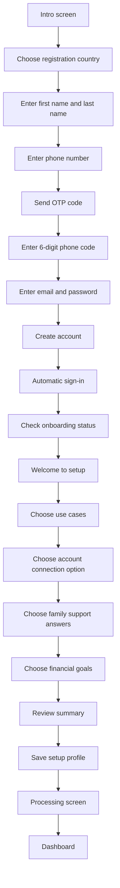
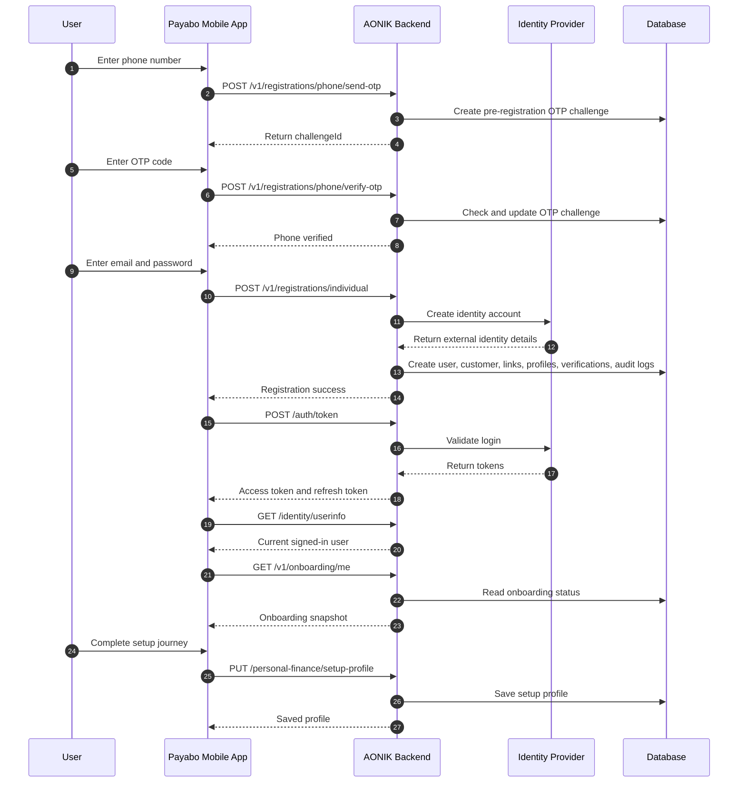

# Payabo Registration Journey

This document explains the full Payabo mobile app registration journey in simple terms.

It covers:

- what the user sees in the app
- what the app sends to the backend
- which APIs are called
- which database tables are affected
- what happens after sign-up, including the setup journey

## Overview

The Payabo registration journey has 2 main parts:

1. Account creation
2. First-time setup

Account creation is where the user enters their details, verifies their phone number, creates login details, and gets signed in.

First-time setup is the short guided journey that helps Payabo understand what the user wants help with.

## Simple Journey Summary

1. The user opens the app and taps `Create an account`.
2. The user chooses their country.
3. The user enters their first name and last name.
4. The user enters their phone number.
5. The app sends a one-time code to that phone number.
6. The user enters the code to prove they own the phone number.
7. The user enters email and password.
8. The app creates the account.
9. The app signs the user in automatically.
10. The app checks what onboarding steps are still incomplete.
11. The user completes the Payabo setup journey.
12. The app saves the setup choices and sends the user to the dashboard.

## Screen Flow

## Step-by-Step User Journey

### Part 1: Account Creation

#### 1. Intro screen

The user lands on the intro screen and chooses `Create an account`.

#### 2. Country selection

The user chooses the country they want to register under.

The current mobile flow supports these countries:

- Botswana
- Ghana
- United Kingdom
- Nigeria
- Zambia
- Zimbabwe

#### 3. Personal details

The user enters:

- first name
- last name

#### 4. Contact details

The user enters their phone number.

When they tap `Verify Number`, the app calls an API to send a one-time passcode, also called an OTP.

#### 5. Phone verification

The user enters the 6-digit code sent to their phone.

If the code is correct, the app allows the user to continue.

#### 6. Login details

The user enters:

- email address
- password

The password must meet the app rules before the account can be created.

#### 7. Account creation

The app sends the full registration details to the backend.

The backend then:

- creates the identity account in the identity provider
- creates the local user record
- creates the customer record
- links the user to the customer record
- stores profile details
- starts email and phone verification records

#### 8. Automatic sign-in

After the account is created successfully, the app signs the user in automatically using the email and password they just created.

The app stores the access token and refresh token securely.

#### 9. Onboarding check

After sign-in, the app asks the backend what onboarding items are complete and what still needs attention.

### Part 2: First-Time Setup

This happens after registration and sign-in.

The user stays on a single setup journey and answers a few simple questions.

#### 1. Welcome

The setup starts with a welcome message and an introduction to the assistant.

#### 2. Use cases

The user selects what they want help with, such as:

- tracking money
- managing bills
- sending money home
- improving spending
- saving for goals

#### 3. Connect account

The user chooses whether to:

- connect a UK bank
- connect a Nigerian bank
- skip for now

#### 4. Family support

The user selects who they usually support financially.

#### 5. Financial goals

The user selects the goals they care about most.

#### 6. Summary and save

The app shows a summary of the user's answers.

When the user taps `Let's go`, the app saves the setup profile and shows a short processing screen before sending the user to the dashboard.

## API Sequence

## API Touchpoints

| Method | Endpoint | What it does in simple terms |
|---|---|---|
| `POST` | `/v1/registrations/phone/send-otp` | Sends a one-time phone verification code and returns a `challengeId` |
| `POST` | `/v1/registrations/phone/verify-otp` | Checks whether the code entered by the user is correct |
| `POST` | `/v1/registrations/individual` | Creates the user's account and profile records |
| `POST` | `/auth/token` | Signs the user in and returns tokens |
| `GET` | `/identity/userinfo` | Returns the signed-in user's basic account information |
| `GET` | `/v1/onboarding/me` | Returns which onboarding items are complete or still missing |
| `PUT` | `/personal-finance/setup-profile` | Saves the answers from the Payabo setup journey |
| `GET` | `/personal-finance/setup-profile` | Loads the saved setup journey answers |
| `DELETE` | `/personal-finance/setup-profile` | Clears the saved setup journey answers |

## Database Tables Affected

The registration journey touches two kinds of data:

- temporary phone verification data before the account exists
- permanent customer and setup data after the account is created

### Tables used before the account is created

| Table | What it stores | When it is used |
|---|---|---|
| `dbo.AnkPreRegistrationChallenges` | Temporary phone OTP challenge records | When the app sends and checks the phone verification code before account creation |

### Tables written during account creation

| Table | What it stores | Why it is affected |
|---|---|---|
| `dbo.AnkUsers` | The user's main account record | Created during registration and updated with phone or email details |
| `dbo.AnkUserRoles` | The user's assigned roles | Used to attach the `PersonalUser` role |
| `dbo.AnkParties` | The customer/person record | Created to represent the user as a customer in the platform |
| `dbo.AnkPartyContacts` | Contact details like email and phone | Stores the user's email and phone contacts |
| `dbo.AnkUserParties` | The link between the user account and customer record | Connects the user to their customer profile |
| `dbo.AnkPersonProfiles` | Personal profile details | Stores title, first name, last name, and registration country |
| `dbo.AnkPersonalProfiles` | Personal finance profile record | Creates the Payabo personal finance profile for the user |
| `dbo.AnkVerificationChallenges` | Email and phone verification challenges after account creation | Starts follow-up verification records tied to the new user |
| `dbo.AnkAuditLogs` | Audit trail of important actions | Records the key registration events for traceability |

### Tables read during registration support

| Table | Why it is read |
|---|---|
| `dbo.AnkRoles` | To find the `PersonalUser` role |
| `dbo.AnkTenants` | To confirm the tenant is valid and active |
| `dbo.AnkSettings` | To determine which identity provider is configured |

### Table written during the setup journey

| Table | What it stores | Why it is affected |
|---|---|---|
| `dbo.AnkSettings` | The saved Payabo setup journey answers as a user-scoped setting | The app saves the user's setup choices after registration |

## What the Backend Creates for a New User

In plain language, a successful registration usually creates or updates these things:

1. A sign-in account in the identity provider
2. A local user record in AONIK
3. A customer record for that user
4. A link between the user and the customer record
5. Personal profile details like name and country
6. A Payabo personal finance profile
7. Verification challenge records for email and phone
8. Audit records showing what happened

## Important Notes

- Phone verification happens before the main account is created.
- The app signs the user in automatically after successful registration.
- The setup journey is a separate step after sign-in, not part of the actual account creation API.
- The setup journey answers are saved in the settings store, not in a special standalone setup table.
- The user is sent to the dashboard only after the setup journey finishes.

## Main Source Files

### Mobile app

- `apps/payabo_mobile/lib/features/auth/presentation/intro_screen.dart`
- `apps/payabo_mobile/lib/features/auth/presentation/register_screen.dart`
- `apps/payabo_mobile/lib/features/auth/presentation/personal_details_screen.dart`
- `apps/payabo_mobile/lib/features/auth/presentation/contact_details_screen.dart`
- `apps/payabo_mobile/lib/features/auth/presentation/phone_code_screen.dart`
- `apps/payabo_mobile/lib/features/auth/presentation/login_details_screen.dart`
- `apps/payabo_mobile/lib/features/setup_journey/presentation/setup_journey_screen.dart`
- `apps/payabo_mobile/lib/features/setup_journey/presentation/setup_processing_screen.dart`
- `apps/payabo_mobile/lib/app/auth/auth_controller.dart`
- `apps/payabo_mobile/lib/app/router/app_router.dart`

### Backend

- `src/Aonik.Platform/Endpoints/Registrations/SendRegistrationPhoneOtpEndpoint.cs`
- `src/Aonik.Platform/Endpoints/Registrations/VerifyRegistrationPhoneOtpEndpoint.cs`
- `src/Aonik.Platform/Endpoints/Registrations/IndividualRegistrationEndpoint.cs`
- `src/Aonik.Platform/Endpoints/Identity/AuthTokenEndpoint.cs`
- `src/Aonik.Platform/Endpoints/Identity/UserInfoEndpoint.cs`
- `src/Aonik.Platform/Endpoints/Onboarding/GetOnboardingMeEndpoint.cs`
- `src/Aonik.Platform/Endpoints/PersonalFinance/PutPayaboSetupProfileEndpoint.cs`
- `src/Aonik.Platform/Services/Registration/RegistrationService.cs`
- `src/Aonik.Platform/Services/Identity/UserProvisioningService.cs`
- `src/Aonik.Platform/Services/Identity/UserIdentityService.cs`
- `src/Aonik.Platform/Services/Identity/UserProfileService.cs`
- `src/Aonik.Platform/Services/Identity/VerificationService.cs`
- `src/Aonik.Finance/Services/PersonalFinance/PersonalProfileProvisioner.cs`
- `src/Aonik.Platform/Services/Settings/PayaboSetupProfileService.cs`
