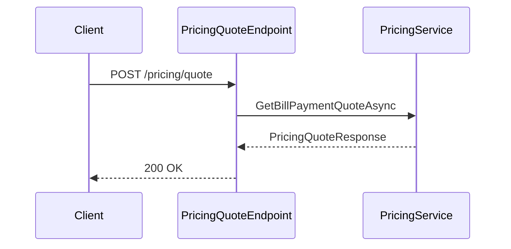

# API Endpoints

AONIK uses **FastEndpoints** for HTTP endpoints.

## Structure

Endpoints live within their owning domain module project:

- `src/Aonik.Platform/Endpoints/` — Identity, Party, Settings, etc.
- `src/Aonik.Finance/Endpoints/` — Billing, Payments, Orders, Pricing, Catalog, etc.

Endpoints call module services and return DTOs. API contracts (request/response records) are co-located with their endpoints in the module project.

## Conventions

- Inherit from `Endpoint<TRequest, TResponse>`.
- Override `Configure()` to set route and auth.
- Override `HandleAsync()` and use `Send.*Async()` helpers.

Examples of response helpers:

- `await Send.OkAsync(response, ct)`
- `await Send.CreatedAtAsync<GetEndpoint>(new { id = response.Id }, response, ct)`
- `await Send.NotFoundAsync(ct)`

Avoid using `SendAsync()` directly.

## Mapping

- Map API request/response contracts to internal DTOs inside the endpoint when needed.

## Catalog Countries Endpoint

`GET /catalog/countries` returns reference data countries, optionally filtered to serviceable catalog services.

Query params:
- `onlyServiceCountries` (bool, optional)
- `capabilityType` (string, optional) - matched as a ServiceCode prefix (ex: `BILLPAY`)

When `capabilityType` is provided, the response only includes countries that have active catalog billers with active services matching the prefix.

## Pricing Quote Endpoint

`POST /pricing/quote` returns a pricing and FX quote for bill payment corridors. It is read-only and does not change financial state.

Request fields:
- `originCurrency`, `destinationCurrency`
- `originCountry`, `destinationCountry`
- `serviceCode`
- exactly one of `originAmount` or `destinationAmount`
- optional `customerId` and `customerTier`

Response fields include `exchangeRate`, `feesTotal`, `totalAmount`, plus policy and FX metadata.

## Admin Reference Data Endpoint

`PUT /admin/reference-data/{type}/{code}` creates or updates a reference data item (such as `CustomerTier`).

Request fields:
- `displayName`
- `sortOrder`
- `isActive`
