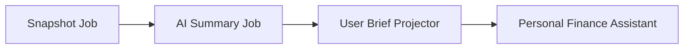
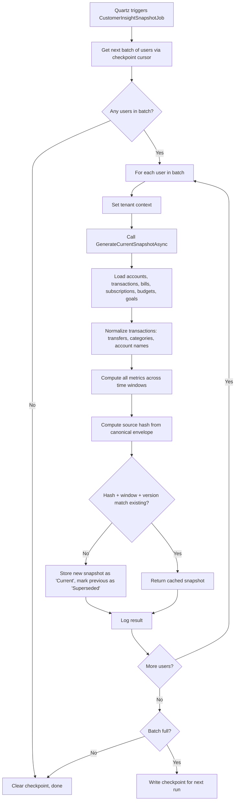
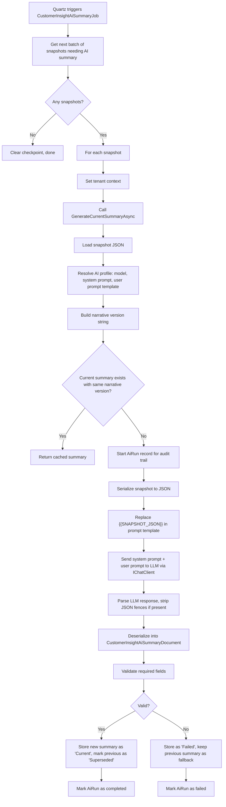
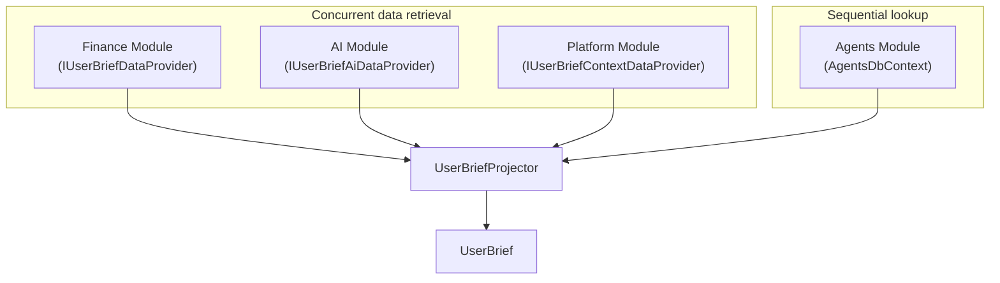
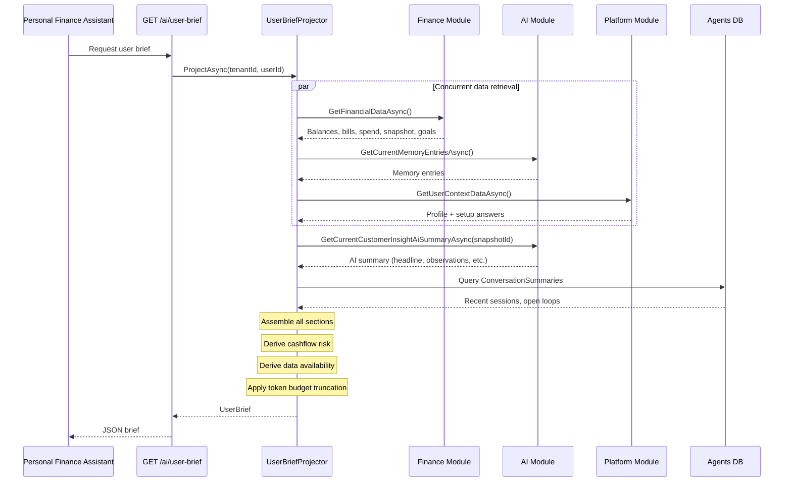
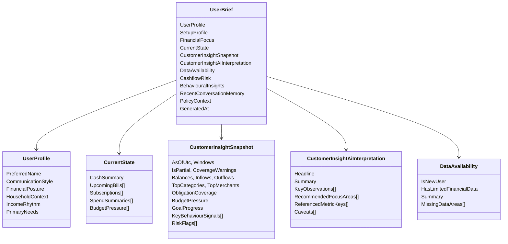
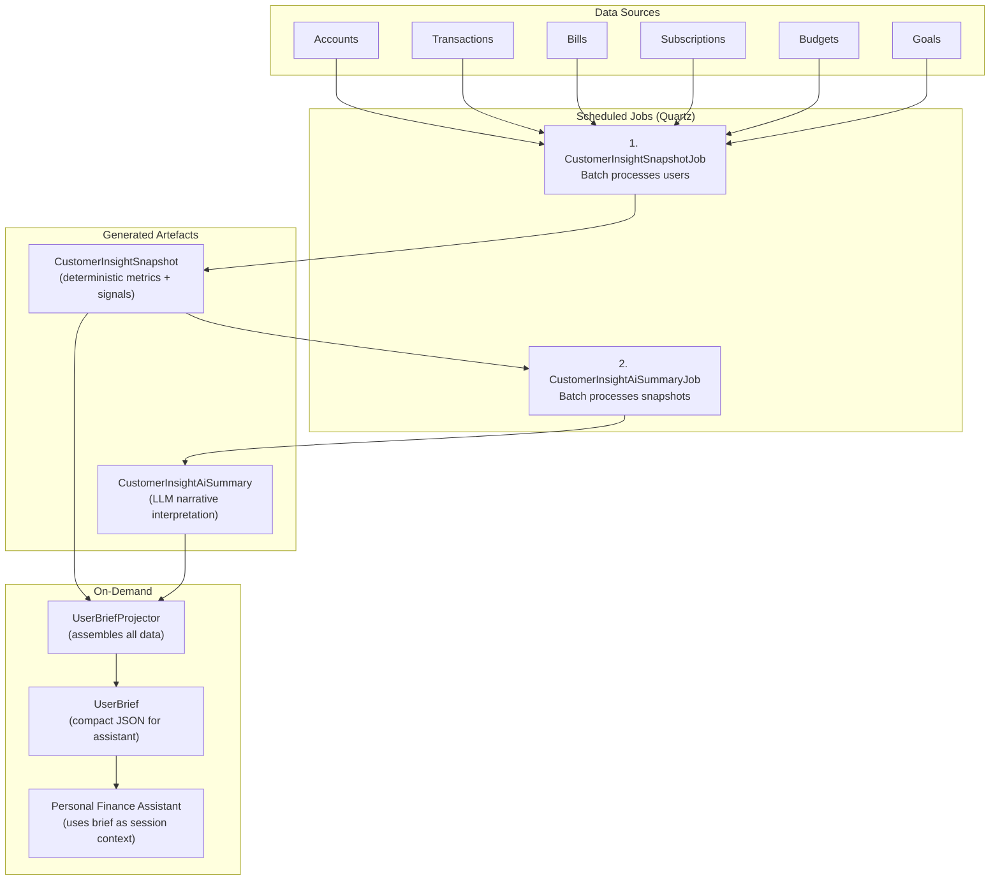

# Customer Insight Generation Pipeline

This document explains how AONIK generates financial insights for a customer, produces an AI summary of those insights, and assembles the User Brief that powers the Personal Finance Assistant.

---

## Overview

The pipeline has **two scheduled jobs** that run sequentially and one **on-demand projector** that assembles everything into a brief:

1. **Snapshot Job** — Crunches raw financial data into a deterministic insight snapshot
2. **AI Summary Job** — Sends the snapshot to an LLM for a human-readable narrative
3. **User Brief Projector** — Assembles snapshot + AI summary + user context into a brief (on-demand, when the assistant starts a session)



---

## Step 1: Generate the Deterministic Snapshot

**What:** Analyse a customer's raw financial data (accounts, transactions, bills, subscriptions, budgets, goals) and produce a structured, deterministic snapshot of their financial situation.

**When:** The `CustomerInsightSnapshotJob` runs on a Quartz schedule. It processes users in batches using a checkpoint cursor (tenant + user ID) so it can resume across runs.

**Where the code lives:**
- Job: `src/Aonik.Worker/Jobs/CustomerInsightSnapshotJob.cs`
- Service: `src/Aonik.Finance/Services/PersonalFinance/CustomerInsightSnapshotService.cs`
- Generator: `src/Aonik.Finance/Services/PersonalFinance/CustomerInsightSnapshotGenerator.cs`
- Models: `src/Aonik.Finance/Contracts/Models/PersonalFinance/CustomerInsightSnapshotModels.cs`

### What the snapshot captures

The generator looks at the customer's data across multiple time windows:

| Window | Duration | Purpose |
|--------|----------|---------|
| Operational | 30 days | Current spending, balances, bills due |
| Trend | 90 days | Month-over-month changes |
| Behaviour | 180 days | Longer-term patterns and habits |
| Obligations lookahead | 30 days | Upcoming bills and subscriptions |

It computes these metrics:

- **Cash position** — Balances across accounts, concentration risk
- **Income summary** — Sources, recurring estimates, month-over-month deltas
- **Expense summary** — Fixed vs variable, essential vs discretionary
- **Category insights** — Top spending categories, trends, concentration
- **Merchant insights** — Top merchants, recurring candidates
- **Obligation insights** — Upcoming bills, subscription coverage ratios
- **Budget insights** — Active budgets, categories exceeding thresholds
- **Goal progress** — Tracking against savings/financial goals
- **Behavioural signals** — Key patterns with severity (Low/Moderate/High/Critical) and confidence (Low/Medium/High)
- **Risk overview** — Cashflow stress, budget pressure, concentration risk, missed obligations, unusual activity

### Deduplication

The generator computes a **source hash** (SHA) from a canonical envelope of the input data. If the hash, time window, and generator version match an existing snapshot, it returns the cached version instead of creating a duplicate.



### Snapshot output schema: `customer_insight_snapshot.v1`

```
CustomerInsightSnapshotDocument
├── TenantId, UserId
├── AsOfUtc, WindowStartUtc, WindowEndUtc
├── Coverage (IsPartial, Warnings, SourceCounts)
├── CashPosition (balances, concentration)
├── IncomeSummary (sources, recurring, MoM delta)
├── ExpenseSummary (fixed/variable, essential/discretionary)
├── Categories[] (name, amount, trend, share)
├── Merchants[] (name, amount, recurring flag)
├── Obligations[] (bills, subscriptions, coverage)
├── Budgets[] (category, budgeted, actual, %)
├── Goals[] (name, target, progress, status)
├── Signals[] (key, category, title, severity, confidence)
├── RiskOverview (cashflow, budget, concentration, missed, unusual)
└── Evidence (transaction counts, confirmed transfers, rule versions)
```

---

## Step 2: Generate the AI Summary

**What:** Send the deterministic snapshot to an LLM to produce a human-readable narrative interpretation — a headline, observations, patterns, recommendations, and conversation starters.

**When:** The `CustomerInsightAiSummaryJob` runs on a Quartz schedule after the snapshot job. It finds snapshots that are due for AI interpretation (new or updated snapshots without a matching current summary).

**Where the code lives:**
- Job: `src/Aonik.Worker/Jobs/CustomerInsightAiSummaryJob.cs`
- Service: `src/Aonik.Ai/Services/CustomerInsightAiSummaryService.cs`
- Reader: `src/Aonik.Ai/Services/CustomerInsightAiSummaryReader.cs`
- Entity: `src/Aonik.Ai/Entities/CustomerInsightAiSummary.cs`
- Models: `src/Aonik.SharedKernel/Abstractions/Ai/CustomerInsightAiSummaryModels.cs`

### How it works



### Narrative versioning

The AI summary has a **narrative version** string in this format:

```
{schemaVersion}|prompt:{promptName}:{promptVersion}|model:{modelId}
```

Example: `customer_insight_ai_summary.v1|prompt:customer_insight_summary:v1|model:claude-sonnet-4-20250514`

If the model or prompt changes, the narrative version changes, and the next job run regenerates the summary. If nothing has changed, the cached summary is reused.

### AI summary output schema: `customer_insight_ai_summary.v1`

```
CustomerInsightAiSummaryDocument
├── Headline                    — One-line opening insight
├── Summary                     — Narrative interpretation paragraph
├── KeyObservations[]           — Main findings from the data
├── PositivePatterns[]          — Strengths and good habits
├── RiskPatterns[]              — Concerns and warning signs
├── RecommendedFocusAreas[]    — Suggested action areas
├── ConversationSuggestions[]  — Topics for the assistant to raise
├── ReferencedMetrics[]        — Which metric keys the AI cited
└── Caveats[]                  — Data limitations the AI flagged
```

### Failure handling

If the LLM call fails (timeout, bad response, validation failure):
- A `Failed` summary record is stored with the failure reason
- The **previous** `Current` summary is left untouched as a fallback
- The `AiRun` is marked as failed for audit
- The pipeline continues to the next snapshot

---

## Step 3: Assemble the User Brief

**What:** Combine the deterministic snapshot, AI summary, user profile, memory, conversation history, and live financial data into a single compact JSON document for the Personal Finance Assistant.

**When:** On-demand, when the assistant session starts. Called via `GET /ai/user-brief`.

**Where the code lives:**
- Projector: `src/Aonik.Agents/Services/UserBriefProjector.cs`
- Endpoint: `src/Aonik.Agents/Endpoints/GetUserBriefEndpoint.cs`
- Models: `src/Aonik.Agents/Contracts/Models/UserBriefModels.cs`

### Data sources

The projector pulls from **four modules concurrently**:



| Source | Module | What it provides |
|--------|--------|-----------------|
| Finance data | `Aonik.Finance` | Accounts, balances, bills, subscriptions, spend summaries, budget pressure, goals, support obligations, corridor countries, **customer insight snapshot projection** |
| AI data | `Aonik.Ai` | Memory entries (identity, communication style, household), **customer insight AI summary** |
| User context | `Aonik.Platform` | Profile (name, email, phone), setup profile (use cases, goals, responsibilities) |
| Conversation history | `Aonik.Agents` | Recent conversation summaries, open loops, recommendation outcomes |

### Assembly sequence



### User Brief structure



### Cashflow risk derivation

The projector calculates a simple risk level from live data:

| Risk Level | Condition |
|-----------|-----------|
| **Low** | Available balance > 2x upcoming obligations, or no obligations |
| **Moderate** | Available balance > 1x upcoming obligations |
| **High** | Available balance < upcoming obligations |

### Behavioural insights

Behavioural insights in the brief come directly from the deterministic snapshot's signals. If the snapshot has no signals, the brief contains no behavioural insights.

### Token budget enforcement

If the serialised brief exceeds the token budget, it truncates in this priority order (least important first):

1. Reduce behavioural insights (5 → 3 → 1 → 0)
2. Reduce conversation history (N → 1 → 0)
3. Trim subscriptions (→ 5)
4. Limit spend categories (→ 3 per currency)
5. Trim AI interpretation arrays (→ 3-5 items each)
6. Trim deterministic snapshot lists (→ 3 items each)

---

## End-to-End Pipeline



---

## Key Design Decisions

1. **Deterministic before AI** — The snapshot is pure computation (no LLM). The AI summary is a separate layer on top. If the AI fails, the deterministic data is still available.

2. **Deduplication at every level** — Snapshots use source hashing; AI summaries use narrative versioning. No redundant work.

3. **Graceful degradation** — If the AI summary fails, the previous one stays as fallback. If no snapshot exists, the brief still assembles from live data. If data is limited, the `DataAvailability` section tells the assistant to be cautious.

4. **Auditability** — Every AI summary is linked to an `AiRun` record, tracing exactly which model, prompt, and input produced it.

5. **Token budget awareness** — The brief auto-truncates to fit within the assistant's context window, shedding low-priority information first.

6. **Batch processing with checkpoints** — Jobs process users/snapshots in configurable batches with persistent cursor checkpoints, so they can resume across runs without reprocessing.
