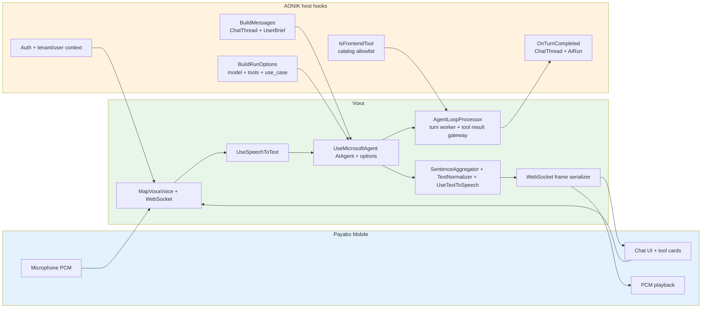

# 022.aonik-voice-realtime

## Objective

Deliver a real-time voice mode for Payabo mobile that uses the same AONIK agent, `ChatThread`, frontend tools, human approval posture, and audit/telemetry foundations as AG-UI chat.

v1 is intentionally narrow:

- Mobile-first WebSocket endpoint at `/ai/voice`.
- Chained voice pipeline only: VAD, STT, AONIK agent, text normalization, sentence aggregation, TTS, WebSocket sink.
- No Voxa realtime/composite provider path in v1.
- No spoken approval.
- No direct backend-tool execution in the voice adapter.
- No parallel chat persistence, auth, or AI audit stack.

Latency target for v1 is `<= 2s p95` first audible bot audio on the chained path. The sub-500 ms premium target belongs to v1.1 composite providers after the required prompt/tool/history exporter exists.

## Non-Negotiable Rules

- Ledger and domain services remain the source of financial truth.
- Orders, payments, ledger entries, and other financial mutations must not be mutated directly by the voice transport.
- Agents may propose; systems execute through approved tools/services.
- Mutating backend tools must be approval-gated by existing AONIK policy wrappers or disabled for voice until that gate exists.
- Voice approval is an on-screen `confirmAction` frontend tool, never spoken yes/no.
- All LLM calls still flow through AONIK `IChatClient`, `AiRoutePolicy`, telemetry, and audit infrastructure.

## Phase 0: MAF + Voxa Contract Alignment

Two coupled decisions:

### 0.1 AONIK On MAF 1.5.0

AONIK upgrades `Microsoft.Agents.AI` from `1.0.0-rc4` to `1.5.0` and aligns `Microsoft.Extensions.AI` to `10.5.1` to match Voxa's MAF adapter package floor.

Updated package floor:

- `Microsoft.Agents.AI` = `1.5.0`
- `Microsoft.Agents.AI.Workflows` = `1.5.0`
- `Microsoft.Extensions.AI` = `10.5.1`
- `Microsoft.Extensions.AI.OpenAI` = `10.5.1`

This must be verified with a full solution build/test run before implementation proceeds. Do not treat source compatibility as assumed until the package upgrade is committed and verified.

### 0.2 AONIK Uses Voxa's Simple Microsoft Agent Extension

AONIK references `Voxa.Services.MicrosoftAgents` and uses a host-friendly extension method instead of writing a local `FrameProcessor` or subclassing a Voxa handler.

The primary Voxa API should be the simplest possible MAF integration:

```csharp
app.MapVoxaVoice("/voice", voice => voice
    .UseWebSocket()
    .UseSpeechToText(OpenAISpeech.Whisper("whisper-1"))
    .UseMicrosoftAgent(agent)
    .UseTextToSpeech(OpenAISpeech.Tts("tts-1", voice: "alloy")));
```

That means Voxa internally calls:

```csharp
await foreach (var update in agent.RunStreamingAsync(messages, options: runOptions, cancellationToken))
{
    // TextContent -> text/speech frames
    // FunctionCallContent -> frontend tool call frames when configured
    // FunctionResultContent / UsageContent -> turn summary and telemetry
}
```

Advanced hosts such as AONIK configure delegate hooks around the same core `AIAgent` call:

```csharp
.UseMicrosoftAgent(agent, options =>
{
    options.BuildMessages = BuildAonikMessagesAsync;
    options.BuildRunOptions = BuildAonikRunOptions;
    options.IsFrontendTool = name => frontendTools.Contains(name);
    options.OnTurnCompleted = PersistAonikTurnAsync;
})
```

The architectural rationale: the deadlock-safe data-loop / turn-worker split, frontend-tool TCS correlation, agent re-invocation loop, content-type fan-out, and TTS handoff are universal voice-agent pipeline concerns. They belong in Voxa. AONIK should only provide host decisions: which messages the agent sees, which run options it uses, which tools are frontend tools, and what to persist after the turn.

### Voxa Contract Dependency

These primitives must ship in Voxa before AONIK can use the simple integration surface:

| Voxa primitive | Lives in | Purpose |
|---|---|---|
| `MapVoxaVoice(...)` / `UseMicrosoftAgent(...)` | `Voxa.AspNetCore` or `Voxa.Transports.WebSocket` + `Voxa.Services.MicrosoftAgents` | Public host API. The common path is `UseMicrosoftAgent(AIAgent agent)`. Advanced hosts pass an options delegate. |
| `AgentLoopProcessor : FrameProcessor` | `Voxa.Core.Processors` | Generic loop owner. Drains a transcription queue, runs an agent turn handler, pumps yielded frames downstream. Framework-agnostic. |
| `MicrosoftAgentVoiceOptions` | `Voxa.Services.MicrosoftAgents` | Optional host hooks: `BuildMessages`, `BuildRunOptions`, `IsFrontendTool`, `OnTurnStarted`, `OnTurnCompleted`, `OnTurnFailed`. No subclassing required. |
| `VoiceTurnContext` | `Voxa.Core` or `Voxa.Services.MicrosoftAgents` | Per-turn payload: `TurnId`, `UserText`, `Hello`, `ClaimsPrincipal`, metadata bag, frontend tool gateway, frame emitter. |
| `IFrontendToolGateway` | `Voxa.Core.Processors` | Back-channel: await matching `ToolCallResultFrame` without blocking the data loop. |
| `IFrameEmitter` | `Voxa.Core.Processors` | Lets host hooks emit custom frames such as AONIK `ThreadReadyFrame`. |
| `LlmTurnStartedFrame` / `LlmTurnEndedFrame` | `Voxa.Core.Frames` | Lifecycle frames emitted around each agent turn. Enables downstream TTS coordination, metrics, and audit. |
| `ToolCallRequestFrame` / `ToolCallResultFrame` marked `IUninterruptible` | `Voxa.Core.Frames` | Mid-stream interruption must not drop in-flight tool calls or results. |
| Custom frame serialization hook | `Voxa.Transports.WebSocket` | Allows hosts to serialize frames like `ThreadReadyFrame` without copying Voxa's sink. Preferred over a local AONIK sink. |

Voxa's previous `MicrosoftAgentsProcessor` is replaced by this host-friendly API before AONIK adopts it. Voxa version requirement for AONIK: the first version that ships these primitives.

### Why This Is Better Than The Prior Plan

The prior plan had AONIK writing a local `AonikAgentProcessor` that replicated universal pipeline boilerplate. The new design pushes that boilerplate into Voxa where it is written once and tested once.

| Concern | Prior plan | Simple Voxa integration plan |
|---|---|---|
| AONIK agent processor code | Local `AonikAgentProcessor` | None |
| Host integration style | Implement/subclass pipeline internals | Pass `AIAgent`, optionally configure delegates |
| Data-loop / turn-worker split | AONIK reimplemented it | Voxa owns it |
| Frontend-tool TCS correlation | AONIK reimplemented it | Voxa owns it |
| Agent re-run loop on tool results | AONIK reimplemented it | Voxa owns it |
| AONIK-specific logic | Mixed into processor | Delegate hooks: messages, options, frontend-tool predicate, persistence |

The drop-in story for a basic MAF app becomes: **create an `AIAgent`, call `UseMicrosoftAgent(agent)`**. AONIK uses the advanced options only because it has persisted history, user brief, frontend tools, and audit requirements.

### Basic MAF Example And Voxa Integration

Microsoft's first-agent shape is deliberately small:

```csharp
using Azure.AI.Projects;
using Azure.Identity;
using Microsoft.Agents.AI;

var endpoint = Environment.GetEnvironmentVariable("AZURE_OPENAI_ENDPOINT")
    ?? throw new InvalidOperationException("Set AZURE_OPENAI_ENDPOINT");

var deploymentName = Environment.GetEnvironmentVariable("AZURE_OPENAI_DEPLOYMENT_NAME")
    ?? "gpt-4o-mini";

AIAgent agent = new AIProjectClient(new Uri(endpoint), new DefaultAzureCredential())
    .AsAIAgent(
        model: deploymentName,
        instructions: "You are a friendly assistant. Keep your answers brief.",
        name: "HelloAgent");

await foreach (var update in agent.RunStreamingAsync("Tell me a one-sentence fun fact."))
{
    Console.Write(update);
}
```

Voxa should voice-enable that same agent with no host adapter code:

```csharp
app.MapVoxaVoice("/voice", voice => voice
    .UseWebSocket()
    .UseSpeechToText(OpenAISpeech.Whisper("whisper-1"))
    .UseMicrosoftAgent(agent)
    .UseTextToSpeech(OpenAISpeech.Tts("tts-1", voice: "alloy")));
```

AONIK's version is the same call with host hooks:

```csharp
app.MapVoxaVoice("/ai/voice", voice => voice
    .RequireAuthorization("MobileVoicePolicy")
    .UseWebSocketHello<VoiceHello>()
    .UseSpeechToText(OpenAISpeech.Whisper("whisper-1"))
    .UseMicrosoftAgent(readOnlyPersonalFinanceAgent, options =>
    {
        options.BuildMessages = BuildAonikMessagesAsync;
        options.BuildRunOptions = BuildAonikRunOptions;
        options.IsFrontendTool = name => frontendToolCatalog.Contains(name);
        options.OnTurnCompleted = PersistAonikTurnAsync;
    })
    .UseTextNormalizer(speechTextNormalizer)
    .UseTextToSpeech(OpenAISpeech.Tts("tts-1", voice: "alloy")));
```

This is the target integration experience. AONIK should not implement Voxa processors just to use voice.

## Phase 1: Project Skeleton And Voxa References

**Decision (v1):** Project references to a sibling `C:\Users\mjosi\source\repos\Voxa\` clone. Fastest for current development. CI will need access to the same Voxa source layout (or switch to a private feed) before merge to main; documented as a follow-up.

v1 references only these Voxa packages/projects:

- `Voxa.Core`
- `Voxa.Transports.WebSocket`
- `Voxa.Services.MicrosoftAgents`
- `Voxa.Speech.Abstractions`
- `Voxa.Speech.OpenAI`
- `Voxa.Speech.Azure`
- `Voxa.Speech.ElevenLabs`
- `Voxa.Speech.Mistral`
- `Voxa.Audio.SileroVad`, only if Silero VAD is enabled in recipes

v1 must not reference:

- `Voxa.Services.AzureVoiceLive`
- `Voxa.Services.OpenAIRealtime`

Implementation tasks:

- Add `src/Aonik.Voice/Aonik.Voice.csproj` targeting `net10.0`.
- Add `AonikVoiceModule : IModule` and register it in `src/Aonik.Api/Program.cs`.
- Add an `Aonik.Voice` project reference from `src/Aonik.Api/Aonik.Api.csproj`.
- Add `app.UseWebSockets()` and `app.MapAonikVoiceEndpoints()` in `Program.cs`.
- Add `MobileVoicePolicy` for Payabo end users. Do not reuse `AdminUserPolicy`.
- Add JWT query-string auth support for WebSocket upgrades in both places:
- `JwtBearerEvents.OnMessageReceived` reads `?access_token=` into `context.Token`.
- `AonikAuthenticationSetup.SelectScheme(...)` also considers the query token for `/ai/voice`, otherwise the policy scheme may choose the wrong scheme before JWT bearer runs.

## Phase 1.5: Backend Tool Safety — Read-Only Voice Variant

This phase is a v1 launch prerequisite, not an open decision.

### Gating model for v1

AONIK does **not** have a server-side approval/policy wrapper for backend tools today — gating in AGUI is via the frontend `confirmAction` tool, which is a UX convention rather than an enforcement boundary. Building a server-side wrapper is out of scope for v1.

**v1 enforces "agents propose, systems execute" by removing mutating tools from the agent's tool surface for voice connections.** No mutating tool can fire if it isn't registered with the agent. Read-only operations (`pf_get_*`, `pf_list_*`, `pf_search_*`) work normally. Mutation requests receive a model response along the lines of "I can prepare that — please confirm in chat."

This is the simpler design: no new wrapper infrastructure, no new approval lifecycle. Mutating tools become available in voice only when AONIK ships a server-side gating mechanism (post-v1).

### Tool classification

Classification is **naming-prefix based**, encoded in `IVoiceToolSafetyInspector`:

- **Read-only** prefixes: `pf_get_`, `pf_list_`, `pf_search_`, `pf_describe_`, `pf_summarize_`.
- **Mutating** prefixes: `pf_create_`, `pf_update_`, `pf_archive_`, `pf_delete_`, `pf_apply_`, `pf_cancel_`, `pf_confirm_`, `pf_reject_`, `pf_set_`, `pf_override_`.
- **Unknown** (unmatched): treated as mutating by default. Inspector logs a warning so new tools get explicitly classified by the next maintainer.

Naming convention is brittle long-term but is the simplest mechanism that uses what AONIK already has. Future v1.1+ work may replace this with a `[VoiceSafe]`/`[VoiceMutating]` attribute on the underlying `AIFunction`.

### Implementation tasks

- Add `IVoiceToolSafetyInspector` in `src/Aonik.Voice/Tools/`.
- Implement `NamingPrefixVoiceToolSafetyInspector` with the prefix lists above; expose configuration so prefixes can be tuned without a code change.
- Add `IVoiceAgentBuilder` that wraps `AgentContextResolution.Agent` and produces a **read-only voice variant** by filtering its tool list (`PersonalFinanceTools` is currently registered via `AIFunctionFactory.Create(...)` in `PersonalFinanceAgentRegistration.Build(...)`; the voice variant constructs a new `ChatClientAgent` with the filtered tool set). The original agent for AGUI is unchanged.
- Audit target list to classify on first run: `src/Aonik.Finance/Agents/Tools/PersonalFinanceTools.cs` — every `AIFunctionFactory.Create(tools.X, name: "pf_*")` registration.
- If any tool name does not match a read-only or mutating prefix, the inspector raises a configuration error at app startup (fail fast, not at first WS connection) listing the offending names. New tools must be classified before voice starts.
- Unit test: classifier tags a representative set of `pf_*` names correctly.
- Integration test: voice startup against `personal-finance-agent` builds a read-only variant; the resulting agent's tool list contains only read-only `pf_*` tools.
- Integration test: a transcription that would trigger a mutating tool elicits a "please confirm in chat" response (model behavior, not strict assertion — assert no mutating-tool `FunctionCallContent` appears in the streamed updates).

## Phase 2: Shared Voice Settings And Speech Normalization

`VoiceProviderConfiguration` and settings abstractions live in `Aonik.SharedKernel`, not in `Aonik.Voice` or `Aonik.Platform`. Platform owns persistence, Voice consumes the settings, and modules must not reference each other directly.

Storage uses the existing generic settings table. No EF migration is needed for v1.

Implementation tasks:

- Add `VoiceProviderConfiguration` in `src/Aonik.SharedKernel/Abstractions/Ai/VoiceProviderConfiguration.cs`.
- Add `ITenantVoiceProviderSettingsService` in `src/Aonik.SharedKernel/Abstractions/Ai/`.
- Add `TenantVoiceProviderSettingsService` in `src/Aonik.Platform/Services/Settings/`.
- Store one JSON payload under a new tenant-scoped key such as `VoiceProviderSettingNames.TenantProfile`.
- Keep provider credentials in encrypted credential storage using the same status-only readback pattern as TTS credentials.
- Add admin/backend endpoints for get settings, update settings, list provider voices, preview voice, and update credentials.
- Add `ISpeechTextNormalizer` in `Aonik.SharedKernel/Abstractions/Ai/`.
- Add an `Aonik.Ai` facade that calls the existing internal `SpeechTextNormalizer.Normalize(...)` implementation.
- Inject `ISpeechTextNormalizer` into `Aonik.Voice`.

The normalizer abstraction is required because `src/Aonik.Ai/Services/SpeechTextNormalizer.cs` is currently internal to `Aonik.Ai`.

## Phase 3: v1 Server Architecture

### Architectural overview

The voice pipeline layers cleanly so AONIK only supplies host decisions. Voxa owns WebSocket audio, STT, the agent turn loop, frontend-tool wait/resume, sentence aggregation, TTS, and frame serialization.



The public integration point should look like this for a basic MAF app:

```csharp
app.MapVoxaVoice("/voice", voice => voice
    .UseWebSocket()
    .UseSpeechToText(OpenAISpeech.Whisper("whisper-1"))
    .UseMicrosoftAgent(agent)
    .UseTextToSpeech(OpenAISpeech.Tts("tts-1", voice: "alloy")));
```

AONIK uses the same API with advanced options:

```csharp
app.MapVoxaVoice("/ai/voice", voice => voice
    .RequireAuthorization("MobileVoicePolicy")
    .UseWebSocketHello<VoiceHello>()
    .UseSpeechToText(OpenAISpeech.Whisper("whisper-1"))
    .UseMicrosoftAgent(readOnlyPersonalFinanceAgent, options =>
    {
        options.BuildMessages = BuildAonikMessagesAsync;
        options.BuildRunOptions = BuildAonikRunOptions;
        options.IsFrontendTool = name => frontendToolCatalog.Contains(name);
        options.OnTurnCompleted = PersistAonikTurnAsync;
    })
    .UseTextNormalizer(speechTextNormalizer)
    .UseTextToSpeech(OpenAISpeech.Tts("tts-1", voice: "alloy")));
```

No AONIK code implements `FrameProcessor`. No AONIK code owns the tool-result queue or agent re-run loop.

### One full turn — flow with a frontend tool round-trip

```mermaid
sequenceDiagram
    participant M as Mobile
    participant V as Voxa WebSocket + STT
    participant L as Voxa AgentLoopProcessor
    participant H as AONIK hook delegates
    participant A as MAF AIAgent
    participant T as Voxa Text/TTS pipeline

    Note over M,T: First user turn — "Show my budget"

    M->>V: binary microphone PCM
    V->>V: STT emits final transcript
    V->>L: TranscriptionFrame(UserText)
    L->>M: transcription envelope
    L-->>V: data loop returns immediately

    L->>H: BuildMessages(turn)
    H->>H: EnsureThread, ReconstructHistory,<br/>prepend UserBriefPreamble
    H->>L: messages + optional ThreadReadyFrame
    L->>M: { type: "threadReady", chatThreadId }
    L->>H: BuildRunOptions(turn)

    L->>A: agent.RunStreamingAsync(messages, runOptions)
    A-->>L: TextContent "Here's your spending..."
    L->>T: LlmTextChunkFrame
    T->>M: text envelope + audio bytes

    A-->>L: FunctionCallContent("display_budget_breakdown")
    L->>H: IsFrontendTool(name)
    H-->>L: true
    L->>M: { type: "toolCall", name: "display_budget_breakdown" }

    Note over L: Voxa awaits tool result on turn worker,<br/>not on the data loop

    M->>V: { type: "toolResult", callId, resultJson }
    V->>L: ToolCallResultFrame
    L->>L: complete pending frontend-tool TCS<br/>data loop returns immediately

    L->>A: RunStreamingAsync(messages + function result)
    A-->>L: TextContent "Done — here it is."
    L->>T: LlmTextChunkFrame
    T->>M: text envelope + audio bytes

    L->>H: OnTurnCompleted(summary)
    H->>H: IPostStreamPersistenceCoordinator.Enqueue<br/>(use_case = "voice")

    Note over M,T: Turn complete; queue ready for next transcription
```

Two design guarantees made visible by the diagram:

1. The Voxa data loop returns immediately at every data-loop hop. Agent execution and tool round-trips run on the Voxa turn worker.
2. AONIK hooks build messages/options and persist summaries; they never touch audio frames, WebSocket sends, or tool-result queues.

### Pipeline Shape

v1 ships one pipeline shape:

```text
WebSocketAudioSource
  -> VAD
  -> STT
  -> AgentLoopProcessor (Voxa.Core)        ← drives UseMicrosoftAgent(agent, options)
  -> SentenceAggregator
  -> SpeechTextNormalizerProcessor
  -> TextToSpeechProcessor
  -> WebSocket sink with custom-frame serialization
```

The pipeline mounts Voxa's `AgentLoopProcessor` rather than a custom AONIK processor. The processor drains transcriptions on a background turn worker and delegates each turn to Voxa's Microsoft-agent adapter created by `UseMicrosoftAgent(agent, options)`.

Preferred sink strategy: Voxa exposes a custom-frame serialization hook so AONIK can register `ThreadReadyFrame -> threadReady` without copying Voxa's WebSocket sink. If that hook is not available in the first Voxa Phase A cut, AONIK may temporarily use a local sink, but that is a fallback and should be removed once Voxa supports custom frame serialization.

### Project Layout

```text
src/Aonik.Voice/
  Aonik.Voice.csproj
  AonikVoiceModule.cs
  Endpoints/
    VoiceWebSocketEndpoint.cs
    VoiceWebSocketEndpoint.Mapping.cs
    HelloEnvelope.cs
  Frames/
    ThreadReadyFrame.cs
  Pipeline/
    AonikVoicePipelineFactory.cs
    PipelineShapes/ChainedShape.cs
  Processors/
    SpeechTextNormalizerProcessor.cs   # Normalizes sentence-sized TextFrame output from SentenceAggregator
  Integration/
    AonikMicrosoftAgentVoiceOptions.cs # Builds UseMicrosoftAgent options delegates
  Tools/
    IVoiceFrontendToolCatalog.cs
    VoiceFrontendToolCatalog.cs
    IVoiceToolSafetyInspector.cs
```

Note: `AonikAgentProcessor` and `AonikAgentTurnHandler` do not exist. The data-loop / turn-worker split, frontend-tool TCS correlation, and agent re-invocation loop all live in Voxa. AONIK contributes delegate functions to `UseMicrosoftAgent(...)`.

### Endpoint Lifecycle

`VoiceWebSocketEndpoint` does only WebSocket and connection setup work:

1. Authenticate using `MobileVoicePolicy`.
2. **Set request-scoped tenant/user context from the validated JWT principal.** AONIK's HTTP middleware does this for normal requests; the WS upgrade path has to do it manually before any DI-resolved scoped service runs (otherwise `IAgentContextualizer`, `IChatThreadManager`, and friends will see the wrong tenant or null user). Pattern: same call sites AGUI uses, invoked manually inside the endpoint method before step 6.
3. Accept the WebSocket.
4. Read and parse the first `hello` envelope manually before constructing `WebSocketAudioSource`. Voxa's `WireProtocol.TryParseClientMessage()` returns null for `hello` by design.
5. Validate `hello.agentId` and frontend tool capabilities. **If `hello.chatThreadId` is present, verify ownership at this layer**: load the thread via `IChatThreadService` and check `tenantId` and `userId` match the authenticated principal. Reject with `error` envelope and close on mismatch. Single layer of ownership enforcement for v1 (no defense-in-depth duplication inside `EnsureThreadAsync`).
6. Resolve tenant voice provider configuration.
7. Resolve `AgentContextResolution` through `IAgentContextualizer.ResolveAsync(hello.AgentId, ct)`.
8. Run `IVoiceToolSafetyInspector` for the resolved agent and build the read-only voice variant via `IVoiceAgentBuilder`. The voice pipeline runs against the variant, not the original agent.
9. Build client tool declarations from a server-owned frontend tool catalog, not from arbitrary client schemas.
10. Build `ChatClientAgentRunOptions` using the existing AG-UI run-options builder. Stamp `ChatOptions.AdditionalProperties[AiTelemetry.UseCaseAttribute] = "voice"` so `TelemetryChatClient` tags AI run logs correctly.
11. Create `MicrosoftAgentVoiceOptions` delegates using AONIK scoped services (`IChatThreadManager`, `IAguiMessageConverter`, `IPostStreamPersistenceCoordinator`, frontend tool catalog, tenant/user context).
12. Call `UseMicrosoftAgent(readOnlyAgent, options => ApplyAonikOptions(options, ...))` in the chained pipeline shape.
13. Start the Voxa pipeline runner.

The endpoint should not create a `ChatThread` at `hello` time. `IChatThreadService.CreateThreadAsync(...)` requires a first user message, so thread creation is deferred until the first final transcription and handled inside AONIK's `BuildMessages` delegate on the first turn.

### Frontend Tool Catalog

The client advertises which frontend tools it supports in `hello`, but the server must not trust client-supplied schemas. The server owns an allowlist and canonical tool declarations for voice v1.

Required v1 frontend tool names:

- `confirmAction`
- `display_fx_rate_chart`
- `display_budget_breakdown`
- `display_spending_pie_chart`
- `display_autopilot_proposal`
- `display_follow_up_suggestions`
- `display_option_selector`
- `navigate_to_screen`

Validation rules:

- Reject unknown frontend tool names.
- Reject missing `confirmAction` for agents that expose any mutating capability.
- Prefer server canonical schemas when building `AITool` declarations.
- Add snapshot tests that compare server catalog names with the mobile shared registry names.

This differs from AG-UI's current client-tool POST behavior intentionally. Voice is a persistent authenticated socket, and tool declarations influence model behavior, so the server must apply a stricter allowlist.

### Backend Tool Safety

Domain agents already contain server-registered backend tools. For example, the personal-finance agent registers `pf_*` tools through `AIFunctionFactory.Create(...)` in `PersonalFinanceTools`.

Voice must not execute backend tools itself. It lets MAF and the resolved AONIK agent own backend tool execution.

For v1, voice runs against a **read-only variant** of the resolved agent. `IVoiceAgentBuilder` filters the original agent's tool list to read-only tools only, classified by `IVoiceToolSafetyInspector` (naming-prefix based — see [Phase 1.5](#phase-15-backend-tool-safety--read-only-voice-variant)). The original agent for AGUI is unchanged.

This means:

- Read-only backend tools auto-execute inside MAF as normal.
- Mutating backend tools are absent from the voice variant's tool list — the model cannot call them.
- Prompt-level instructions to call `confirmAction` for mutations are useful UX but not the enforcement boundary; absence of the tool from the agent is the enforcement.
- If `IVoiceToolSafetyInspector` finds an unclassified tool name (not in either prefix list), the voice module fails fast at app startup so a maintainer classifies it before any WS traffic.

The voice adapter must not add a direct DI fallback executor for backend tools.

### Backend Tool Progress Pattern

Voice must support the natural conversational pattern where the agent acknowledges a request, runs backend read tools, then speaks the result.

Example user flow:

```text
User: What are my top 10 expenses?

Assistant: Yep, give me a moment, I'll check that for you now.
          [backend read tool runs]
Assistant: Your top expenses were rent, groceries, transport...
          [optional chart/list card appears]
```

This is supported by the normal MAF streaming loop. The agent can emit `TextContent` before calling a backend tool. Voxa must immediately forward that text into the text/TTS pipeline before the backend tool completes.

Flow:

1. STT emits final transcript: `What are my top 10 expenses?`.
2. Voxa calls `UseMicrosoftAgent(...)` and AONIK's `BuildMessages` delegate.
3. Voxa calls `agent.RunStreamingAsync(messages, runOptions, ct)`.
4. Agent streams a short acknowledgement as `TextContent`.
5. Voxa emits `LlmTextChunkFrame`; the chat UI shows text and TTS starts speaking it.
6. Agent calls a read-only backend tool such as `pf_get_spending_summary` or `pf_list_transactions`.
7. MAF executes the backend tool server-side.
8. While the backend tool is running, Voxa/AONIK may emit a sanitized progress/status event such as `Checking your spending...`.
9. Agent receives the backend tool result.
10. Agent streams final answer text.
11. Agent may call a frontend display tool such as `display_spending_pie_chart` or `display_budget_breakdown`.
12. Voxa sends the frontend `toolCall` to mobile; mobile renders the visual card while the spoken summary continues.

Rules:

- Backend read tools must not prevent earlier assistant text from reaching TTS.
- Backend tool progress shown to users must be sanitized. Do not expose raw tool names such as `pf_get_spending_summary` in consumer UI.
- A generic status frame/envelope is preferred for v1, for example `{ "type": "status", "message": "Checking your spending..." }`.
- If Voxa does not add a `status` envelope in Phase A, AONIK may skip explicit progress UI in v1 and rely on the assistant's pre-tool acknowledgement.
- Frontend display tools remain separate from backend tools. Backend tools fetch data; frontend tools render charts, selectors, and cards.
- The personal-finance prompt should continue instructing the agent to emit one short neutral acknowledgement before read/data tools.

Recommended Voxa extension:

| Frame | Envelope | Purpose |
|---|---|---|
| `StatusFrame("Checking your spending...")` | `status` | Generic sanitized progress update for client UI. Not a tool result and not visible to the model. |

If added, `StatusFrame` should be optional and transport-neutral. It is a UI hint only; the agent's actual tool execution remains MAF-owned.

### `UseMicrosoftAgent(AIAgent, options)` For AONIK

The voice turn loop is owned by Voxa. AONIK configures the Microsoft-agent stage with delegates. The advanced overload should look conceptually like this:

```csharp
voice.UseMicrosoftAgent(readOnlyAgent, options =>
{
    options.BuildMessages = async (turn, ct) => await BuildAonikMessagesAsync(turn, ct);
    options.BuildRunOptions = turn => BuildAonikRunOptions(turn);
    options.IsFrontendTool = name => frontendToolCatalog.Contains(name);
    options.OnTurnCompleted = async (turn, summary, ct) => await PersistAonikTurnAsync(turn, summary, ct);
});
```

AONIK delegate responsibilities:

| Delegate | Purpose | Notes |
|---|---|---|
| `BuildMessages(turn, ct)` | Build the message list for this turn: ensure/append `ChatThread`, reconstruct persisted history, prepend `UserBriefPreamble`. | Calls `IChatThreadManager.EnsureThreadAsync` every turn. Uses single-user-message form for `ReconstructHistoryAsync`. Emits `ThreadReadyFrame` once through `turn.Emitter`. |
| `BuildRunOptions(turn)` | Return `ChatClientAgentRunOptions` carrying frontend tool declarations, configured model override, and `aonik.use_case = "voice"`. | Reuses `AguiRunOptionsBuilder.Build(clientTools, ConfiguredModelName)`. |
| `IsFrontendTool(name)` | Return true for names in `IVoiceFrontendToolCatalog.AllowedNames`. | Voxa routes frontend tools through WebSocket `toolCall` / `toolResult`; backend read-only tools auto-execute inside MAF. |
| `OnTurnCompleted(turn, summary, ct)` | Enqueue `IPostStreamPersistenceCoordinator.Enqueue(new PostStreamPersistenceContext(..., UseCase: "voice"))`. | Mirrors `AguiStreamingEndpoint.cs:479-491`. Skipped by Voxa if the turn is cancelled or abandoned. |
| `OnTurnFailed(turn, error, ct)` | Optional. Add host logging or metrics for failed voice turns. | No successful `AiRun` row should be written for abandoned turns in v1. |

Concrete AONIK example:

```csharp
var persistedThreadId = default(Guid?);
var firstTurnIsNew = false;

voice.UseMicrosoftAgent(readOnlyAgent, options =>
{
    options.BuildMessages = async (turn, ct) =>
    {
        var userMessage = new AguiMessage
        {
            Role = "user",
            Content = turn.UserText,
        };

        var requestedThreadId = persistedThreadId?.ToString("N")
            ?? turn.Hello.ChatThreadId;

        var threadCtx = await threadManager.EnsureThreadAsync(
            requestedThreadId,
            [userMessage],
            turn.AgentId,
            ct);

        if (persistedThreadId is null)
        {
            persistedThreadId = threadCtx.PersistedThreadId;
            firstTurnIsNew = threadCtx.IsNewThread;

            await turn.Emitter.EmitAsync(
                new ThreadReadyFrame(threadCtx.ThreadIdString, threadCtx.IsNewThread),
                ct);
        }

        var history = await threadManager.ReconstructHistoryAsync(
            persistedThreadId,
            [userMessage],
            ct);

        var messages = converter.ConvertMessages(history.Messages).ToList();
        if (agentContext.UserBriefPreamble is { } preamble)
        {
            messages.Insert(0, preamble);
        }

        return messages;
    };

    options.BuildRunOptions = turn => runOptions;

    options.IsFrontendTool = name => frontendToolCatalog.Contains(name);

    options.OnTurnCompleted = async (turn, summary, ct) =>
    {
        postStreamCoordinator.Enqueue(new PostStreamPersistenceContext(
            PersistedThreadId: persistedThreadId,
            TenantId: tenantId,
            UserId: userId,
            AssistantText: summary.AssistantText,
            AgentId: turn.AgentId,
            InputTokens: summary.InputTokens,
            OutputTokens: summary.OutputTokens,
            LatencyMs: summary.ElapsedMs,
            IsNewThread: firstTurnIsNew,
            FirstUserMessage: turn.UserText,
            ThreadIdString: persistedThreadId?.ToString("N") ?? string.Empty,
            RunId: turn.TurnId,
            UseCase: "voice"));

        firstTurnIsNew = false;
        await ValueTask.CompletedTask;
    };
});
```

Important details provided by Voxa, no longer AONIK's responsibility:

- The data loop never blocks on tool round-trips. Voxa enforces the split — host delegates cannot deadlock the data loop by awaiting tool results, because the await happens on the turn worker.
- Frontend-tool call IDs are auto-normalised by Voxa's Microsoft-agent adapter (if `FunctionCallContent.CallId` is null, a generated id flows through both the outbound `ToolCallRequestFrame` and the assistant message that gets appended for the re-run).
- Per-turn try/catch is in `AgentLoopProcessor`. On handler exception, `ErrorFrame` is emitted upstream and the next queued transcription is processed (unless the connection is cancelled).
- On connection cancellation / `EndFrame`, `AgentLoopProcessor` completes the turn queue, cancels pending frontend-tool TCSs, and joins the worker — handlers don't manage this.
- Per-turn activity (`aonik.chat.voice.turn`) is started by `AgentLoopProcessor` around each turn invocation and stamped with thread id, agent id, user id, tenant id, and use case from the `VoiceTurnContext` metadata. AONIK delegates can attach additional tags via `Activity.Current`.

Important details that remain AONIK's responsibility:

- Use the initial `hello.chatThreadId` on the first turn, otherwise resume will create a new thread by mistake. The AONIK delegate closure captures `persistedThreadId` after the first `EnsureThreadAsync` and reuses it.
- If the user disconnects mid-turn, do not call `IPostStreamPersistenceCoordinator.Enqueue` for an abandoned turn. `AgentLoopProcessor` invokes `OnTurnCompleted` only on successful completion; cancellation flows through `OnTurnFailed` if configured.

### Run Options And Telemetry Stamping

Voice should reuse `AguiRunOptionsBuilder`, then stamp voice-specific telemetry on the resulting `ChatOptions`.

If the builder returns null, create a `ChatClientAgentRunOptions` with a new `ChatOptions` so the use case can still be stamped.

Required properties:

```csharp
runOptions.ChatOptions.AdditionalProperties[AiTelemetry.UseCaseAttribute] = "voice";
```

Also set the chat-level activity tag:

```csharp
using var chatActivity = AiTelemetry.ActivitySource.StartActivity("aonik.chat.voice", ActivityKind.Internal);
chatActivity?.SetTag(AiTelemetry.UseCaseAttribute, "voice");
```

The activity tag helps trace grouping. The `ChatOptions.AdditionalProperties` value is what `TelemetryChatClient` reads for AI call logs.

### Post-Turn Persistence And AiRun Rows

`AuditMiddleware` currently does not create `AiRun` rows for streaming responses. AG-UI writes post-stream run metrics through `IPostStreamPersistenceCoordinator`.

Voice follows the same model.

Required source change:

- Add `UseCase` to `PostStreamPersistenceContext`, or add an equivalent overload/options object.
- `PostStreamPersistenceCoordinator.PersistAiRunAsync(...)` must use `context.UseCase` when provided instead of deriving the use case only from `AgentId`.
- Voice enqueues with `UseCase = "voice"`.

The coordinator remains responsible for:

- Creating a new `ChatThread` with the first user message when `IsNewThread` is true.
- Appending the assistant text.
- Generating a title for new threads.
- Writing one `AiRun` row for the completed turn.

Do not add a separate `AonikAuditingProcessor` in v1.

### Thread Continuity

Voice uses the AG-UI stateless pattern:

- `session: null`
- persisted `ChatThread` history reconstructed every turn
- no MAF `AgentSession` in v1

`hello.chatThreadId` behavior:

- If present, first turn calls `EnsureThreadAsync(hello.ChatThreadId, [userMessage], agentId, ct)`.
- If absent, first turn calls `EnsureThreadAsync(null, [userMessage], agentId, ct)`.
- If present, ownership must be verified against the current tenant/user before the thread is used.
- The first turn emits `threadReady` after `EnsureThreadAsync` returns.
- Subsequent turns use the stored persisted thread id.

`threadReady` is required because new voice threads cannot be created at `hello` time, but mobile still needs the persisted id for reconnect.

### WebSocket Sink Custom Frame Serialization

`SentenceAggregator` consumes `LlmTextChunkFrame`s and emits sentence-sized `TextFrame`s. `SpeechTextNormalizerProcessor` then normalizes each `TextFrame` through `ISpeechTextNormalizer` before TTS. Normalizing after sentence aggregation avoids corrupting currency, acronym, and markdown handling across arbitrary model token boundaries.

Voxa's WebSocket sink should serialize these outbound frame types:

- `AudioRawFrame` as binary PCM.
- `TranscriptionFrame` as Voxa `transcription` JSON.
- `TextFrame` as Voxa `text` JSON.
- `ToolCallRequestFrame` as Voxa `toolCall` JSON.
- `BotStartedSpeakingFrame` and `BotStoppedSpeakingFrame` as Voxa `speaking` JSON.
- `UserStartedSpeakingFrame` and `UserStoppedSpeakingFrame` as Voxa `speaking` JSON.
- `InterruptionFrame` as Voxa `interruption` JSON.
- `ErrorFrame` as Voxa `error` JSON.
- `EndFrame` as Voxa `end` JSON.
- `ThreadReadyFrame` as AONIK `threadReady` JSON.

The sink must not expose raw WebSocket writes to processors. All outbound frames go through the sink's private send lock. AONIK should register `ThreadReadyFrame` through Voxa's custom-frame serialization hook rather than copying the whole sink.

## Wire Protocol

Voxa's base WebSocket protocol is reused for audio, text, transcriptions, speaking state, errors, end, and frontend tool calls.

Base envelopes used by voice v1:

| Direction | Envelope | Purpose |
|---|---|---|
| C to S | `hello` | Initial config. Parsed manually before `WebSocketAudioSource` starts. |
| C to S | binary PCM | Microphone audio. |
| C to S | `toolResult` | Frontend tool result, including `confirmAction`. |
| C to S | `text` | Optional push-to-talk typed fallback. |
| C to S | `end` | Client closes the voice session. |
| S to C | `transcription` | User transcript. |
| S to C | `text` | Bot text chunk or sentence chunk. |
| S to C | binary PCM | Bot audio. |
| S to C | `toolCall` | Frontend tool request. |
| S to C | `status` | Optional sanitized progress update such as `Checking your spending...`. |
| S to C | `speaking` | User/bot speaking state. |
| S to C | `interruption` | Bot response interrupted. |
| S to C | `error` | Surface-level error. |
| S to C | `end` | Server closes the voice session. |

AONIK adds one v1 envelope:

| Direction | Envelope | Payload | When |
|---|---|---|---|
| S to C | `threadReady` | `{ "chatThreadId": string, "isNew": bool }` | Once per WebSocket session after first `EnsureThreadAsync`. |

No custom approval envelope is added. Approval remains a `toolCall` with `name: "confirmAction"`, followed by a client `toolResult` with the same `callId`.

## Tool Calling And Approval

### Frontend Tools

Frontend tools are tools the model can call but the server does not execute. They are sent to mobile as `toolCall` envelopes.

Frontend v1 tools:

| Tool | Mobile behavior |
|---|---|
| `confirmAction` | Shows approval card and returns approved/rejected result. |
| `display_fx_rate_chart` | Shows FX chart. |
| `display_budget_breakdown` | Shows budget breakdown. |
| `display_spending_pie_chart` | Shows spending pie chart. |
| `display_autopilot_proposal` | Shows proposal card. |
| `display_follow_up_suggestions` | Shows tappable suggestions. |
| `display_option_selector` | Shows blocking option selector and returns selected option. |
| `navigate_to_screen` | Deep-links to a mobile screen and returns acknowledgement. |

Mobile dispatches by `toolCall.name`, not by envelope type.

### Approval Flow

1. Agent emits `FunctionCallContent` for `confirmAction`.
2. AONIK's `options.IsFrontendTool("confirmAction")` delegate returns true.
3. Voxa's Microsoft-agent adapter registers a pending frontend-tool wait and yields a `ToolCallRequestFrame` (marked `IUninterruptible`).
4. Voxa's WebSocket sink sends `{ "type": "toolCall", "name": "confirmAction", ... }`.
5. Mobile renders an approval card.
6. User approves or rejects on screen.
7. Mobile sends `{ "type": "toolResult", "callId": "...", "resultJson": "..." }`.
8. `WebSocketAudioSource` parses it into `ToolCallResultFrame`.
9. `AgentLoopProcessor`'s data loop catches the frame and calls `TCS.TrySetResult(...)` — returns immediately, never blocks.
10. The handler's awaiting `RunTurnAsync` (on the turn worker) appends the assistant `FunctionCallContent` + tool `FunctionResultContent` to the message list and re-invokes `agent.RunStreamingAsync`.

No spoken approval is accepted in v1.

### Backend Tools

Backend tools are server-registered tools owned by AONIK agents. They are not implemented or invoked by AONIK voice transport code.

Rules:

- Read-only backend tools may execute inside MAF.
- Mutating backend tools must be approval-gated by the AONIK agent/tool policy layer or disabled for voice.
- The voice adapter must fail fast if it detects unapproved mutating backend tools on a resolved agent.
- Raw backend tool names such as `pf_create_bill` should not be shown to end users in v1.
- v1 may show a generic sanitized status such as "Checking that now" while backend tools run, but it must not expose raw internal tool names or arguments.

This keeps voice aligned with AONIK's human-in-the-loop rule and avoids a second tool execution path.

## Tenant Configuration Model

v1 accepts only `kind: "chained"`.

```jsonc
{
  "kind": "chained",
  "recipeId": "cost-chained-openai",
  "chained": {
    "stt": { "vendor": "openai-whisper", "model": "whisper-1" },
    "tts": { "vendor": "openai", "voiceId": "alloy", "modelId": "tts-1" },
    "vad": { "kind": "energy", "stopMs": 800 },
    "transcriptionFilter": true,
    "sentenceAggregator": true
  }
}
```

Reserved for v1.1:

- `voice-live`
- `openai-realtime`
- `azure-openai-realtime`

v1 recipes:

| Recipe | Stack | Target p95 |
|---|---|---|
| Cost chained - OpenAI | Whisper + gpt-4o-mini + OpenAI TTS | ~2s |
| Premium voice chained | Whisper + gpt-4o-mini + ElevenLabs | ~2s |
| Azure-only chained | Azure STT + Azure OpenAI + Azure TTS | ~2s |
| Mixed cost-optimized | Azure STT + gpt-4o-mini + Mistral Voxtral | ~2s |

No-config behavior:

- Feature flag/status endpoint returns unavailable with `reason: "voice-not-configured"`.
- Payabo mobile hides the voice button for end users.
- Admin UI shows an empty state with recipe setup.

## Relationship With Existing TTS Settings

Admin UI becomes a unified Voice & Speech page.

```text
Voice & Speech Settings
  Realtime voice mode
    Recipe picker only in v1
    Provider credentials
    Voice picker
    Test voice

  Chat speech (TTS)
    Existing TTS settings, relocated unchanged
```

Rules:

- Existing chat TTS continues to work unchanged.
- Voice mode is opt-in and unconfigured by default.
- No EF migration is required for v1.
- Shared credentials are reused when realtime voice and chat speech use the same vendor.
- A "Use the same voice across realtime and chat" checkbox may sync compatible voices.
- Composer mode is not shown in v1.

## Mobile Client

### Required Refactor

Current Payabo AG-UI frontend tools are declared inside `LiveChatRepository.sendMessage()`. Extract them to a shared mobile module, for example:

```text
apps/payabo_mobile/lib/features/agent_tools/frontend_tool_registry.dart
```

Both `LiveChatRepository` and voice mode consume the same registry.

### Voice Files

```text
apps/payabo_mobile/lib/features/voice/
  voxa_voice_client.dart
  voxa_pcm_player.dart
  voice_tool_handlers.dart
  voice_approval_card.dart
  voice_session_provider.dart
```

Responsibilities:

- `voxa_voice_client.dart` opens WSS, sends `hello`, streams PCM, receives PCM and JSON envelopes.
- `voxa_voice_client.dart` stores `threadReady.chatThreadId` and includes it as `hello.chatThreadId` when reconnecting after a dropped socket.
- `voxa_pcm_player.dart` handles low-latency PCM playback. The existing MP3 temp-file playback service is not reused.
- `voice_tool_handlers.dart` dispatches `toolCall` by name through the shared frontend tool registry.
- `voice_approval_card.dart` renders `confirmAction`.
- `voice_session_provider.dart` tracks connected/listening/speaking/error state.

Envelope dispatch example:

```dart
client.envelopeStream.listen((envelope) {
  switch (envelope.type) {
    case 'threadReady':
      _storeThreadId(envelope.chatThreadId);
      break;
    case 'transcription':
      _renderUserTranscript(envelope);
      break;
    case 'text':
      _renderBotText(envelope);
      break;
    case 'toolCall':
      _voiceToolHandlers.dispatchByName(envelope.name, envelope);
      break;
    case 'status':
      _showTransientStatus(envelope.message);
      break;
    case 'speaking':
      _setSpeakingState(envelope);
      break;
    case 'interruption':
      _stopBotPlayback();
      break;
    case 'error':
      _showError(envelope);
      break;
  }
});
```

## Admin UI

v1 Admin UI tasks:

- Rename or replace `SettingsTextToSpeechPage.tsx` with a Voice & Speech settings page.
- Show realtime voice mode recipe picker only.
- Keep existing chat speech settings unchanged in the second section.
- Add provider credential setup and status-only credential readback.
- Add voice preview/test button.
- Add per-tenant kill switch.

Composer mode is v1.1.

## v1 Verification

### Unit Tests

- `VoiceProviderConfigurationValidator` accepts only `kind: "chained"` in v1.
- `AonikVoicePipelineFactory` builds the expected chained shape and wires `UseMicrosoftAgent(readOnlyAgent, options)`.
- AONIK's `BuildMessages` delegate calls `EnsureThreadAsync` once per final transcription.
- AONIK's `BuildMessages` delegate calls `ReconstructHistoryAsync` with the single-user-message form.
- AONIK's `BuildMessages` delegate emits `ThreadReadyFrame` via the Voxa turn emitter exactly once per WebSocket session.
- AONIK's `BuildMessages` delegate uses `hello.chatThreadId` on the first turn when supplied.
- AONIK's `IsFrontendTool` delegate returns true for names in the catalog and false otherwise.
- AONIK's `OnTurnCompleted` delegate enqueues a `PostStreamPersistenceContext` with `UseCase = "voice"`.
- Voice run options stamp `aonik.use_case = "voice"` in `ChatOptions.AdditionalProperties`.
- `PostStreamPersistenceContext` supports `UseCase`, and voice enqueues `UseCase = "voice"`.
- Voxa's WebSocket sink custom-frame serializer serializes `threadReady` and all required Voxa frame types through one send lock.
- Tool safety inspector rejects unwrapped mutating backend tools for voice.
- Frontend tool catalog rejects unknown names and uses server canonical declarations.

Voxa-side guarantees AONIK relies on (covered by Voxa's own test suite, called out here so a regression flips a meaningful red light):

- `AgentLoopProcessor.ProcessFrameAsync` returns within 5 ms regardless of agent state — the data loop is never blocked by handler work.
- Frontend tool TCSs are created with `RunContinuationsAsynchronously` so the data loop never executes handler continuations inline.
- `ToolCallRequestFrame` and `ToolCallResultFrame` are marked `IUninterruptible` and survive a mid-stream `InterruptionFrame`.
- `LlmTurnStartedFrame` / `LlmTurnEndedFrame` bracket each `RunTurnAsync` invocation.

### Integration Tests

- Open WSS, send `hello`, send fixture audio, receive `threadReady`, transcription, bot text/audio within `<= 3s p95` on gated chained OpenAI credentials.
- Reconnect with `threadReady.chatThreadId`, send another turn, verify history continuity.
- Send three transcriptions in one WebSocket session, verify all user and assistant turns persist to the same `ChatThread`.
- Ask for top expenses; verify the assistant streams a short acknowledgement before backend read-tool completion, then streams the final answer after the tool result.
- If `StatusFrame` is implemented, verify backend read-tool execution can emit a sanitized `status` envelope and does not expose raw `pf_*` tool names.
- Trigger `confirmAction`, receive `toolCall`, send `toolResult`, verify the agent reruns and continues.
- Attempt voice startup for an agent with unwrapped mutating tools, verify fail-fast behavior.
- Verify no duplicate `AiRun` rows are written for one voice turn.

### Mobile Tests

- Fake WebSocket test for `hello`, `threadReady`, PCM receive, tool dispatch, approval result send, reconnect with thread id.
- Widget test for `voice_approval_card.dart`.
- Real-device smoke on Pixel and iPhone: ask for spending summary, receive spoken answer and matching display card within target.

### Observability Tests

- Confirm `TelemetryChatClient` logs voice LLM calls with use case `voice`.
- Confirm post-turn `AiRun` row uses use case `voice` and includes token/latency metrics.
- Confirm chat-level activity includes `aonik.chat.thread_id`, user id baggage, and voice stage timings.
- Confirm each final transcription creates a child `aonik.chat.voice.turn` activity with outcome, latency, thread id, and agent id (started by `AgentLoopProcessor` around `RunTurnAsync`).
- Confirm `AgentLoopProcessor.ProcessFrameAsync` duration is recorded as a histogram and remains low in dogfood (regression guard for the deadlock-safety guarantee).

## v1.1: Composite Providers

Composite providers are deferred.

Reason: Voxa realtime processors such as Azure Voice Live and OpenAI Realtime do not accept an `AIAgent`. They need prompt instructions, function schema declarations, and history in the realtime provider's own session format.

Prerequisites:

- Extract `IRealtimeAgentExporter` from AONIK orchestration.
- Export instructions for a resolved agent.
- Export backend/frontend function schemas.
- Export conversation history in a realtime-provider-compatible shape.
- Define tool approval behavior for realtime provider tool calls.

Only after those exist should AONIK reference:

- `Voxa.Services.AzureVoiceLive`
- `Voxa.Services.OpenAIRealtime`

## v1.1: Composer Mode

Composer mode is deferred until curated recipes have production usage.

Future composer options:

- STT vendor/model picker.
- LLM provider/model picker.
- TTS vendor/voice picker.
- VAD selector.
- Advanced sentence aggregation and turn-taking settings.
- Save custom recipe.
- Validate incompatible combinations.

## Open Decisions

Closed:

- MAF version: AONIK on `Microsoft.Agents.AI 1.5.0`, `Microsoft.Extensions.AI 10.5.1` (source-compatible upgrade from 1.0.0-rc4; all 753 existing tests pass).
- Voxa MAF integration: AONIK adopts `Voxa.Services.MicrosoftAgents` through `UseMicrosoftAgent(AIAgent, options)`. The previous local `AonikAgentProcessor` and subclass-based plans are superseded by the host-friendly Voxa contract. Voxa carries the deadlock-safe loop, frontend-tool TCS correlation, and re-run loop; AONIK supplies delegate hooks for ChatThread, preamble, run options, frontend-tool classification, and post-stream persistence.
- Provider path: chained only in v1.
- Approval: on-screen `confirmAction`, no spoken approval.
- Thread creation: deferred until first final transcription.
- Thread id return: one AONIK `threadReady` envelope.
- Sink strategy: Voxa custom-frame serialization hook for `ThreadReadyFrame`; local AONIK sink only as a temporary fallback if the hook is not available in the first Voxa cut.
- Audit owner: post-turn persistence coordinator writes streaming `AiRun` rows; no `AonikAuditingProcessor`.
- Backend tool gating in v1: read-only voice variant via `IVoiceAgentBuilder` filtering, naming-prefix classification. Mutating tools become available in voice when AONIK ships a server-side gating mechanism (post-v1).
- Tool ownership check on `hello.chatThreadId`: enforced at the endpoint, single layer in v1.
- Tenant/user request scope: set manually at WS upgrade from JWT principal, before agent resolution.

Still open:

1. PCM playback library: `flutter_pcm_player` or custom ring buffer.
2. Pilot rollout cadence and default feature flag state.
3. First v1.1 composite provider target: Azure Voice Live, OpenAI Realtime, or both.
4. When AONIK adds a server-side approval/policy wrapper (post-v1), revisit Phase 1.5 to allow mutating tools in voice with the wrapper in place.
5. CI integration for Voxa project references (sibling clone path or migrate to private NuGet feed before merge to main).

## References

- [Voxa OSS framework](https://github.com/michaeljosiah/voxa)
- [Voxa ROADMAP](https://github.com/michaeljosiah/voxa/blob/main/ROADMAP.md)
- [`AguiStreamingEndpoint`](../../src/Aonik.Agents/Endpoints/AguiStreamingEndpoint.cs)
- [`AguiStreamPipeline`](../../src/Aonik.Agents/Services/AguiStreamPipeline.cs)
- [`ChatThreadManager`](../../src/Aonik.Agents/Services/ChatThreadManager.cs)
- [`IPostStreamPersistenceCoordinator`](../../src/Aonik.Agents/Contracts/Services/IPostStreamPersistenceCoordinator.cs)
- [`TelemetryChatClient`](../../src/Aonik.Ai/Observability/TelemetryChatClient.cs)
- [`AuditMiddleware`](../../src/Aonik.Ai/Middleware/AuditMiddleware.cs)
- [`SpeechTextNormalizer`](../../src/Aonik.Ai/Services/SpeechTextNormalizer.cs)
- [`PersonalFinanceAgentRegistration`](../../src/Aonik.Finance/Agents/PersonalFinanceAgentRegistration.cs)
- [`PersonalFinanceTools`](../../src/Aonik.Finance/Agents/Tools/PersonalFinanceTools.cs)
- [`SettingsTextToSpeechPage.tsx`](../../src/Aonik.AdminUi/src/pages/settings/SettingsTextToSpeechPage.tsx)
