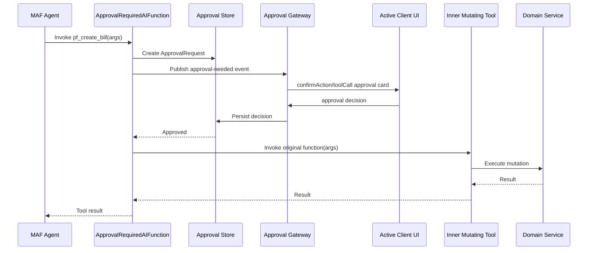

# 023.server-side-ai-tool-approval

## Objective

Add a server-side approval wrapper for AI tools so financially or operationally material mutations cannot execute unless an explicit approval decision exists.

This closes the gap where an agent is instructed to call a frontend `confirmAction` tool before mutation, but the server does not enforce that sequence. Prompt instructions and frontend UX are not a security boundary. The backend tool itself must be unable to mutate state until approval is granted.

## Principles

- Agents propose; systems execute.
- Mutating tools are approval-gated by the server.
- Read tools may execute directly.
- Approval is explicit, auditable, tenant/user scoped, and tied to the agent run and conversation.
- The wrapper is transport-neutral: AG-UI, voice WebSocket, admin playground, and future clients use the same enforcement path.
- The wrapped tool remains the only code path that executes the underlying domain service.
- Approval does not replace domain validation, authorization policies, risk checks, or ledger/payment invariants.

## Current Gap

Today, several tools are registered directly through `AIFunctionFactory.Create(...)`. For example, personal-finance tools include read operations and mutating operations such as create, update, archive, delete, cancel, apply, confirm, reject, and override actions.

The prompt tells the model to call `confirmAction` first for mutations. That is useful UX but not enforceable. If the model skips `confirmAction`, a directly registered mutating backend tool may still execute.

For voice v1, the workaround is to expose a read-only agent variant. This spec defines the server-side gating mechanism needed to safely expose mutating tools to voice and other agent surfaces.

## Desired Developer Experience

Tool registration should make mutation risk explicit.

```csharp
// Read-only tools execute directly.
tools.Add(AIFunctionFactory.Create(personalFinance.ListBills, name: "pf_list_bills"));
tools.Add(AIFunctionFactory.Create(personalFinance.GetBill, name: "pf_get_bill"));

// Mutating tools are wrapped at registration time.
tools.AddApprovalRequired(
    AIFunctionFactory.Create(personalFinance.CreateBill, name: "pf_create_bill"),
    new ToolApprovalOptions(
        RiskTier: ApprovalRiskTier.Medium,
        ActionKind: "personal_finance.bill.create",
        SummaryTemplate: "Create a new bill",
        RequiresFreshUserPresence: true));
```

The agent still sees a tool called `pf_create_bill`. The wrapper intercepts invocation, creates or resumes an approval request, waits for approval, then invokes the original function only if approved.

Conceptual flow:

```text
Agent calls pf_create_bill(args)
  -> Approval wrapper intercepts
  -> Approval request is created and sent to the active client
  -> User approves or rejects
  -> If approved, wrapper invokes the real pf_create_bill
  -> If rejected or timed out, wrapper returns a rejection result to the agent
```

## Scope

### v1 Scope

- Wrap selected mutating `AIFunction` instances with a server-side approval gate.
- Persist approval requests and decisions for audit.
- Support active AG-UI and voice sessions through a common approval gateway.
- Return structured tool results for approved, rejected, expired, and failed approvals.
- Tie approval records to tenant, user, thread, agent, tool call, and AI run where available.
- Preserve the existing frontend `confirmAction` card UX as a presentation mechanism, not as the enforcement boundary.

### Non-Goals v1

- Spoken approval.
- Background/offline approvals.
- Multi-approver workflows.
- Approval delegation.
- Manual admin approval queues for consumers.
- Replacing domain authorization checks.
- Replacing ledger/payment/order invariants.

## Architecture



Transport adapters only present approval requests and collect decisions. They do not decide whether a mutation can execute.

## Core Components

### `ApprovalRequiredAIFunction`

Decorator around an `AIFunction`.

Responsibilities:

- Preserve the wrapped tool name, description, and schema so the model sees the same tool.
- Intercept invocation before the inner tool runs.
- Create an approval request from the tool call and invocation context.
- Publish the request to the active approval gateway.
- Await an approval decision or timeout.
- Invoke the inner tool only when approved.
- Return a structured rejection/timeout result when not approved.
- Record audit events for requested, approved, rejected, expired, invoked, and failed states.

Pseudo-code:

```csharp
public sealed class ApprovalRequiredAIFunction : AIFunction
{
    private readonly AIFunction _inner;
    private readonly IToolApprovalService _approvals;
    private readonly ToolApprovalOptions _options;

    public override async ValueTask<object?> InvokeAsync(
        AIFunctionArguments arguments,
        CancellationToken cancellationToken = default)
    {
        var request = await _approvals.RequestAsync(new ToolApprovalRequest
        {
            ToolName = _inner.Name,
            ArgumentsJson = Serialize(arguments),
            RiskTier = _options.RiskTier,
            ActionKind = _options.ActionKind,
            Summary = _options.RenderSummary(arguments),
        }, cancellationToken);

        var decision = await _approvals.WaitForDecisionAsync(request.Id, cancellationToken);

        if (!decision.Approved)
        {
            return ToolApprovalResult.Rejected(request.Id, decision.Reason);
        }

        return await _inner.InvokeAsync(arguments, cancellationToken);
    }
}
```

### `IToolApprovalService`

Server-side orchestration service.

```csharp
public interface IToolApprovalService
{
    Task<ToolApprovalRequestRecord> RequestAsync(
        ToolApprovalRequest request,
        CancellationToken cancellationToken = default);

    Task<ToolApprovalDecision> WaitForDecisionAsync(
        Guid approvalRequestId,
        CancellationToken cancellationToken = default);

    Task<ToolApprovalDecision> DecideAsync(
        Guid approvalRequestId,
        ToolApprovalDecisionInput decision,
        CancellationToken cancellationToken = default);
}
```

Responsibilities:

- Persist approval request.
- Attach tenant/user/thread/agent/tool/AI run context.
- Publish approval-needed event to the active session.
- Correlate decision responses.
- Enforce timeout and cancellation.
- Ensure the deciding user matches the expected tenant/user/session.
- Prevent replay and double approval.

### Approval Gateway

The gateway connects active agent sessions to client UI.

The gateway must be transport-neutral:

- AG-UI SSE can surface approval as existing tool-call events.
- Voice WebSocket can surface approval as Voxa `toolCall` envelope with `name: "confirmAction"`.
- Admin playground can render the same approval payload.

Suggested interface:

```csharp
public interface IToolApprovalGateway
{
    Task PublishAsync(ToolApprovalRequestRecord request, CancellationToken cancellationToken);
    Task<ToolApprovalDecision> WaitAsync(Guid approvalRequestId, TimeSpan timeout, CancellationToken cancellationToken);
}
```

The gateway is not the policy engine. It is a request/response bridge between server enforcement and client presentation.

### Approval Store

New persistence is required.

Entity: `ToolApprovalRequest`

Suggested fields:

- `Id`
- `TenantId`
- `UserId`
- `ChatThreadId`
- `AgentId`
- `AiRunId`
- `ToolName`
- `ToolCallId`
- `ActionKind`
- `RiskTier`
- `ArgumentsHash`
- `ArgumentsRedactedJson`
- `SummaryJson`
- `Status`: `Pending`, `Approved`, `Rejected`, `Expired`, `Cancelled`, `Failed`
- `RequestedAtUtc`
- `DecidedAtUtc`
- `ExpiresAtUtc`
- `DecisionUserId`
- `DecisionReason`
- `InnerToolInvokedAtUtc`
- `InnerToolCompletedAtUtc`
- `FailureMessage`

EF rules:

- Add the entity to the owning module configuration.
- Add `DbSet<ToolApprovalRequest>` to `AonikDbContext` and any module context that needs runtime access.
- Generate migrations only through `AonikDbContext` using EF CLI.
- Do not hand-write migration files.

## Approval Payload

The approval request sent to clients should be stable and UI-friendly.

```jsonc
{
  "approvalRequestId": "...",
  "toolCallId": "...",
  "toolName": "pf_create_bill",
  "actionKind": "personal_finance.bill.create",
  "riskTier": "medium",
  "summary": "Create a new electricity bill",
  "details": [
    { "label": "Payee", "value": "Octopus Energy" },
    { "label": "Amount", "value": "£120.00" },
    { "label": "Due date", "value": "2026-06-01" }
  ],
  "expiresAtUtc": "2026-05-10T12:34:56Z"
}
```

Rules:

- Prefer human-readable summaries over raw JSON.
- Do not expose secrets, credentials, full account numbers, or unnecessary PII.
- Include enough detail for informed approval.
- Include material changes for updates, preferably old value to new value.
- Include risk tier and expiry.

## Client UX

### AG-UI

AG-UI can continue presenting approval through the existing `confirmAction` frontend tool shape.

Difference from today:

- The server creates the approval request.
- The frontend card is presentation only.
- The backend wrapper waits for the decision before invoking the real tool.

### Voice

Voice uses the same Voxa tool envelope:

```jsonc
{
  "type": "toolCall",
  "callId": "approval-call-id",
  "name": "confirmAction",
  "argumentsJson": "{ ... approval payload ... }"
}
```

Client responds:

```jsonc
{
  "type": "toolResult",
  "callId": "approval-call-id",
  "resultJson": "{ \"approved\": true }"
}
```

The wrapper should treat this as an approval decision, not as direct permission from the model.

No spoken approval is accepted.

## Tool Registration Strategy

### v1 Targets

Wrap all mutating personal-finance tools before voice exposes mutations:

- `pf_create_*`
- `pf_update_*`
- `pf_archive_*`
- `pf_delete_*`
- `pf_apply_*`
- `pf_cancel_*`
- `pf_confirm_*`
- `pf_reject_*`
- `pf_set_*`
- `pf_override_*`

Read-only tools remain direct:

- `pf_get_*`
- `pf_list_*`
- `pf_search_*`
- `pf_describe_*`
- `pf_summarize_*`

Unknown tools fail closed until classified.

### API Shape

```csharp
public static class ApprovalToolRegistrationExtensions
{
    public static AITool WithApprovalRequired(
        this AIFunction function,
        ToolApprovalOptions options);

    public static void AddApprovalRequired(
        this IList<AITool> tools,
        AIFunction function,
        ToolApprovalOptions options);
}
```

Example:

```csharp
yield return AIFunctionFactory
    .Create(tools.CreateBill, name: "pf_create_bill")
    .WithApprovalRequired(new ToolApprovalOptions(
        RiskTier: ApprovalRiskTier.Medium,
        ActionKind: "personal_finance.bill.create",
        SummaryTemplate: "Create bill"));
```

## State Machine

```text
Pending
  -> Approved
  -> Rejected
  -> Expired
  -> Cancelled
  -> Failed

Approved
  -> Invoked
  -> InvokeFailed
  -> Completed
```

Rules:

- Only `Pending` requests can be decided.
- Only the expected user/session can approve.
- Approval expires after the configured timeout.
- Approval cannot be reused for different arguments.
- If arguments change, a new approval request is required.
- If the socket/request disconnects before decision, the request is cancelled or expired.

## Security And Audit

Approval records must include:

- Tenant id.
- User id.
- Chat thread id.
- Agent id.
- AI run id when available.
- Tool name.
- Tool call id.
- Redacted arguments.
- Arguments hash.
- Approval decision and deciding user.
- Timestamps for request, decision, invocation, completion.

Security rules:

- The approving user must match the authenticated user for consumer flows.
- Tenant boundary is mandatory.
- Expired approvals cannot execute tools.
- Rejected approvals cannot execute tools.
- Approval payloads must not leak sensitive data beyond what is needed for informed consent.
- The wrapper must be the only registration path for mutating tools in approved agents.

## Relationship With Voice Spec

Until this server-side wrapper exists, voice v1 should expose only read-only backend tools.

After this wrapper exists:

- Voice can expose wrapped mutating tools.
- `confirmAction` becomes a UI surface for a server-created approval request.
- The voice adapter no longer needs to rely on read-only variants for safety.
- The same wrapper works for AG-UI and voice because enforcement is server-side.

## Implementation Plan

### Phase 1: Classification And Registration

- Classify all existing personal-finance tools as read-only or mutating.
- Add tests that fail when a new `pf_*` tool is unclassified.
- Add registration helpers for approval-wrapped tools.
- Update personal-finance mutating tool registration to use wrappers.

### Phase 2: Approval Persistence

- Add `ToolApprovalRequest` entity and EF configuration.
- Add DbSets to required contexts.
- Generate EF migration through `AonikDbContext` only.
- Add indexes for tenant/thread/status/expiry.

### Phase 3: Approval Service And Gateway

- Implement `IToolApprovalService`.
- Implement in-memory active-session gateway for AG-UI/voice sessions.
- Add timeout handling.
- Add decision endpoint or session callback handler, depending on transport.

### Phase 4: AG-UI Integration

- Surface server-created approval requests as existing `confirmAction` frontend cards.
- Route frontend decision back to `IToolApprovalService.DecideAsync(...)`.
- Preserve existing UX while changing enforcement boundary to server side.

### Phase 5: Voice Integration

- Surface approval requests as Voxa `toolCall` envelopes with `name: "confirmAction"`.
- Route `toolResult` decisions to `IToolApprovalService.DecideAsync(...)`.
- Remove read-only voice restriction only for agents whose mutating tools are wrapped.

## Verification

### Unit Tests

- Wrapper does not invoke inner tool before approval.
- Approved request invokes inner tool exactly once.
- Rejected request does not invoke inner tool.
- Expired request does not invoke inner tool.
- Cancelled request does not invoke inner tool.
- Arguments hash prevents approval replay with changed arguments.
- Unknown mutating tool registration fails closed.
- Redaction removes configured sensitive fields.

### Integration Tests

- AG-UI mutation creates approval request and waits for decision.
- Voice mutation creates approval request and waits for decision.
- Approval decision from another user is rejected.
- Approval decision from another tenant is rejected.
- WebSocket disconnect cancels or expires pending approval.
- Approved mutating personal-finance tool persists domain change.
- Rejected mutating personal-finance tool leaves domain state unchanged.
- `AiRun` and approval records correlate by thread/tool call where available.

### Safety Tests

- Agent attempts to call mutating tool without prior `confirmAction`; wrapper still blocks and creates approval request.
- Model prompt injection attempts to bypass approval; wrapper still blocks.
- Duplicate approval decision does not double-execute inner tool.

## Open Decisions

1. Whether approval requests are persisted before being sent to the client or only after the client acknowledges receipt. Recommended: persist first.
2. Timeout duration per risk tier. Recommended v1 default: two minutes for consumer approvals.
3. Whether rejected approvals are summarized back to the agent as plain text or structured JSON. Recommended: structured JSON with `approved: false` and optional reason.
4. Whether high-risk approvals require step-up authentication. Recommended: defer to v1.1 unless required by compliance.
5. Whether admin/operator approvals are needed for B2B workflows. Recommended: defer.

## References

- [`PersonalFinanceTools`](../../src/Aonik.Finance/Agents/Tools/PersonalFinanceTools.cs)
- [`AguiStreamPipeline`](../../src/Aonik.Agents/Services/AguiStreamPipeline.cs)
- [`PostStreamPersistenceCoordinator`](../../src/Aonik.Agents/Services/PostStreamPersistenceCoordinator.cs)
- [`022.aonik-voice-realtime`](./022.aonik-voice-realtime.md)
